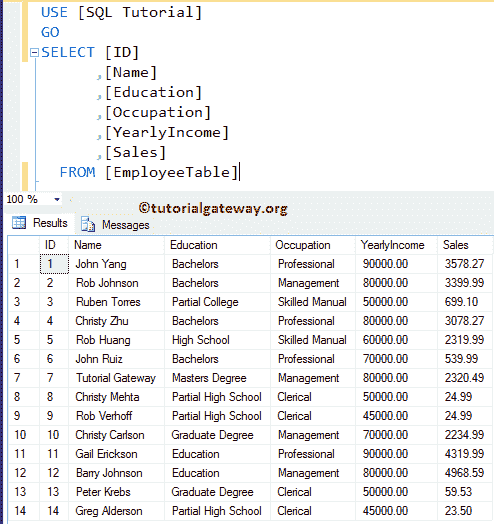
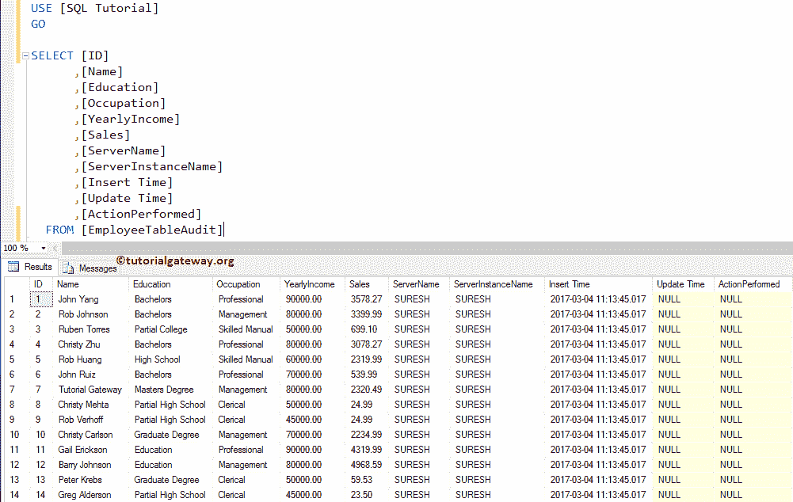

# `INSTEAD of UPDATE`触发器

> 原文：<https://www.tutorialgateway.org/instead-of-update-triggers-in-sql-server/>

在执行开始之前，将触发“SQL 替代更新”触发器。因此，您可以使用这个 SQL Server `INSTEAD of UPDATE`触发器来传递标识列的值或更新不同的表等。

对于这个 SQL `INSTEAD of UPDATE`触发器演示，我们将使用下面显示的表。这里，我们的任务是在这个雇员表上创建一个 SQL Server 而不是 UPDATE TRIGGER。通过使用这个代替更新触发器，我们想要限制记录更新



我们的员工表审计还保存了同样的 14 条记录，以及服务器名称、服务器实例名称和插入时间(审计信息)。



## 而不是 SQL Server 示例中的更新触发器

SQL 代替更新触发器可以在表和视图上创建。通常，我们在视图上使用这些触发器。在本例中，我们将展示如何在 SQL Server 中创建一个`INSTEAD of UPDATE`触发器。例如，如果您想限制用户更新原始表中的记录。如果您希望这些更新的日志在另一个历史表中，请使用此触发器。

提示:您可以参考 [SQL Server](https://www.tutorialgateway.org/sql/) 中的[视图](https://www.tutorialgateway.org/views-in-sql-server/)、[触发器](https://www.tutorialgateway.org/triggers-in-sql-server/)、[`INSTEAD Of INSERT`触发器](https://www.tutorialgateway.org/instead-of-insert-triggers-in-sql-server/)和[`Instead Of DELETE`触发器](https://www.tutorialgateway.org/instead-of-delete-triggers-in-sql-server/)文章。

在这里，我们将使用 CREATE TRIGGER 语句在雇员表上创建一个 SQL Server 中的`INSTEAD of UPDATE`触发器。从下面的代码片段中，您可以看到我们正在使用 [INSERT INTO`SELECT`语句](https://www.tutorialgateway.org/sql-insert-into-select-statement/)来选择插入到 Employee 表中的所有记录。然后我们将这些记录插入到审计表中。

这意味着，当用户更新任何员工表记录时，触发器会将这些记录插入到审核表中，并保持员工表不变。

```
-- Example for INSTEAD OF UPDATE Triggers in SQL Server

CREATE TRIGGER InsteadOfUPDATETriggerExample on [EmployeeTable]
INSTEAD OF UPDATE 
AS DECLARE @ActionPeformed VARCHAR(50)

IF UPDATE(YearlyIncome)
BEGIN
     SET @ActionPeformed = 'Updated Yearly Income'
END
ELSE BEGIN
      SET @ActionPeformed = 'Updated Sales'
END

INSERT INTO [EmployeeTableAudit]( 
       [ID]
      ,[Name]
      ,[Education]
      ,[Occupation]
      ,[YearlyIncome]
      ,[Sales]
      ,[Update Time]
     ,[ActionPerformed])
SELECT ID,
	Name,
	Education,
	Occupation,
	YearlyIncome,
	Sales,
	GETDATE(),
	@ActionPeformed
FROM INSERTED;
PRINT 'We Successfully Fired Our First INSTEAD OF UPDATE Triggers in SQL Server.'
GO
```


让我通过打开对象资源管理器->转到 SQL 教程数据库->转到并展开雇员表->然后展开触发器文件夹


向您展示新创建的触发器

出于演示目的，我们将职业=专业人员的员工表中的所有记录的年收入更新为 123，456，销售额= 5000。

```
-- SQL INSTEAD OF UPDATE Triggers Example

UPDATE [EmployeeTable]
	SET [YearlyIncome] = 123456, [Sales] = 5000
	WHERE [Occupation] = N'Professional'
```


从上面的截图可以看到，我们的触发器被触发了。并且，不是将 4 条记录插入到员工审计表中。请使用以下 SQL 查询来检查员工表中插入的记录

```
-- SQL INSTEAD OF UPDATE Triggers Example

SELECT [ID]
      ,[Name]
      ,[Education]
      ,[Occupation]
      ,[YearlyIncome]
      ,[Sales]
  FROM [EmployeeTable]

```


虽然我们更新了雇员表，但是从上面的截图中可以看到，我们的雇员表没有改变。接下来，使用以下查询检查员工表审计中的记录。

```
-- SQL Server INSTEAD OF UPDATE Triggers Example

SELECT [Name]
      ,[Education]
      ,[Occupation]
      ,[YearlyIncome]
      ,[Sales]
      ,[ServerName]
      ,[ServerInstanceName]
      ,[Insert Time]
  FROM [EmployeeTableAudit]
```


在这里，您可以看到触发器已将 4 条新记录放入员工审核表中

## 而不是 SQL Server 示例 2 中的更新触发器

让我们看看如何使用 SQL Server 中的`INSTEAD of UPDATE`触发器来更新审核表(触发表)中的所有记录。对于这个 SQL Server `INSTEAD of UPDATE`触发器的例子，我们使用的是 [`MERGE`语句](https://www.tutorialgateway.org/sql-merge-statement/)。

```
-- Example for INSTEAD OF UPDATE Triggers in SQL Server

CREATE TRIGGER InsteadOfUPDATETriggerExample on [EmployeeTable]
INSTEAD OF UPDATE 
AS DECLARE @ActionPeformed VARCHAR(50)

IF UPDATE(YearlyIncome)
BEGIN
     SET @ActionPeformed = 'Updated Yearly Income'
END
ELSE BEGIN
      SET @ActionPeformed = 'Updated Sales'
END

MERGE [EmployeeTableAudit] AS AuditTab
USING (SELECT * FROM INSERTED) AS Emp
ON AuditTab.ID = emp.ID
WHEN MATCHED THEN
UPDATE SET AuditTab.[Name] = Emp.Name, 
         AuditTab.[Education] = Emp.Education, 
	 AuditTab.[Occupation] = Emp.Occupation,
	 AuditTab.[YearlyIncome] = Emp.YearlyIncome, 
	 AuditTab.[Sales] = Emp.Sales, 
	 AuditTab.[Update Time] = GETDATE(), 
	 AuditTab.[ActionPerformed] = @ActionPeformed;
PRINT 'We Successfully Fired Our Second INSTEAD OF UPDATE Triggers in SQL Server.'
GO
```


接下来，让我对员工表执行更新

```
-- SQL INSTEAD OF UPDATE Triggers Example

UPDATE [EmployeeTable]
	SET [YearlyIncome] = 111111, 
	    [Sales] = 7777
	WHERE [Occupation] = N'Clerical'
```


我们不必检查雇员表，因为我们都知道该表中不会发生更新。接下来，查看员工审计表。


从上面的截图可以看到，触发器已经更新了所有的记录。

## 而不是 SQL Server 示例 3 中的更新触发器

此示例向您展示了如何使用 SQL Server 中的`INSTEAD of UPDATE`触发器来更新雇员表中的所有行。为此，我们使用[内连接](https://www.tutorialgateway.org/sql-inner-join/)。

```
-- Example for INSTEAD OF UPDATE Triggers in SQL Server

CREATE TRIGGER InsteadOfUPDATETriggerExample on [EmployeeTable]
INSTEAD OF UPDATE 
AS 

UPDATE [EmployeeTable] 
 SET [EmployeeTable].[Name] = 'Tutorial Gateway', 
     [EmployeeTable].[Education] = ins.Education,
     [EmployeeTable].[Occupation] = ins.Occupation,
     [EmployeeTable].[YearlyIncome] = ins.YearlyIncome,
     [EmployeeTable].[Sales] = 55555
 FROM [EmployeeTable] 
 INNER JOIN INSERTED AS ins
 ON [EmployeeTable].ID = ins.ID 

PRINT 'We Successfully Fired Our Third INSTEAD OF UPDATE Triggers in SQL Server.'
GO
```


下面的语句将把名称设置为“教程网关”

```
SET [EmployeeTable].[Name] = 'Tutorial Gateway',
```

下一条语句将销售金额设置为 55，555

```
 [EmployeeTable].[Sales] = 55555
```

这意味着，无论您将什么值传递给名称和销售列，Sql Server 中的更新触发器都将插入“教程网关”和 55，555。或者你可以说，触发器会覆盖这些值

接下来，让我对员工表执行更新

```
UPDATE [EmployeeTable]
	SET [YearlyIncome] = 999999, 
	    [Sales] = 88886
	WHERE [Occupation] = N'Management'
```


从上面的截图来看，我们的 SQL `INSTEAD of UPDATE`触发器被触发了。并且还更新了雇员表中的所有行。让我们看看雇员表。

