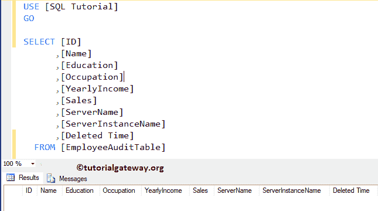
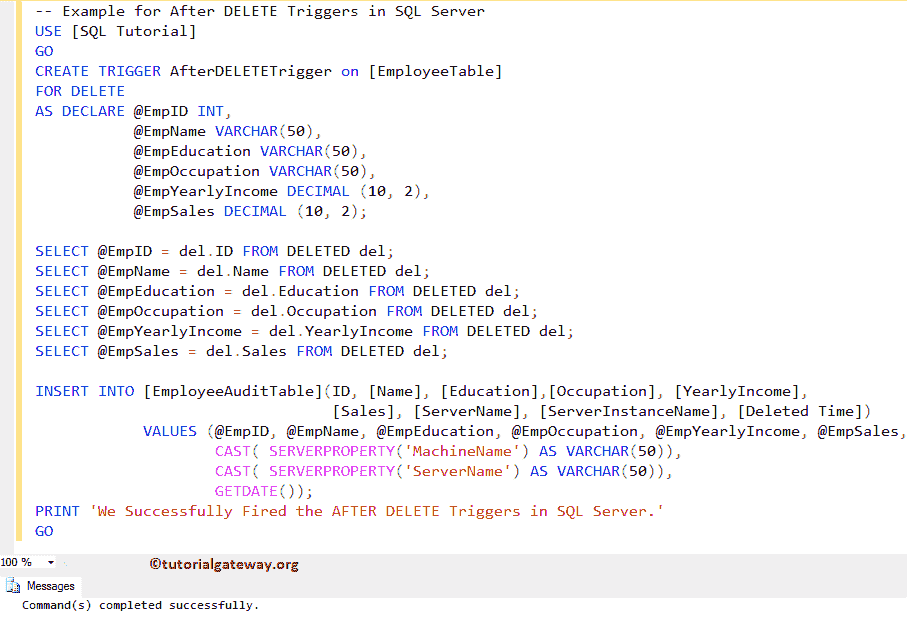
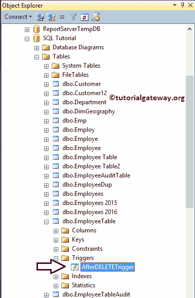
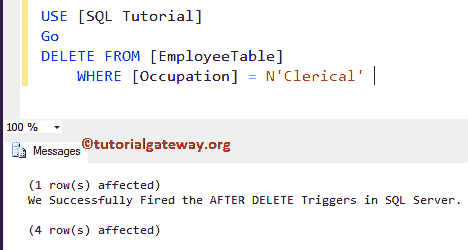
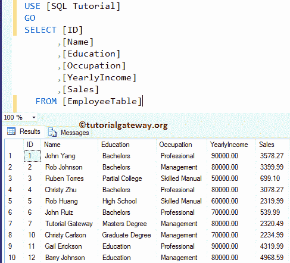
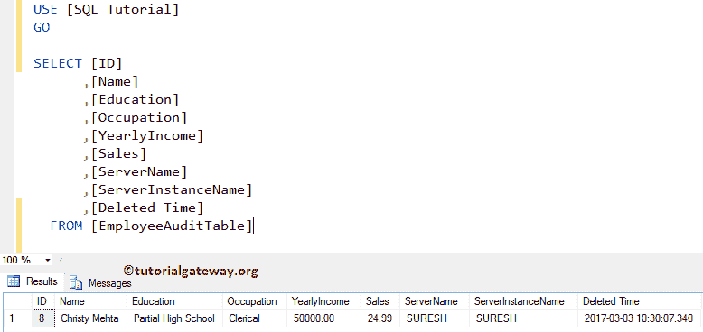
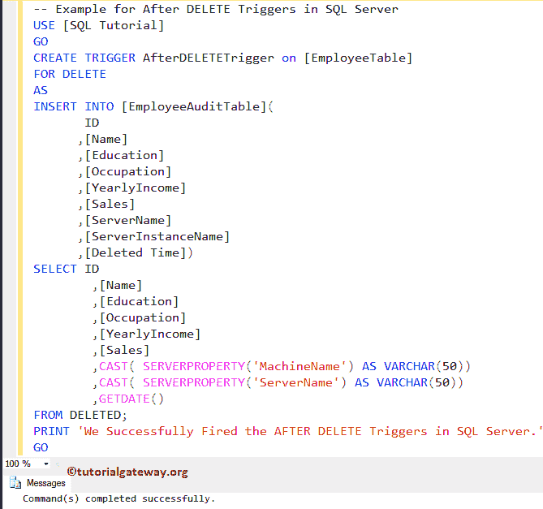
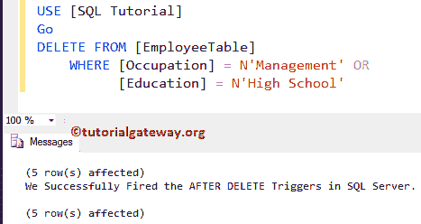
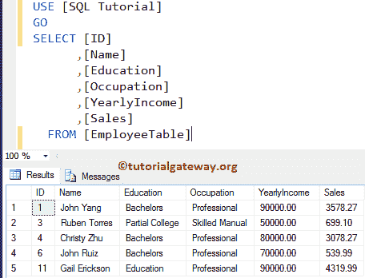
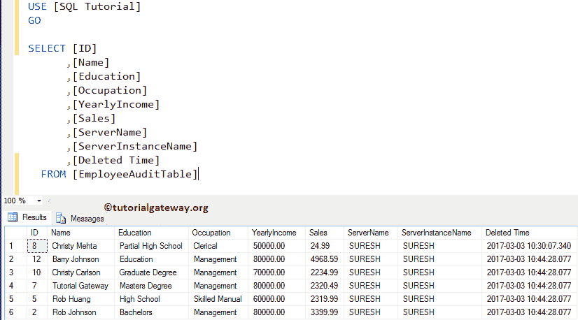

# 在 SQL Server 中删除触发器后

> 原文：<https://www.tutorialgateway.org/after-delete-triggers-in-sql-server/>

完成对表的删除操作后，将触发删除后的 SQL Server 触发器。视图不支持删除后 SQL 触发器。在这个删除触发器后的 SQL Server 演示中，我们使用了下面显示的表格。

这里，我们的任务是在这个雇员表上创建删除触发器后的 SQL Server。通过使用删除触发器后的 SQL Server，我们希望将员工表中已删除的记录插入员工审核表


我们的员工表审计为空。



## 在 SQL Server 示例中删除触发器后

在本例中，我们将向您展示如何在 SQL Server 中创建删除后触发器。这里，我们使用 CREATE TRIGGER 语句在 Employee 表中创建一个触发器。

提示:您可以参考 [SQL Server](https://www.tutorialgateway.org/sql/) 中的[触发器](https://www.tutorialgateway.org/triggers-in-sql-server/)、[后插入触发器](https://www.tutorialgateway.org/after-insert-triggers-in-sql-server/)、[视图](https://www.tutorialgateway.org/views-in-sql-server/)和[后更新触发器](https://www.tutorialgateway.org/after-update-triggers-in-sql-server/)文章。

请记住，删除后[触发器](https://www.tutorialgateway.org/triggers-in-sql-server/)会在员工表上完成删除操作后触发。一旦完成从员工表中删除记录，它将开始从员工审核表中插入/删除记录。如果它不能从雇员表中删除，那么它就不会插入到审计表中。

```
-- Example for After DELETE Triggers in SQL Server

CREATE TRIGGER AfterDELETETrigger on [EmployeeTable]
FOR DELETE 
AS DECLARE @EmpID INT,
           @EmpName VARCHAR(50),
	   @EmpEducation VARCHAR(50),
	   @EmpOccupation VARCHAR(50),
	   @EmpYearlyIncome DECIMAL (10, 2), 
	   @EmpSales DECIMAL (10, 2);

SELECT @EmpID = del.ID FROM DELETED del;
SELECT @EmpName = del.Name FROM DELETED del;
SELECT @EmpEducation = del.Education FROM DELETED del;
SELECT @EmpOccupation = del.Occupation FROM DELETED del;
SELECT @EmpYearlyIncome = del.YearlyIncome FROM DELETED del;
SELECT @EmpSales = del.Sales FROM DELETED del;

INSERT INTO [EmployeeAuditTable]( 
       ID
      ,[Name]
      ,[Education]
      ,[Occupation]
      ,[YearlyIncome]
      ,[Sales]
      ,[ServerName]
      ,[ServerInstanceName]
      ,[Deleted Time])
VALUES (@EmpID,
        @EmpName,
	@EmpEducation,
	@EmpOccupation,
	@EmpYearlyIncome,
	@EmpSales,
	CAST( SERVERPROPERTY('MachineName') AS VARCHAR(50)), 
	CAST( SERVERPROPERTY('ServerName') AS VARCHAR(50)), 
	GETDATE());
PRINT 'We Successfully Fired the AFTER DELETE Triggers in SQL Server.'
GO
```



首先，我们使用 DECLARE 语句来声明所需的变量

```
DECLARE @EmpID INT,
        @EmpName VARCHAR(50),
        @EmpEducation VARCHAR(50),
	@EmpOccupation VARCHAR(50),
	@EmpYearlyIncome DECIMAL (10, 2), 
	@EmpSales DECIMAL (10, 2);
```

接下来，我们使用 [`SELECT`语句](https://www.tutorialgateway.org/sql-select-statement/)选择删除的记录。以下语句将从已删除的行中仅选择一条记录。

```
SELECT @EmpID = del.ID FROM DELETED del;
SELECT @EmpName = del.Name FROM DELETED del;
SELECT @EmpEducation = del.Education FROM DELETED del;
SELECT @EmpOccupation = del.Occupation FROM DELETED del;
SELECT @EmpYearlyIncome = del.YearlyIncome FROM DELETED del;
SELECT @EmpSales = del.Sales FROM DELETED del;
```

接下来，我们使用 INSERT 语句将选定的值插入到员工审计表中。这里，以下语句将返回机器名和服务器名。这些信息可能对审计有帮助

```
SERVERPROPERTY('MachineName'), 
SERVERPROPERTY('ServerName')
```

让我向您展示对象资源管理器中新创建的删除触发器后的 SQL Server。为此，请转到 SQL 教程数据库->查找并展开员工表->然后展开触发器文件夹



出于演示目的，我们正在删除职业为“文员”的记录，以检查删除后触发器是否被触发。

```
-- SQL AFTER DELETE Trigger Example

DELETE FROM [EmployeeTable]
	WHERE [Occupation] = N'Clerical'
```



正如您所看到的，我们的 SQL Server AFTER Delete 触发器被触发，并且还在审计表中插入了一条记录。请使用以下 SQL 查询来检查员工表

```
-- SQL AFTER DELETE Trigger Example
SELECT [ID]
      ,[Name]
      ,[Education]
      ,[Occupation]
      ,[YearlyIncome]
      ,[Sales]
  FROM [EmployeeTable]

```



接下来，使用以下查询检查员工审计表中的记录。

```
-- SQL AFTER DELETE Trigger Example
SELECT [ID]
      ,[Name]
      ,[Education]
      ,[Occupation]
      ,[YearlyIncome]
      ,[Sales]
      ,[ServerName]
      ,[ServerInstanceName]
      ,[Deleted Time]
  FROM [EmployeeAuditTable]
```



从上面的截图中，您可以看到我们的员工审计表正在返回一条记录。因为，在我们的触发器定义中，我们只为每个删除操作选择一条记录。

## 在 SQL Server 示例 2 中删除触发器后

此示例显示如何使用 SQL Server 中的“删除后触发器”将所有已删除的记录插入员工审核表(已触发表)。在这里，我们将修改我们在前面的示例中创建的触发器。

```
-- Example for After DELETE Triggers in SQL Server

CREATE TRIGGER AfterDELETETrigger on [EmployeeTable]
FOR DELETE 
AS 
INSERT INTO [EmployeeAuditTable]( 
       ID
      ,[Name]
      ,[Education]
      ,[Occupation]
      ,[YearlyIncome]
      ,[Sales]
      ,[ServerName]
      ,[ServerInstanceName]
      ,[Deleted Time])
  SELECT ID
	,[Name]
	,[Education]
	,[Occupation]
	,[YearlyIncome]
	,[Sales]
	,CAST( SERVERPROPERTY('MachineName') AS VARCHAR(50)) 
	,CAST( SERVERPROPERTY('ServerName') AS VARCHAR(50)) 
	,GETDATE()
FROM DELETED;
PRINT 'We Successfully Fired the AFTER DELETE Triggers in SQL Server.'
GO
```



从上面可以看到，我们正在使用 [INSERT INTO`SELECT`语句](https://www.tutorialgateway.org/sql-insert-into-select-statement/)来选择从 Employee 表中删除的所有记录。然后，我们将这些记录插入到员工审计表中。

接下来，让我从员工表中删除这些记录，他们的职业是管理，或者教育=高中

```
-- SQL Server AFTER DELETE Trigger Example

DELETE FROM [EmployeeTable]
	WHERE [Occupation] = N'Management' OR
		[Education] = N'High School'
```



从上图中，您可以看到删除后触发器被触发。并将所有记录插入到审核表中。让我们看看雇员表



接下来，查看员工审计表。



从上面的截图中，可以看到触发器已经插入了所有的记录。