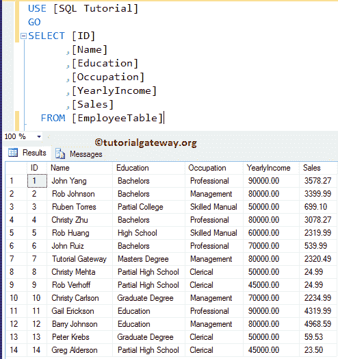
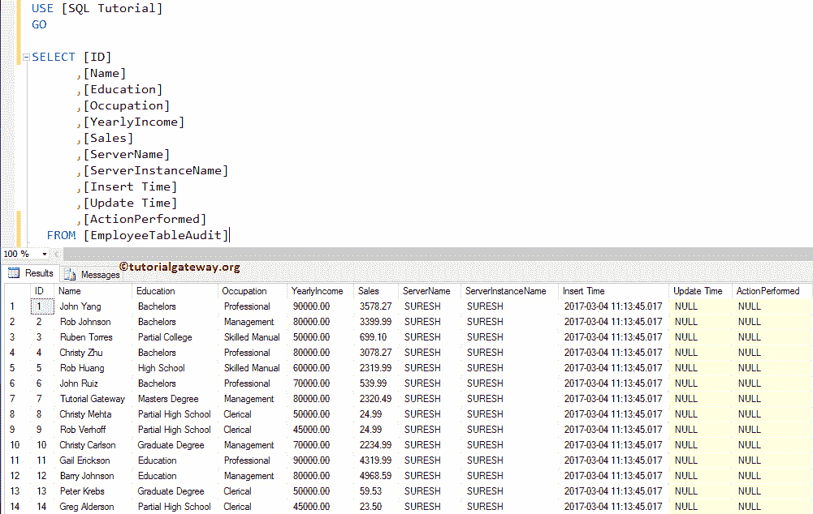
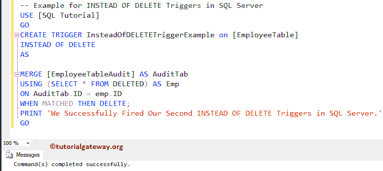
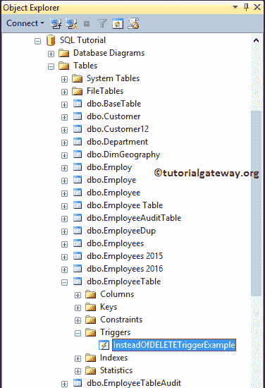
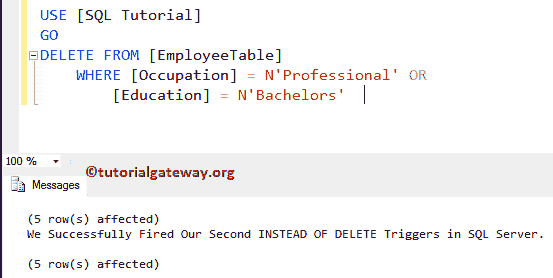
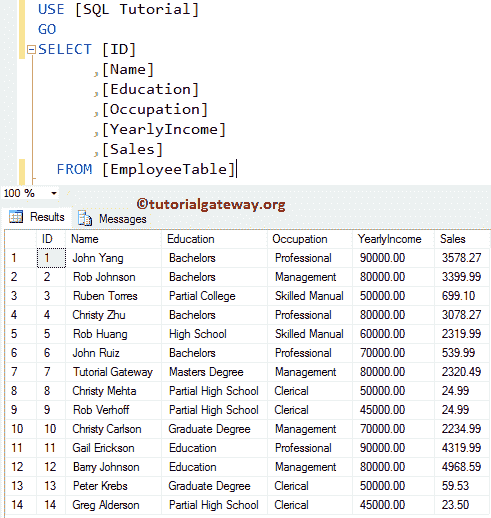
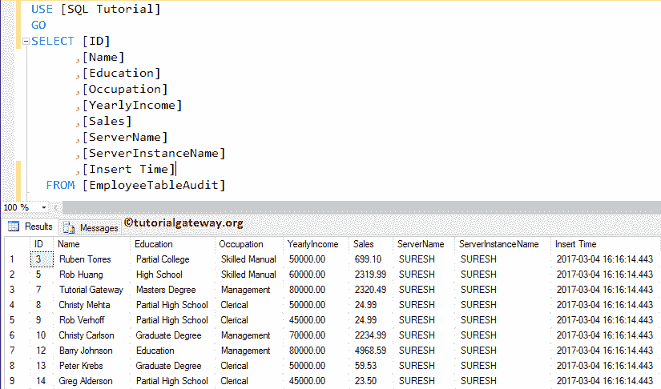

# 而不是删除触发器

> 原文：<https://www.tutorialgateway.org/instead-of-delete-triggers-in-sql-server/>

在执行开始之前，将触发 SQL 而不是 DELETE 触发器。因此，使用这个 SQL 代替 delete 触发器在 DELETE 选项之前将值存储在另一个表中，或者执行一些操作，或者删除不同的表，等等。

对于这个 SQL 而不是 DELETE 触发器演示，我们使用下表。这里，我们的任务是在这个雇员表上创建一个 SQL Server 而不是 DELETE 触发器。而通过使用这个触发器，我们要限制



的删除操作

员工表审核还保存相同的 14 条记录，以及服务器实例名、服务器名和插入时间(审核信息)。



## 而不是 SQL Server 示例中的删除触发器

SQL 而不是在表和视图中创建的删除触发器。通常，我们在视图上使用这些触发器。让我们看看如何在 SQL Server 中创建一个替代删除触发器。例如，如果您希望限制用户删除原始表中的记录，并且希望这些日志位于另一个历史表中，请使用此触发器。

这里，我们将使用 CREATE TRIGGER 语句在 Employee 表上创建一个触发器。从下面的代码中，您可以看到我们正在使用 [`MERGE`语句](https://www.tutorialgateway.org/sql-merge-statement/)从 Employee 表中选择您想要删除的所有记录。然后，我们将从审计表中删除这些记录。

提示:您可以参考 [SQL Server](https://www.tutorialgateway.org/sql/) 中的[触发器](https://www.tutorialgateway.org/triggers-in-sql-server/)、[代替插入触发器](https://www.tutorialgateway.org/instead-of-insert-triggers-in-sql-server/)、[视图](https://www.tutorialgateway.org/views-in-sql-server/)和[代替更新触发器](https://www.tutorialgateway.org/instead-of-update-triggers-in-sql-server/)文章。

这意味着当用户删除任何员工表记录时，相反，删除触发器将从审核表中删除这些记录。它保持雇员表不变。

```
-- Example for INSTEAD OF DELETE Triggers in SQL Server

CREATE TRIGGER InsteadOfDELETETriggerExample on [EmployeeTable]
INSTEAD OF DELETE
AS 

MERGE [EmployeeTableAudit] AS AuditTab
USING (SELECT * FROM DELETED) AS Emp
ON AuditTab.ID = emp.ID
WHEN MATCHED THEN DELETE; 
PRINT 'We Successfully Fired Our First INSTEAD OF DELETE Triggers in SQL Server.'
GO
```



让我通过打开对象资源管理器向您展示新创建的代替删除触发器。接下来，转到 SQL 教程数据库->展开员工表->然后展开触发器文件夹



出于演示目的，我们将删除“雇员”表中所有职业=专业或学历=学士的记录。

```
-- SQL Instead Of DELETE Triggers Example

DELETE FROM [EmployeeTable]
	WHERE [Occupation] = N'Professional' OR
		[Education] = N'Bachelors'
```



从上面的截图中，可以看到我们的 SQL Server 而不是中的 DELETE 触发器被触发了。而且，它不是从员工表中删除 4 条记录，而是从员工审计表中删除。请使用以下 SQL 查询来检查员工表中插入的记录

```
-- SQL Server Instead Of DELETE Triggers Example
SELECT [ID]
      ,[Name]
      ,[Education]
      ,[Occupation]
      ,[YearlyIncome]
      ,[Sales]
  FROM [EmployeeTable]

```



虽然我们对 Employee 表执行了删除操作。从上面的截图可以看出，我们的 Emp 表没有变化。接下来，使用以下选择查询检查“员工”表“审计”中的记录。

```
-- SQL Instead Of DELETE Triggers Example

SELECT [Name]
      ,[Education]
      ,[Occupation]
      ,[YearlyIncome]
      ,[Sales]
      ,[ServerName]
      ,[ServerInstanceName]
      ,[Insert Time]
  FROM [EmployeeTableAudit]
```



在这里，您可以看到 SQL Server 而不是 DELETE 触发器从员工审核表中删除了匹配的记录。