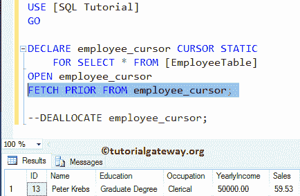

# SQL Server 中的静态游标

> 原文:[https://www . tutorialgateway . org/static-游标在 sql-server/](https://www.tutorialgateway.org/static-cursor-in-sql-server/)

SQL 静态游标始终是只读的，因为结果集将存储在 tempdb 中。您可以在 SQL Server 中使用这个静态游标来向前和向后移动。对于这个 SQL Server 静态游标演示，我们使用如下所示的表格，其中保存了 14 条记录


## SQL Server 示例中的静态游标

在这个 SQL 游标示例中，我们将向您展示如何在 SQL Server 中声明和打开静态游标。这里，我们使用 DECLARE CURSOR 语法语句。

```
DECLARE employee_cursor CURSOR STATIC  
    FOR SELECT * FROM [EmployeeTable]
OPEN employee_cursor  
FETCH NEXT FROM employee_cursor;
```

分析

在本例中，下面的语句将为 employee 表中的所有记录声明名为 employee_cursor 的静态游标

```
DECLARE employee_cursor CURSOR STATIC
FOR SELECT * FROM [EmployeeTable]
```

它将打开已声明的

```
OPEN employee_cursor
```

下一条语句将从 employee_cursor 获取或返回下一条记录。

```
FETCH NEXT FROM employee_cursor;
```

虽然雇员表有 14 条记录，但是这个 SQL Server 静态游标正在检索一条记录。这是因为 FETCH NEXT 将只获取一条记录，如果你想要全部，那么就使用 Loops。


请注意，SQL Server 静态游标仅检索第二条记录。如果仔细观察，我们只选择了 FETCH 语句，因为我们的 employee_cursor 仍在使用中，因为我们还没有关闭或释放它。


让我使用 FETCH LAST 选项。它返回我们表中的最后一条记录，即标识号 14。


接下来，我们使用 FETCH PRIOR 选项。它返回最后写入的记录之前的行，也就是标识号 13(在 14 之前)。



最后，我们使用了 FETCH FIRST 选项。返回表中出现的第一条记录，即标识号 1。


## SQL Server 中的静态游标示例 2

在前面的 sql 游标示例中，我们已经展示了它是如何一次获取(或工作)一行的。在这个 Sql Server 中的静态游标示例中，我们将使用 WHILE 循环来循环元素并将它们打印为输出

```
SET NOCOUNT ON
-- Declaring the Variables 
DECLARE @EmpID INT,
        @EmpName VARCHAR(50),
        @EmpEducation VARCHAR(50),
 @EmpOccupation VARCHAR(50),
 @EmpYearlyIncome DECIMAL (10, 2), 
 @EmpSales DECIMAL (10, 2);

DECLARE employee_cursor CURSOR 
STATIC FOR 
 SELECT [ID]
       ,[Name]
       ,[Education]
       ,[Occupation]
       ,[YearlyIncome]
       ,[Sales]
 FROM EmployeeTable

OPEN employee_cursor
IF @@CURSOR_ROWS > 0
BEGIN 
 FETCH NEXT FROM employee_cursor 
                  INTO @EmpID, @EmpName, @EmpEducation,
        @EmpOccupation, @EmpYearlyIncome, @EmpSales
 WHILE @@FETCH_STATUS = 0
 BEGIN
 PRINT 'ID = '+ CONVERT(VARCHAR(10), @EmpID)+', Full Name = '+ @EmpName
 +', Education = '+ @EmpEducation +', Occupation = '+ @EmpOccupation 
 + ', Yearly Income = ' + CONVERT(VARCHAR(10),@EmpYearlyIncome)
 + ', Sales Amount = ' + CONVERT(VARCHAR(10),@EmpSales)

                FETCH NEXT FROM employee_cursor 
                              INTO @EmpID, @EmpName, @EmpEducation,
    @EmpOccupation, @EmpYearlyIncome, @EmpSales
 END
END
CLOSE employee_cursor
DEALLOCATE employee_cursor
SET NOCOUNT OFF 
```

分析

在这个 SQL Server 静态游标示例中，首先，我们使用[设置 NOCOUNT ON](https://www.tutorialgateway.org/sql-set-nocount-on/) 停止来自 [SQL Server](https://www.tutorialgateway.org/sql/) 查询的受影响消息的行数。接下来，我们声明了一些变量来保存来自它的数据。然后，我们声明，并为 employee 表中的所有记录打开名为 employee_cursor 的 SQL 静态游标

接下来，我们使用@@CURSOR_ROWS 在 [`if`语句](https://www.tutorialgateway.org/sql-if-else/)中检查其中是否有行

```
IF @@CURSOR_ROWS > 0
```

它将从 employee_cursor 获取下一条记录到已经声明的变量中。

```
FETCH NEXT FROM employee_cursor 
           INTO @EmpID, @EmpName, @EmpEducation,
	       @EmpOccupation, @EmpYearlyIncome, @EmpSales
```

接下来，我们使用 [WHILE LOOP](https://www.tutorialgateway.org/sql-while-loop/) 来循环元素。在循环中，FETCH_STATUS 用于检查 FETCH 语句的状态。在循环中，我们使用 Print 语句逐行打印记录。

```
PRINT 'ID = '+ CONVERT(VARCHAR(10), @EmpID)+', Full Name = '+ @EmpName
	+', Education = '+ @EmpEducation +', Occupation = '+ @EmpOccupation 
	+ ', Yearly Income = ' + CONVERT(VARCHAR(10),@EmpYearlyIncome)
	+ ', Sales Amount = ' + CONVERT(VARCHAR(10),@EmpSales)
```

然后，我们使用 FETCH NEXT 从其中获取下一条记录。

```
FETCH NEXT FROM employee_cursor 
           INTO @EmpID, @EmpName, @EmpEducation,
	        @EmpOccupation, @EmpYearlyIncome, @EmpSales
```

最后，我们使用 CLOSE 和 DECLARE 语句来关闭和释放它。

```
CLOSE employee_cursor
DEALLOCATE employee_cursor
```


## SQL Server 中的静态游标示例 3

在前面的 SQL 游标示例中，我们展示了如何使用 WHILE 循环来循环游标元素，并将它们作为输出打印出来。在 SQL Server 示例中的这个静态游标中，我们将在 while 循环中添加一个 select 语句，以结果集的形式显示这些项。

```
SET NOCOUNT ON
DECLARE @EmpID INT,
        @EmpName VARCHAR(50),
        @EmpEducation VARCHAR(50),
	@EmpOccupation VARCHAR(50),
	@EmpYearlyIncome DECIMAL (10, 2), 
	@EmpSales DECIMAL (10, 2);

DECLARE employee_cursor CURSOR 
STATIC FOR 
	SELECT [ID]
	      ,[Name]
	      ,[Education]
	      ,[Occupation]
	      ,[YearlyIncome]
	      ,[Sales]
	FROM EmployeeTable

OPEN employee_cursor
IF @@CURSOR_ROWS > 0
BEGIN 
	FETCH NEXT FROM employee_cursor 
                  INTO @EmpID, @EmpName, @EmpEducation,
		       @EmpOccupation, @EmpYearlyIncome, @EmpSales
	WHILE @@FETCH_STATUS = 0
	BEGIN
		PRINT 'ID = '+ CONVERT(VARCHAR(10), @EmpID)+', Full Name = '+ @EmpName
			+', Education = '+ @EmpEducation +', Occupation = '+ @EmpOccupation 
			+ ', Yearly Income = ' + CONVERT(VARCHAR(10),@EmpYearlyIncome)
			+ ', Sales Amount = ' + CONVERT(VARCHAR(10),@EmpSales)

                -- Display the result set
                SELECT @EmpID AS ID, @EmpName AS Name, @EmpEducation AS Education,
		   @EmpOccupation AS Occupation, @EmpYearlyIncome + 25000 AS YearlyIncome, 
                   @EmpSales + 1000 AS Sales

                FETCH NEXT FROM employee_cursor 
                              INTO @EmpID, @EmpName, @EmpEducation,
				   @EmpOccupation, @EmpYearlyIncome, @EmpSales
	END
END
CLOSE employee_cursor
DEALLOCATE employee_cursor
SET NOCOUNT OFF 
```

它将每条记录显示为单独的结果集。也反映了我们在[选择表](https://www.tutorialgateway.org/sql-select-statement/)中所做的改变(年收入+ 25000，销售额+ 1000)


让我们看看消息选项卡，检查 SQL Server 中光标的打印语句结果。如您所见，它显示的是员工表中的年收入和销售额。这是因为我们没有更改 Print 语句中的任何值。

