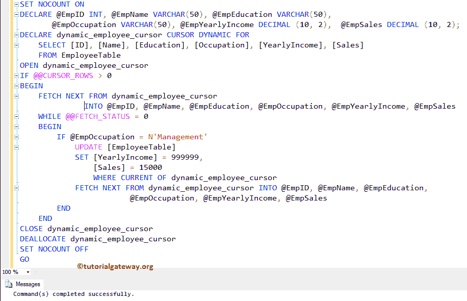
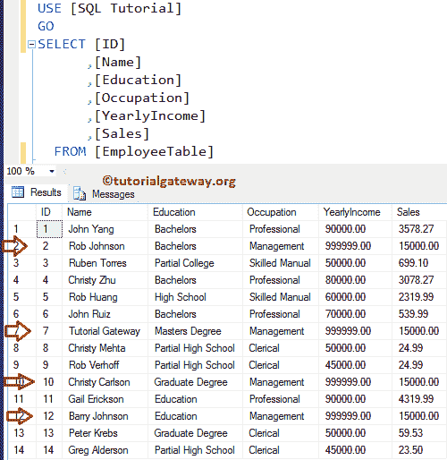
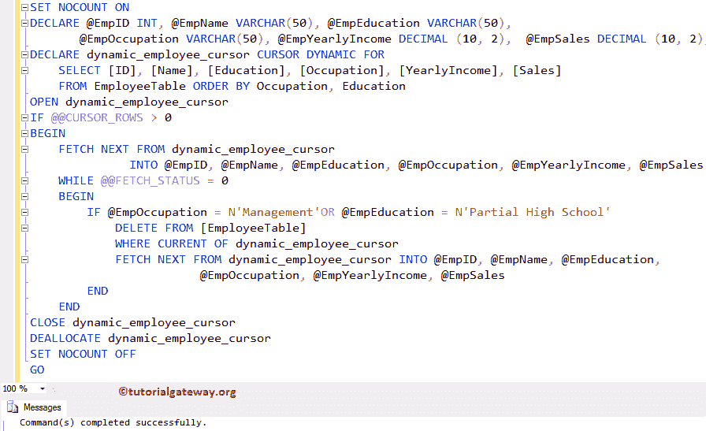
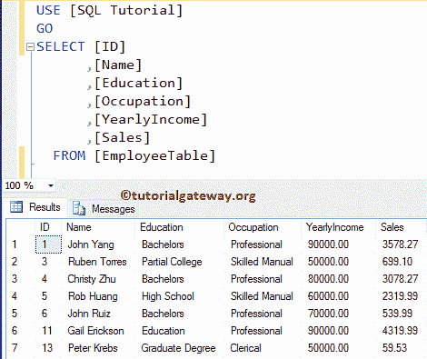

# SQL Server 中的动态游标

> 原文:[https://www . tutorialgateway . org/dynamic-游标在 sql-server/](https://www.tutorialgateway.org/dynamic-cursor-in-sql-server/)

SQL 动态游标与静态游标完全相反。您可以使用此 SQL Server 动态游标来执行插入、删除和更新操作。与静态游标不同，动态游标中所做的所有更改都将反映原始数据。

让我们看一下如何在 SQL Server 中创建动态游标，以及如何在动态游标中执行更新和删除操作。对于这个动态光标演示，我们将使用包含 14 条记录


的 Employee 表

## 用于更新的动态游标

在本例中，我们将向您展示如何在 SQL Server 中声明和打开动态游标。以及如何在 SQL 动态游标内执行 Update 操作。

为此，我们使用了 DECLARE CURSOR 语句。在动态游标中，我们将使用 [WHILE LOOP](https://www.tutorialgateway.org/sql-while-loop/) 来循环遍历 [SQL Server](https://www.tutorialgateway.org/sql/) 游标元素并执行更新

```
SET NOCOUNT ON
-- Declaring the Variables 
DECLARE @EmpID INT,
        @EmpName VARCHAR(50),
        @EmpEducation VARCHAR(50),
	@EmpOccupation VARCHAR(50),
	@EmpYearlyIncome DECIMAL (10, 2), 
	@EmpSales DECIMAL (10, 2);

-- SQL Dynamic Cursor Declaration
DECLARE dynamic_employee_cursor CURSOR 
DYNAMIC FOR 
	SELECT [ID]
	      ,[Name]
	      ,[Education]
	      ,[Occupation]
	      ,[YearlyIncome]
	      ,[Sales]
	FROM EmployeeTable
        ORDER BY Occupation

OPEN dynamic_employee_cursor
IF @@CURSOR_ROWS > 0
BEGIN 
      FETCH NEXT FROM dynamic_employee_cursor
            INTO @EmpID, @EmpName, @EmpEducation,
	         @EmpOccupation, @EmpYearlyIncome, @EmpSales
      WHILE @@FETCH_STATUS = 0
      BEGIN
	IF @EmpOccupation = N'Management'
 	    UPDATE [EmployeeTable] 
		SET [YearlyIncome] = 999999,
		    [Sales] = 15000
	    WHERE CURRENT OF dynamic_employee_cursor                

        FETCH NEXT FROM dynamic_employee_cursor 
             INTO @EmpID, @EmpName, @EmpEducation,
	          @EmpOccupation, @EmpYearlyIncome, @EmpSales
      END
END
CLOSE dynamic_employee_cursor
DEALLOCATE dynamic_employee_cursor
SET NOCOUNT OFF 
GO

```

分析

首先，我们使用[设置 NOCOUNT ON](https://www.tutorialgateway.org/sql-set-nocount-on/) 来停止来自 SQL Query 的受影响消息的行数。接下来，我们声明了几个变量来保存来自游标的数据。然后，我们声明，并为 employee 表中的所有记录打开名为 dynamic_employee_cursor 的 SQL Server 动态游标

接下来，我们使用@@CURSOR_ROWS 在 [IF 语句](https://www.tutorialgateway.org/sql-if-else/)中检查 CURSOR 中是否有任何行

```
IF @@CURSOR_ROWS > 0
```

下面的语句将从 dynamic_employee_cursor 获取下一条记录到已经声明的变量中。

```
FETCH NEXT FROM dynamic_employee_cursor
           INTO @EmpID, @EmpName, @EmpEducation,
	        @EmpOccupation, @EmpYearlyIncome, @EmpSales
```

然后，我们使用 [WHILE LOOP](https://www.tutorialgateway.org/sql-while-loop/) 在游标元素上循环，在循环中，FETCH_STATUS 用于检查 FETCH 语句的状态。

在循环中，我们又使用了一个 [IF 语句](https://www.tutorialgateway.org/sql-if-else/)来检查职业是否等于管理

```
IF @EmpOccupation = N'Management'
```

如果条件为真，光标将使用[更新语句](https://www.tutorialgateway.org/sql-update-statement/)更新年收入和销售额。

```
UPDATE [EmployeeTable] 
SET [YearlyIncome] = 999999,
    [Sales] = 15000
WHERE CURRENT OF dynamic_employee_cursor
```

提示:如果您的表(这里是雇员表)有主键，那么只有您可以使用 WHERE CURRENT OF 语句。否则，它将抛出一个错误。

然后，我们使用 FETCH NEXT 从游标中获取下一条记录。

```
FETCH NEXT FROM dynamic_employee_cursor 
           INTO @EmpID, @EmpName, @EmpEducation,
                @EmpOccupation, @EmpYearlyIncome, @EmpSales
```

在这里，我们使用 CLOSE 和 DECLARE 语句来关闭和释放游标。

```
CLOSE dynamic_employee_cursor
DEALLOCATE dynamic_employee_cursor
```



请使用以下 SQL 查询来检查游标是否更新了员工表中的记录。

```
SELECT [ID]
      ,[Name]
      ,[Education]
      ,[Occupation]
      ,[YearlyIncome]
      ,[Sales]
  FROM [EmployeeTable]

```

从下面的截图可以看到，光标已经更新了【收入和销售额】



## 用于删除的动态游标

在本例中，我们将向您展示如何在动态游标中执行删除操作。

```
-- SQL Server Dynamic Cursor Example
SET NOCOUNT ON
-- Declaring the Variables 
DECLARE @EmpID INT,
        @EmpName VARCHAR(50),
        @EmpEducation VARCHAR(50),
	@EmpOccupation VARCHAR(50),
	@EmpYearlyIncome DECIMAL (10, 2), 
	@EmpSales DECIMAL (10, 2);

DECLARE dynamic_employee_cursor CURSOR 
DYNAMIC FOR 
	SELECT [ID]
	      ,[Name]
	      ,[Education]
	      ,[Occupation]
	      ,[YearlyIncome]
	      ,[Sales]
	FROM EmployeeTable
        ORDER BY Occupation, Education

OPEN dynamic_employee_cursor
IF @@CURSOR_ROWS > 0
BEGIN 
      FETCH NEXT FROM dynamic_employee_cursor
            INTO @EmpID, @EmpName, @EmpEducation,
	         @EmpOccupation, @EmpYearlyIncome, @EmpSales
      WHILE @@FETCH_STATUS = 0
      BEGIN
	IF @EmpOccupation = N'Management' OR @EmpEducation = N'Partial High School'
 	    DELETE FROM [EmployeeTable] 
	    WHERE CURRENT OF dynamic_employee_cursor                

        FETCH NEXT FROM dynamic_employee_cursor 
             INTO @EmpID, @EmpName, @EmpEducation,
	          @EmpOccupation, @EmpYearlyIncome, @EmpSales
      END
END
CLOSE dynamic_employee_cursor
DEALLOCATE dynamic_employee_cursor
SET NOCOUNT OFF 
GO
```

分析

在这个 SQL Server 动态游标示例中，我们没有更改任何内容，除了几行代码，这些行是:

在循环中，我们又使用了一个 [IF 语句](https://www.tutorialgateway.org/sql-if-else/)来检查职业是否等于管理或教育=部分高中

```
IF @EmpOccupation = N'Management' OR @EmpEducation = N'Partial High School'
```

如果条件为真，动态光标将使用 [DELETE 语句](https://www.tutorialgateway.org/sql-delete-statement/)删除该记录。

```
DELETE FROM [EmployeeTable] 
WHERE CURRENT OF dynamic_employee_cursor
```



让我们看看员工表



请参考[静态光标](https://www.tutorialgateway.org/static-cursor-in-sql-server/)、[插入语句](https://www.tutorialgateway.org/sql-insert-statement/)、[删除语句](https://www.tutorialgateway.org/sql-delete-statement/)和[更新语句](https://www.tutorialgateway.org/sql-update-statement/)操作。