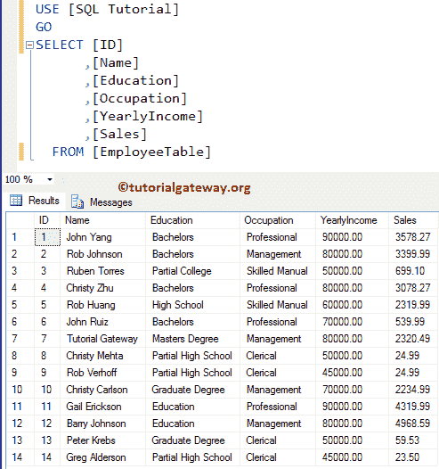

# SQL Server 中仅前向的游标

> 原文：<https://www.tutorialgateway.org/forward_only-cursor-in-sql-server/>

SQL Server 中的仅前向光标不支持滚动。这个 SQL FORWARD_ONLY 游标只能从第一行移动到最后一行，不支持其他方式(向后滚动)。这意味着 SQL FORWARD_ONLY 游标支持 FETCH_ONLY 选项，它将为所有剩余的 FETCH 选项返回一个错误。

SQL Server 允许我们使用静态、动态或键集关键字以及仅前进光标。如果您省略了这些关键字中的任何一个，那么 SQL Server 会将其假定为动态的。

为此，在 SQL Server 演示中创建一个仅前向的游标，我们使用下表。如您所见，我们的员工表保存了 14 条记录



## SQL Server 示例 1 中的仅前向游标

在本例中，我们将向您展示如何在 SQL Server 中声明和打开一个 forward_only 游标。在这里，我们将使用不同的 fetch 选项来演示支持 FETCH 的选项。

```
DECLARE forward_employee_cursor CURSOR FORWARD_ONLY
    FOR SELECT * FROM [EmployeeTable]
OPEN forward_employee_cursor  
FETCH NEXT FROM forward_employee_cursor;
```

分析

下面的语句将为雇员表中的所有记录声明一个名为向前雇员光标的仅前向光标

```
DECLARE forward_employee_cursor CURSOR FORWARD_ONLY
    FOR SELECT * FROM [EmployeeTable]
```

下面的语句将打开声明的光标

```
OPEN forward_employee_cursor
```

下一条语句将从 forward_employee_cursor 游标获取或返回下一条记录。

```
FETCH NEXT FROM forward_employee_cursor;
```

虽然我们的雇员表有 14 条记录，但是光标正在检索一条记录。因为 [SQL Server](https://www.tutorialgateway.org/sql/) FETCH NEXT 只会从光标处取一行，如果你想要全部，那就用 Loops。


让我使用 FETCH FIRST 选项。如你所见，这是一个错误。


让我使用 FETCH LAST 选项。


接下来，我们使用 FETCH PRIOR 选项。


## SQL Server 示例 2 中的仅前向游标

让我们看看如何创建仅前向静态游标和仅前向动态游标。为此，我们使用了 DECLARE CURSOR 语句，在该语句中，我们使用 [WHILE LOOP](https://www.tutorialgateway.org/sql-while-loop/) 来循环游标元素并执行更新

```
SET NOCOUNT ON
-- Declaring the Variables 
DECLARE @EmpID INT,
        @EmpName VARCHAR(50),
        @EmpEducation VARCHAR(50),
	@EmpOccupation VARCHAR(50),
	@EmpYearlyIncome DECIMAL (10, 2), 
	@EmpSales DECIMAL (10, 2);

DECLARE forward_employee_cursor CURSOR 
FORWARD_ONLY STATIC FOR 
	SELECT [ID]
	      ,[Name]
	      ,[Education]
	      ,[Occupation]
	      ,[YearlyIncome]
	      ,[Sales]
	FROM EmployeeTable
        ORDER BY Occupation

OPEN forward_employee_cursor
IF @@CURSOR_ROWS > 0
BEGIN 
      FETCH NEXT FROM forward_employee_cursor
            INTO @EmpID, @EmpName, @EmpEducation,
	         @EmpOccupation, @EmpYearlyIncome, @EmpSales
      WHILE @@FETCH_STATUS = 0
      BEGIN
	IF @EmpOccupation = N'Management'
 	    UPDATE [EmployeeTable] 
		SET [YearlyIncome] = 999999,
		    [Sales] = 15000
	    WHERE CURRENT OF forward_employee_cursor                

        FETCH NEXT FROM forward_employee_cursor
             INTO @EmpID, @EmpName, @EmpEducation,
	          @EmpOccupation, @EmpYearlyIncome, @EmpSales
      END
END
CLOSE forward_employee_cursor
DEALLOCATE forward_employee_cursor
SET NOCOUNT OFF 
GO
```

如果观察游标声明，我们使用的是 SQL FORWARD_ONLY 静态游标，并执行 UPDATE 选项。我们已经在前一篇文章中解释了剩余的步骤。建议大家参考一下【SQL Server 中的[动态游标】](https://www.tutorialgateway.org/dynamic-cursor-in-sql-server/)，以及键集游标的例子。


您可以看到错误说明:光标是只读的。这是因为我们在游标声明中提到了 FORWARD_ONLY STATIC。并且，[静态光标](https://www.tutorialgateway.org/static-cursor-in-sql-server/)不支持插入、删除或更新操作。

请使用以下 SQL 查询来检查游标是否更新了员工表中的记录。

```
SELECT [ID]
      ,[Name]
      ,[Education]
      ,[Occupation]
      ,[YearlyIncome]
      ,[Sales]
  FROM [EmployeeTable]
```


让我通过编写:FORWARD_ONLY DYNAMIC 来将游标声明从静态更改为动态。请记住，即使您忘记了 DYNAMIC 关键字，它也会起作用，因为它是 forward_only 触发器


的默认关键字

现在你可以看到更新的记录。

