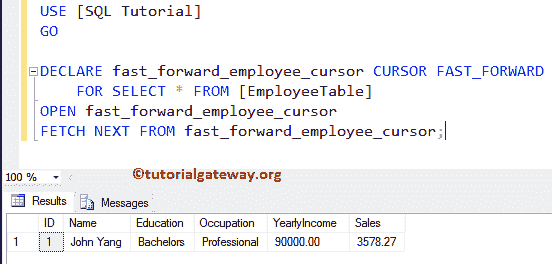
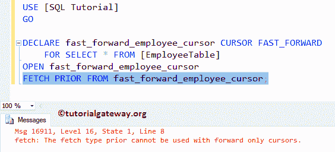
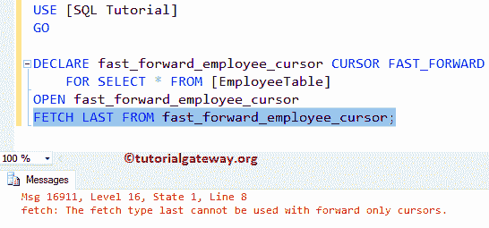
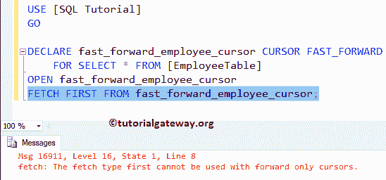

# SQLServer中的快进游标

> 原文：<https://www.tutorialgateway.org/fast_forward-cursor-in-sql-server/>

SQL FAST_FORWARD 游标是我们拥有的最快的游标之一。这个 SQL 快速向前游标是向前只读和只读的组合。这意味着 FAST_FORWARD 游标将仅从第一行移动到最后一行，并且不支持向后滚动。

对于这个在 SQL Server 中创建 FAST_FORWARD 游标的示例，我们使用下面显示的 Employee 表，该表包含 14 条记录


## SQL Server 示例中的快进游标

在这个例子中，我们向您展示了如何声明和打开一个 fast_forward 游标。并且，我们将使用不同的 fetch 选项来演示支持 FETCH 的选项。

```
-- SQL FAST_FORWARD Cursor Example

DECLARE fast_forward_employee_cursor CURSOR FAST_FORWARD
    FOR SELECT * FROM [EmployeeTable]
OPEN fast_forward_employee_cursor  
FETCH NEXT FROM fast_forward_employee_cursor;
```

下面的语句将为雇员表中的所有记录声明名为快进雇员游标的快进游标

```
DECLARE fast_forward_employee_cursor CURSOR FAST_FORWARD
    FOR SELECT * FROM [EmployeeTable]
```

接下来，我们使用 OPEN Cursor 语句打开声明的游标

```
OPEN fast_forward_employee_cursor
```

最后一条语句将从 fast_forward_employee_cursor 游标中获取或返回下一条记录。

```
FETCH NEXT FROM fast_forward_employee_cursor;
```

虽然 employee 表有 14 行，但是这个游标正在检索 1 条记录。这是因为， [SQL Server](https://www.tutorialgateway.org/sql/) FETCH NEXT 选项将只从游标中获取一条记录，如果您想要全部，那么使用 Loops。



接下来，我们使用 FETCH PRIOR 选项。如你所见，这是一个错误。



让我使用 FETCH LAST 选项。



让我使用 FETCH FIRST 选项。



请参考 [FORWARD_ONLY 游标](https://www.tutorialgateway.org/forward_only-cursor-in-sql-server/)一文。