# SQL Server 中的键集游标

> 原文：<https://www.tutorialgateway.org/keyset-cursor-in-sql-server/>

SQL Server 中的键集游标只能从第一行移动到最后一行，最后一行移动到第一行。当 Sql Server KEYSET 游标打开时，行和成员的顺序是固定的。唯一标识行的键集将存储在 tempdb 数据库下的表中。

请记住在具有唯一键的表上使用 SQL 键集光标。否则，该游标将像任何其他静态游标一样工作。一旦在雇员上打开了 SQL 键集游标，该表上的任何插入操作都不会反映在游标中。但是 DELETE 和 UPDATE 操作都会反映。

对于这个 SQL Server 键集游标演示，我们使用如下所示的 Employee 表，该表包含 14 条记录


## SQL Server 示例 1 中的键集游标

让我们看看如何在 SQL Server 中声明和打开键集游标，以及如何从游标中获取行。在本例中，我们将使用 [WHILE LOOP](https://www.tutorialgateway.org/sql-while-loop/) 循环遍历 [SQL Server](https://www.tutorialgateway.org/sql/) 光标元素，并将它们作为输出打印出来。

请记住，如果您在任何没有至少一个唯一列的表上应用 SQL 键集游标，那么它将充当[静态游标](https://www.tutorialgateway.org/static-cursor-in-sql-server/)

```sql
SET NOCOUNT ON
-- Declaring the Variables 
DECLARE @EmpID INT,
        @EmpName VARCHAR(50),
        @EmpEducation VARCHAR(50),
	@EmpOccupation VARCHAR(50),
	@EmpYearlyIncome DECIMAL (10, 2), 
	@EmpSales DECIMAL (10, 2);

DECLARE keyset_employee_cursor CURSOR 
KEYSET FOR 
	SELECT [ID]
	      ,[Name]
	      ,[Education]
	      ,[Occupation]
	      ,[YearlyIncome]
	      ,[Sales]
	FROM EmployeeTable

OPEN keyset_employee_cursor
IF @@CURSOR_ROWS > 0
BEGIN 
	FETCH NEXT FROM keyset_employee_cursor 
              INTO @EmpID, @EmpName, @EmpEducation,
		       @EmpOccupation, @EmpYearlyIncome, @EmpSales
	WHILE @@FETCH_STATUS = 0
	BEGIN
		PRINT 'ID = '+ CONVERT(VARCHAR(10), @EmpID)+', Full Name = '+ @EmpName
			+', Education = '+ @EmpEducation +', Occupation = '+ @EmpOccupation 
			+ ', Yearly Income = ' + CONVERT(VARCHAR(10),@EmpYearlyIncome)
			+ ', Sales Amount = ' + CONVERT(VARCHAR(10),@EmpSales)

                FETCH NEXT FROM keyset_employee_cursor
                      INTO @EmpID, @EmpName, @EmpEducation,
				   @EmpOccupation, @EmpYearlyIncome, @EmpSales
	END
END
CLOSE keyset_employee_cursor
DEALLOCATE keyset_employee_cursor
SET NOCOUNT OFF
```

如果观察游标声明，我们在声明游标时使用的是 KEYSET 游标。我们已经解释了 SQL Server 示例中[静态游标的剩余步骤。](https://www.tutorialgateway.org/static-cursor-in-sql-server/)

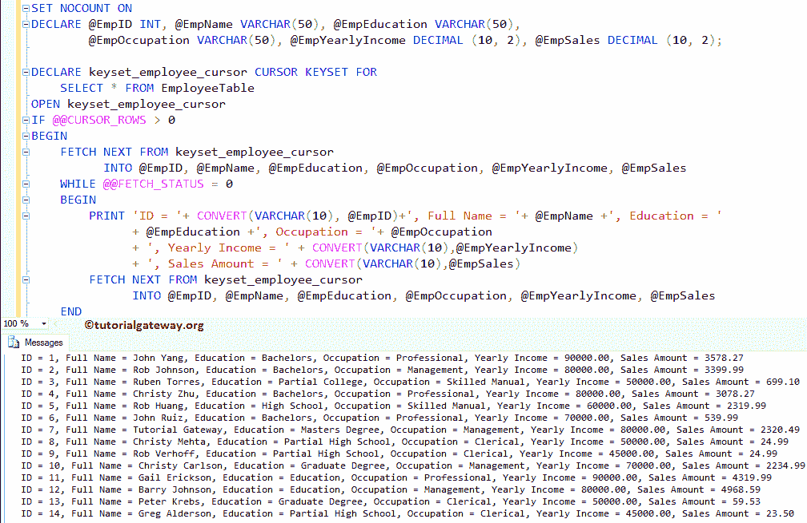

让我添加 WAITFOR DELAY '00:00:05 '来延迟查询的执行，并打印@@FETCH_STATUS 来打印 FETCH 状态(-2 到 0)

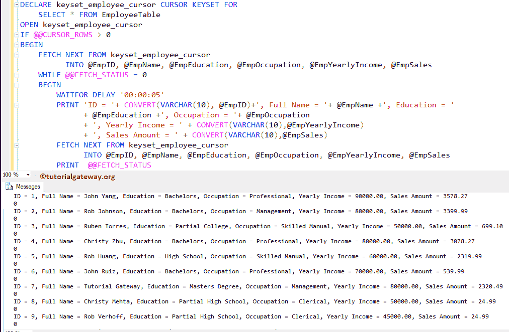

## SQL Server 示例 2 中的键集游标

当光标打开时执行[插入](https://www.tutorialgateway.org/sql-insert-statement/)操作会发生什么？

```sql
SET NOCOUNT ON
-- Declaring the Variables 
DECLARE @EmpID INT,
        @EmpName VARCHAR(50),
        @EmpEducation VARCHAR(50),
	@EmpOccupation VARCHAR(50),
	@EmpYearlyIncome DECIMAL (10, 2), 
	@EmpSales DECIMAL (10, 2);

DECLARE keyset_employee_cursor CURSOR 
KEYSET FOR 
	SELECT TOP 5 [ID]
	      ,[Name]
	      ,[Education]
	      ,[Occupation]
	      ,[YearlyIncome]
	      ,[Sales]
	FROM EmployeeTable

OPEN keyset_employee_cursor
IF @@CURSOR_ROWS > 0
BEGIN 
	FETCH NEXT FROM keyset_employee_cursor 
              INTO @EmpID, @EmpName, @EmpEducation,
		       @EmpOccupation, @EmpYearlyIncome, @EmpSales
	WHILE @@FETCH_STATUS = 0
	BEGIN
                WAITFOR DELAY '00:00:05'
		PRINT 'ID = '+ CONVERT(VARCHAR(10), @EmpID)+', Full Name = '+ @EmpName
			+', Education = '+ @EmpEducation +', Occupation = '+ @EmpOccupation 
			+ ', Yearly Income = ' + CONVERT(VARCHAR(10),@EmpYearlyIncome)
			+ ', Sales Amount = ' + CONVERT(VARCHAR(10),@EmpSales)

                FETCH NEXT FROM keyset_employee_cursor
                      INTO @EmpID, @EmpName, @EmpEducation,
				   @EmpOccupation, @EmpYearlyIncome, @EmpSales
                PRINT @@FETCH_STATUS
	END
END
CLOSE keyset_employee_cursor
DEALLOCATE keyset_employee_cursor
SET NOCOUNT OFF
```

当光标打开时，让我使用下面的查询插入一些记录

```sql
INSERT INTO [EmployeeTable] (
		[Name]
	       ,[Education]
	       ,[Occupation]
	       ,[YearlyIncome]
	       ,[Sales]
	     )
VALUES ('Imran Khan', 'Bachelors', 'Skilled Professional', 69000, 100)
      ,('Doe Lara', 'Bachelors', 'Management', 85000, 60)
      ,('Ramesh Kumar', 'High School', 'Professional', 45000, 630)
      ,('John Ruiz', 'Partial High School', 'Clerical', 40000, 220)
```

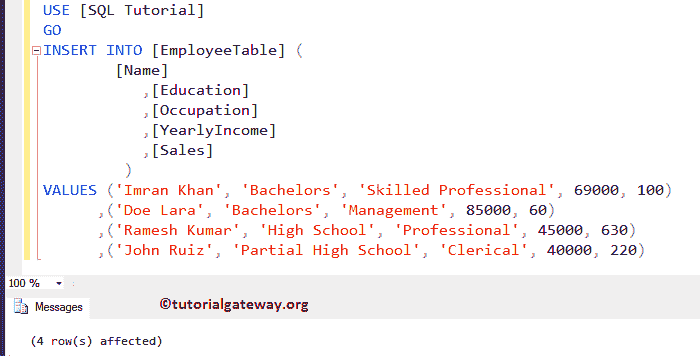

如果您观察下面的屏幕截图，虽然我们已经在 Employee 表中插入了四条新记录，但是键集光标正在返回前 5 条记录。因为一旦光标打开，它将固定键值，而另一个用户的插入操作不会反映在光标内部。

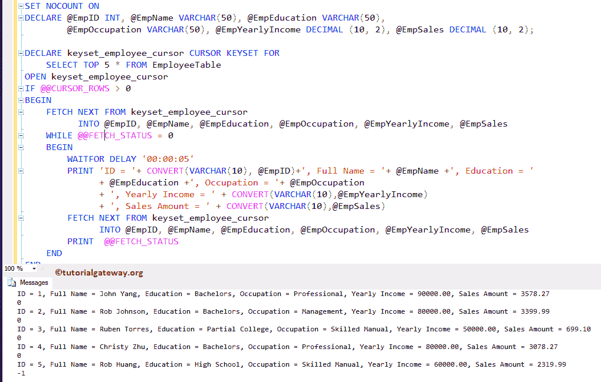

请使用以下 SQL 查询来检查新记录是否插入到员工表中。

```sql
SELECT [ID]
      ,[Name]
      ,[Education]
      ,[Occupation]
      ,[YearlyIncome]
      ,[Sales]
  FROM [EmployeeTable]

```

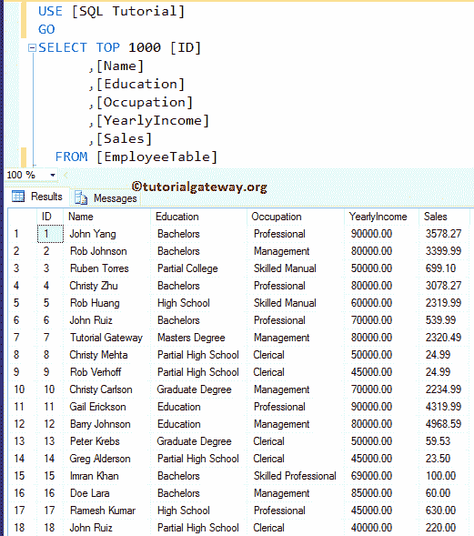

## SQL Server 示例 3 中的键集游标

当光标打开时执行[更新](https://www.tutorialgateway.org/sql-update-statement/)操作会发生什么。为此，我们使用前面使用的光标定义。这里，我们选择所有的列，而不是前 5 列。

当光标打开时，让我使用以下查询更新职业为管理的员工的年收入和销售额

```sql
UPDATE [EmployeeTable] 
    SET [YearlyIncome] = 999999,
        [Sales] = 15000
WHERE [Occupation] = N'Management'
```

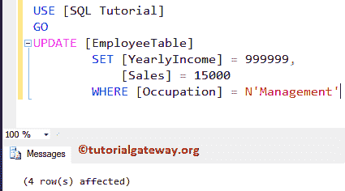

如果您看到，虽然键集光标是打开的，但它显示的是我们的雇员表中的更新值。因为，即使光标是打开的，它也可以读取更新的值(由另一个用户更新的值)。

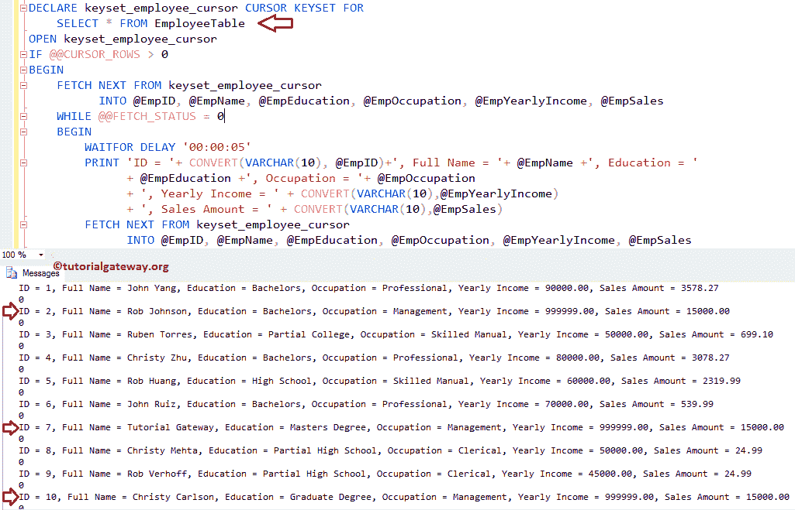

让我检查雇员表，更新是否发生在服务器级别。

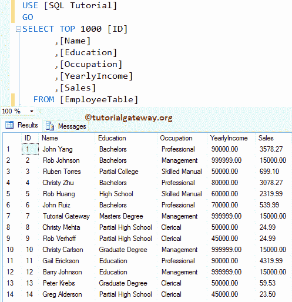

## SQL Server 示例 4 中的键集游标

当按键光标打开时，执行[删除](https://www.tutorialgateway.org/sql-delete-statement/)操作。为此，让我在光标打开时删除职业为专业或教育为部分高中的员工

```sql
DELETE FROM [EmployeeTable] 
WHERE [Occupation] = N'professional' OR
      [Education] = N'Partial High School'
```

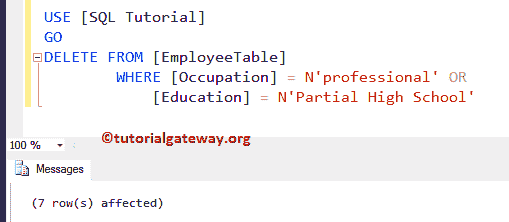

虽然 Sql Server 键集游标是打开的，但它在到达第三条记录后终止，因为第四条记录的职业=专业，所以提取状态返回-2。尝试增加时间延迟以获得正确的结果。

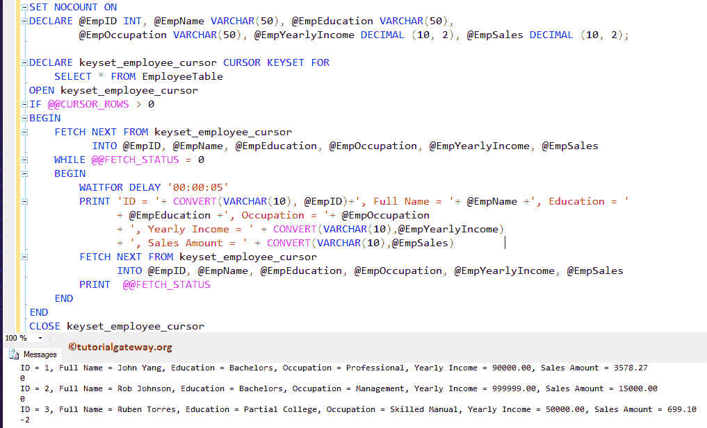

让我检查一下 Employee 表，原始表上是否发生了删除。

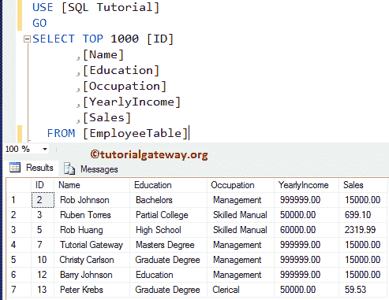