# 什么是 SQL 事务

> 原文：<https://www.tutorialgateway.org/sql-transaction/>

SQL 事务有助于作为一个集合执行多条语句。如果成功，在该 SQL 事务中所做的所有更改都将应用于该表。如果事务中的任何一条语句遇到错误，那么在该事务中所做的更改将被删除或回滚。

让我向您展示可以解释 SQL 事务的各种示例的列表。它们是 IF ELSE 中的 BEGIN TRANSACTION、COMMIT、ROLLBACK、named、Trans，以及 TRY CATCH 块中的 SQL Server 事务。处理 SQL Server 事务时要记住的事项列表。

*   每个 SQL 事务都应该以“开始事务”、“开始 TRAN”或“开始事务事务名”开头
*   SQL Server 中的每个事务都必须以提交或回滚语句结束。
*   提交事务:该语句告诉 SQL 保存在开始和提交之间所做的更改。这种说法有多种写法。您可以编写提交、提交 TRAN、提交事务或提交事务事务名称
*   回滚事务:该语句告诉 SQL 删除在开始和回滚之间所做的所有更改。这种说法有多种写法。您可以编写回滚、回滚 TRAN、回滚事务或回滚事务事务名称

## SQL 事务示例

在这个 SQL Server 示例中，我们将在 BEGIN 和 COMMIT 事务中放置一个 [INSERT INTO SELECT](https://www.tutorialgateway.org/sql-insert-into-select-statement/) 语句。如您所见，它将从“员工”表中选择前四条记录，并将它们存储在“员工记录”表中。

```
BEGIN TRAN

INSERT INTO [dbo].[EmployeeRecords] (
	         [EmpID], [FirstName], [LastName], [Education], [Occupation], [YearlyIncome], [Sales])
SELECT TOP 4 [EmpID], [FirstName], [LastName], [Education], [Occupation], [YearlyIncome], [Sales]
FROM [dbo].[Employee]

COMMIT TRANSACTION
```

运行上面的查询

```
Messages
--------
(4 row(s) affected)
```

让我们看看“员工记录”表中插入的行。

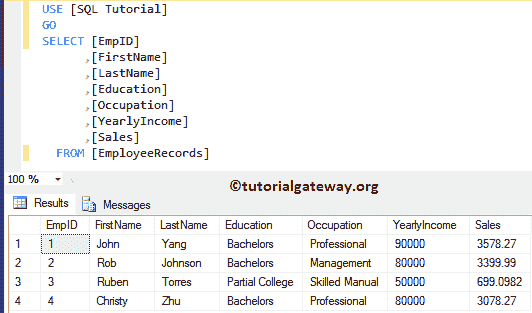

SQL server 中的事务不限于一条语句。我们可以在一个 trans 中放置多个语句。在这个 [SQL Server](https://www.tutorialgateway.org/sql/) 的例子中，我们将放一个[`INSERT`语句](https://www.tutorialgateway.org/sql-insert-statement/)，和[`UPDATE`语句](https://www.tutorialgateway.org/sql-update-statement/)

```
BEGIN TRANSACTION

INSERT INTO [dbo].[EmployeeRecords] (
	    [EmpID], [FirstName], [LastName], [Education], [Occupation], [YearlyIncome], [Sales])
     VALUES (5, 'SQL', 'Server', 'Education', 'Teaching', 10000, 200)

UPDATE [dbo].[EmployeeRecords]
	SET [Education] = 'Tutorials',
		[YearlyIncome] = 98000
	WHERE [EmpID] = 5

COMMIT TRANSACTION
```

在单个查询中运行插入和`UPDATE`语句

```
Messages
--------
(1 row(s) affected)
(1 row(s) affected)
```

之后“员工”表中的记录。

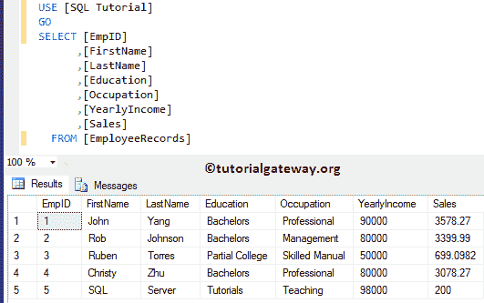

## 事务中的自动回滚

事务内部的语句作为一个集合执行，如果一个语句失败，那么剩下的语句不执行。这个过程在 SQL 中也被称为自动回滚事务。

这一次，我们将故意忽略事务中的一条语句。如您所见，`UPDATE`语句将返回一个错误，因为我们正在将字符串(VARCHAR)信息输入浮点数据类型。

```
BEGIN TRANSACTION

INSERT INTO [dbo].[EmployeeRecords] (
	    [EmpID], [FirstName], [LastName], [Education], [Occupation], [YearlyIncome], [Sales])
     VALUES (6, 'Tutorial', 'Gateway', 'Education', 'Learning', 65000, 1400)

UPDATE [dbo].[EmployeeRecords]
	SET [Education] = 'Masters',
	    [YearlyIncome] = 'Wrong Data'
	WHERE [EmpID] = 6

COMMIT TRANSACTION
```

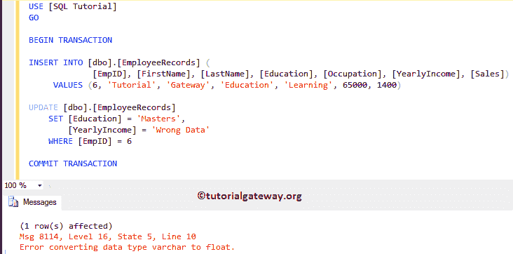

不过，`UPDATE`语句有一个错误。我们无法看到插入的记录，因为它被 SQL 回滚了。

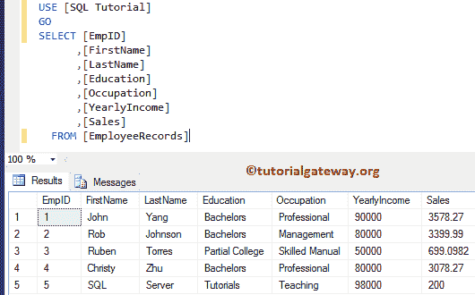

让我从上面的代码片段中删除 BEGIN 和 COMMIT，并执行这些语句。

```
INSERT INTO [dbo].[EmployeeRecords] (
	         [EmpID], [FirstName], [LastName], [Education], [Occupation], [YearlyIncome], [Sales])
     VALUES (6, 'Tutorial', 'Gateway', 'Education', 'Learning', 65000, 1400)

UPDATE [dbo].[EmployeeRecords]
	SET [Education] = 'Masters',
		[YearlyIncome] = 'Wrong Data'
	WHERE [EmpID] = 6
```

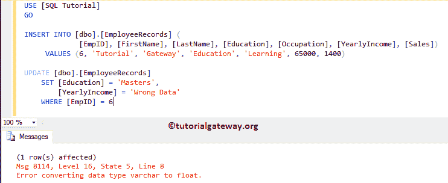

我插入了 Emp Id 6 的新记录，但未能更新。

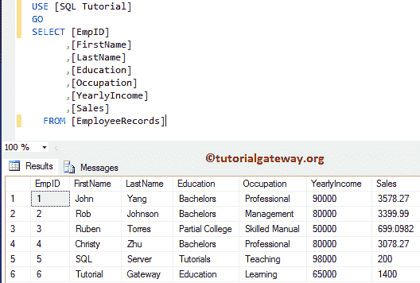

## SQL Server 中的回滚事务

SQL 中的回滚事务对于回滚到事务的开头或保存点非常有用。您可以使用这个 SQL 回滚来删除未完成的行或处理错误。

例如，如果您的事务正在插入一条新记录，并且抛出了一个错误，那么您可以使用这个回滚将表恢复到原始位置。

在本例中，我们将在 Employee 表中插入一条新记录，并在插入后应用回滚事务。为了演示这一点，我们在事务内部和外部都使用了`SELECT`语句。第一个`SELECT`语句将在事务完成之前向您显示表记录。

```
BEGIN TRANSACTION

INSERT INTO [dbo].[EmployeeRecords] (
	         [EmpID], [FirstName], [LastName], [Education], [Occupation], [YearlyIncome], [Sales])
     VALUES (7, 'SQL Server', 'Tutorial', 'Masters', 'Learn', 55000, 1250)

SELECT * FROM [dbo].[EmployeeRecords]

ROLLBACK TRANSACTION

SELECT * FROM [dbo].[EmployeeRecords]
```

虽然上面的语句没有错误，但是没有插入记录。

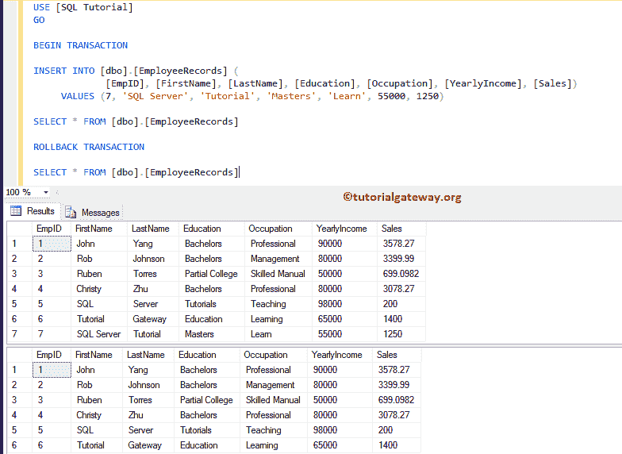

## SQL Server 中的命名事务

SQL Server 允许您命名事务。当您在一个查询中处理多个事务时，建议始终使用命名事务。

```
-- AddEmployee is the Transaction name
BEGIN TRANSACTION AddEmployee

INSERT INTO [dbo].[EmployeeRecords] (
	    [EmpID], [FirstName], [LastName], [Education], [Occupation], [YearlyIncome], [Sales])
     VALUES (7, 'SQL Server', 'Tutorial', 'Masters', 'Learn', 55000, 1250)

COMMIT TRANSACTION AddEmployee

SELECT * FROM [dbo].[EmployeeRecords]
```

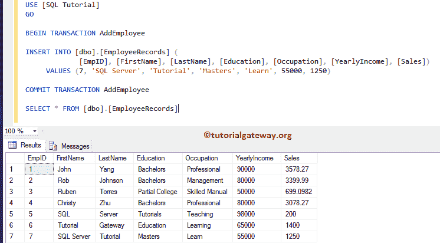

## 否则语句中的 SQL 事务

如果我们将事务放在任何条件语句中，比如 [IF ELSE](https://www.tutorialgateway.org/sql-if-else/) ，那么它们会非常有用。例如，在插入之前检查 employee 表中的现有记录，如果有，则回滚，否则提交等。

下面的语句是一个简单的 SQL Server 事务示例，其中我们声明了一个变量(假设用户要输入该值)。接下来，我们使用了`INSERT`语句，接下来在 If 中，我们检查@sales 是否小于 1000。如果为真，回滚事务；否则，在`SELECT`语句中提交事务。

```
DECLARE @Sales FLOAT = 250.0

BEGIN TRANSACTION AddEmployee

INSERT INTO [dbo].[EmployeeRecords] (
	    [EmpID], [FirstName], [LastName], [Education], [Occupation], [YearlyIncome], [Sales])
     VALUES (8, 'Dave', 'Rob', 'High School', 'Professional', 85000, @Sales)

IF @Sales < 1000
	BEGIN
	    ROLLBACK TRANSACTION AddEmployee
	    PRINT 'Sorry! Sales Amount Should be More than 1000'
	END
ELSE
	BEGIN
		COMMIT TRANSACTION AddEmployee
		PRINT 'Inserted the Record Successfully'
	END		
SELECT * FROM [dbo].[EmployeeRecords]
```

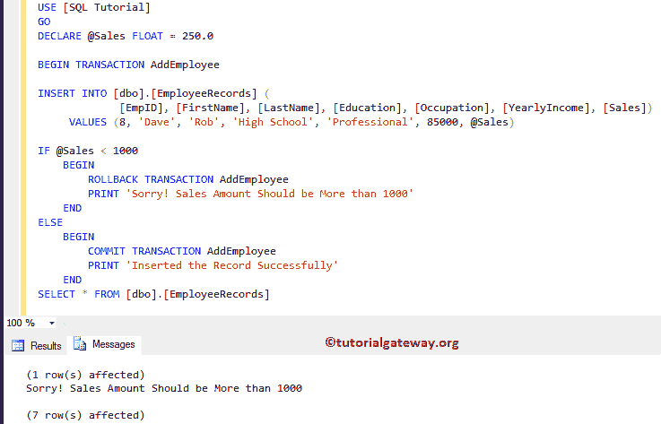

让我给你看看记录

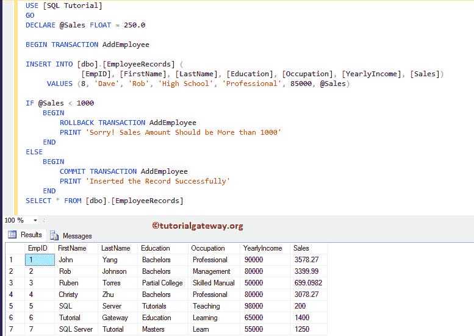

这次，我们将变量@Sales 值更改为 1450.02

```
DECLARE @Sales FLOAT = 1450.02

BEGIN TRANSACTION AddEmployee

INSERT INTO [dbo].[EmployeeRecords] (
	    [EmpID], [FirstName], [LastName], [Education], [Occupation], [YearlyIncome], [Sales])
     VALUES (8, 'Dave', 'Rob', 'High School', 'Professional', 85000, @Sales)

IF @Sales < 1000
	BEGIN
	    ROLLBACK TRANSACTION AddEmployee
	    PRINT 'Sorry! Sales Amount Should be More than 1000'
	END
ELSE
	BEGIN
		COMMIT TRANSACTION AddEmployee
		PRINT 'Inserted the Record Successfully'
	END		
SELECT * FROM [dbo].[EmployeeRecords]
```

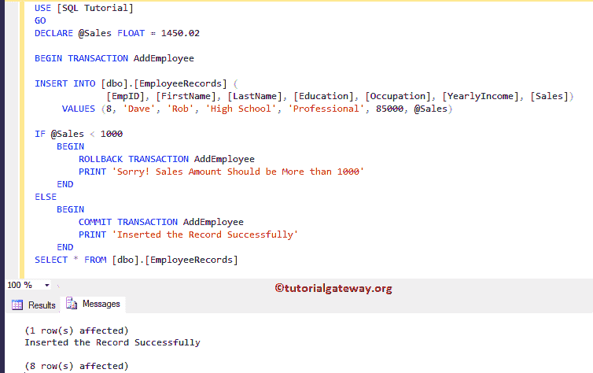

员工表中的结果数据。

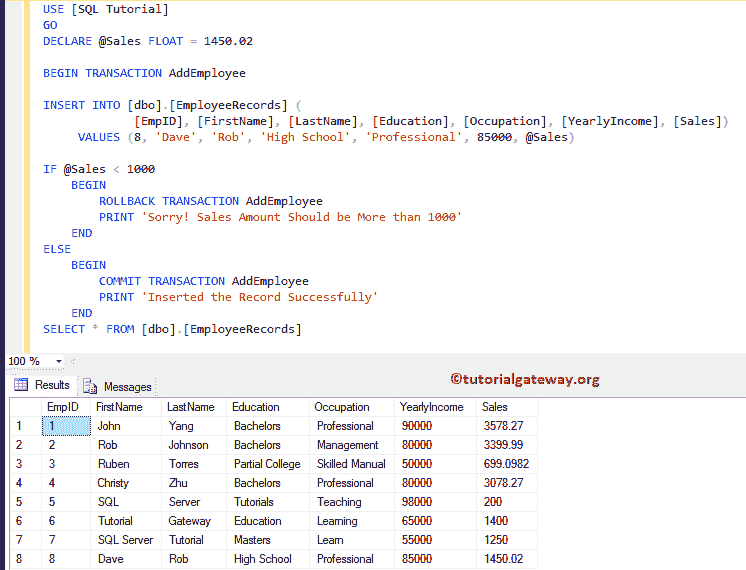

## TRY CATCH 中的 SQL 事务

如果我们将 SQL Server 事务放在 [TRY CATCH](https://www.tutorialgateway.org/sql-try-catch/) 块中，它们会非常有用。例如，如果其中有错误，那么可以使用 catch 块将事务回滚到原始位置。

这是一个简单的 SQL 事务示例，我们在其中放置了一个 select 和一个`UPDATE`语句。如果仔细观察，我们的`UPDATE`语句会因为数据类型冲突而抛出一个错误。

```
BEGIN TRY
	BEGIN TRANSACTION AddEmployee

	INSERT INTO [dbo].[EmployeeRecords] (
			[EmpID], [FirstName], [LastName], [Education], [Occupation], [YearlyIncome], [Sales])
		 VALUES (9, 'Chong', 'Lee', 'Tutorials', 'Developer', 66500, 1950)

	UPDATE [dbo].[EmployeeRecords]
		SET [Education] = 'Bachelors',
		    [YearlyIncome] = 'Hey You gotme Wrong!'
		WHERE [EmpID] = 9

	COMMIT TRANSACTION AddEmployee
	PRINT 'Inserted the Record Successfully'
END TRY
BEGIN CATCH
	ROLLBACK TRANSACTION AddEmployee
	PRINT 'Sorry! There is a Data Type Mismatch for yearly Income'
END CATCH

SELECT * FROM [dbo].[EmployeeRecords]
```

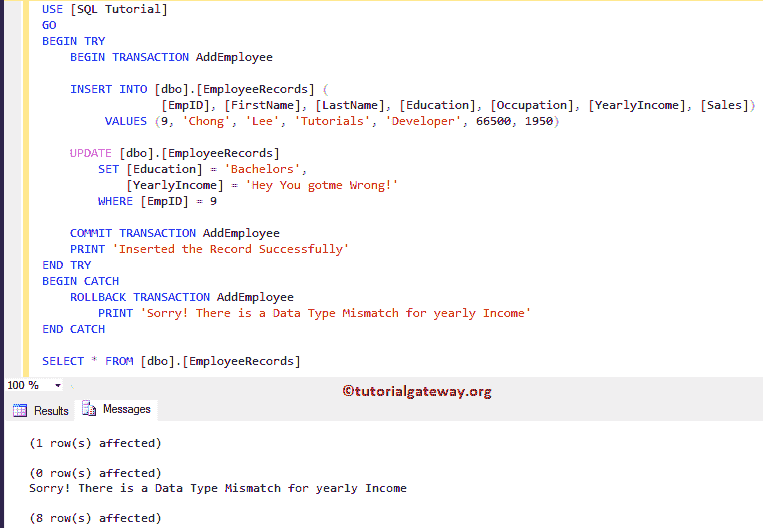

而表格里面的数据是:

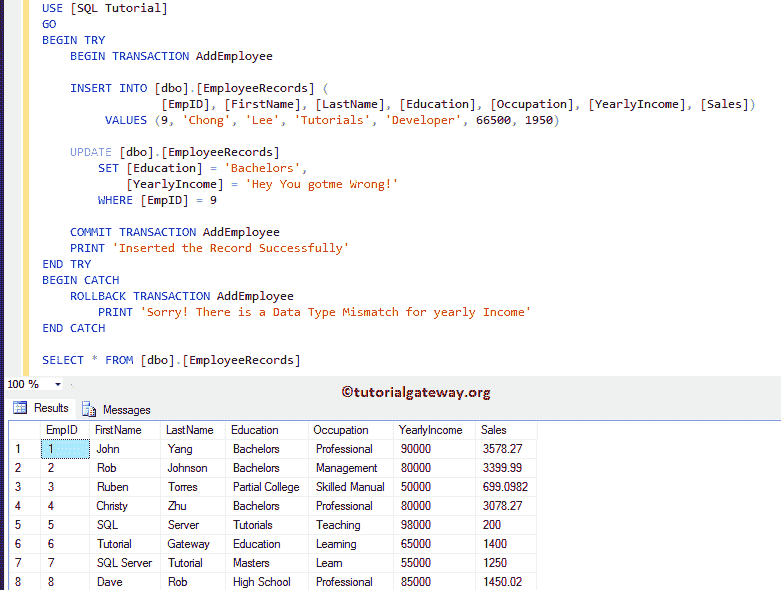

让我将年收入值更改为 91567 并运行它

```
BEGIN TRY
	BEGIN TRANSACTION AddEmployee

	INSERT INTO [dbo].[EmployeeRecords] (
				 [EmpID], [FirstName], [LastName], [Education], [Occupation], [YearlyIncome], [Sales])
		 VALUES (9, 'Chong', 'Lee', 'Tutorials', 'Developer', 66500, 1950)

	UPDATE [dbo].[EmployeeRecords]
		SET [Education] = 'Bachelors',
			[YearlyIncome] = 91567 -- We changed it
		WHERE [EmpID] = 9

	COMMIT TRANSACTION AddEmployee
	PRINT 'Inserted the Record Successfully'
END TRY
BEGIN CATCH
	ROLLBACK TRANSACTION AddEmployee
		PRINT 'Sorry! There is a Data Type Mismatch for yearly Income'
END CATCH

SELECT * FROM [dbo].[EmployeeRecords]
```

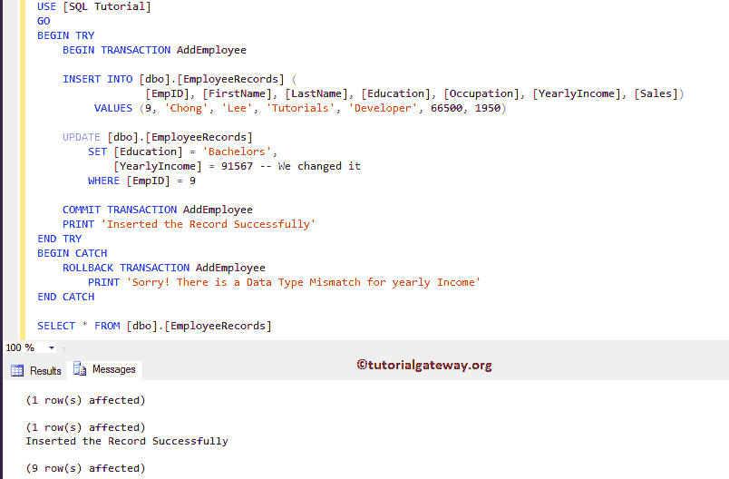

而员工表里面的数据是:

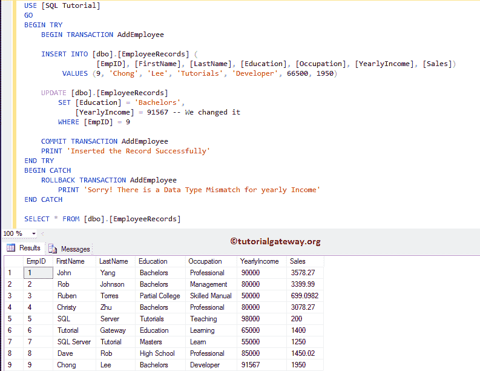

## SQL 事务常见错误

在查询中使用它们时会出现的常见错误之一。正如您所看到的，我们在 BEGIN TRANSACTION 之后使用了简单的`UPDATE`语句，但是忘记提到提交或回滚

```
BEGIN TRANSACTION 
	UPDATE [dbo].[EmployeeRecords]
		SET [YearlyIncome] = 125896
		   WHERE [EmpID] = 6
```

```
Messages
--------
(1 row(s) affected)
```

让我再打开一个查询窗口(单击 SSMS 的新建查询)，并编写一个简单的`SELECT`语句来选择“员工记录”表中的所有记录。

看行刑时间比平时长。因为默认情况下 [`SELECT`语句](https://www.tutorialgateway.org/sql-select-statement/)会返回提交的数据，我们忘记提交更新了。

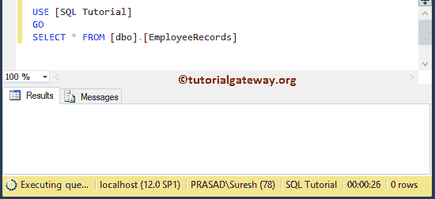

让我将事务隔离级别设置为未提交读取。它将读取未提交的数据。

```
SET TRANSACTION ISOLATION LEVEL READ UNCOMMITTED
SELECT * FROM [dbo].[EmployeeRecords]
```

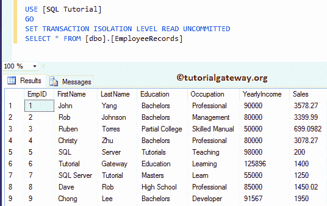