# SQL Server 中的嵌套事务

> 原文：<https://www.tutorialgateway.org/nested-transactions-in-sql-server/>

在我们的上一篇文章中，我们用例子解释了关于事务的一切。在这里，我们向您展示了什么是 SQL Server 中的嵌套事务，以及如何通过示例来创建它们。我们还将讨论 SQL Server 中的事务保存点。

从下面的截图中，您可以看到，我们创建了一个新表来演示 SQL Server 嵌套事务。

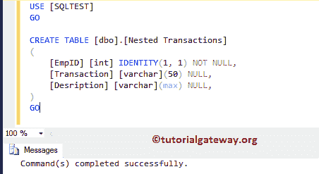

请参考 [SQL 事务](https://www.tutorialgateway.org/sql-transaction/)文章，了解 [SQL Server](https://www.tutorialgateway.org/sql/) 事务的概念。

## SQL Server 中的嵌套事务示例 1

在这个 SQL Server 嵌套事务示例中，我们将使用@@TRANCOUNT 来显示每一层发生的事务数量。这是一个简单的例子，没有任何问题。

```
SELECT 'Before Staring any Transaction', @@TRANCOUNT 

BEGIN TRANSACTION TRAN1

	SELECT 'After Staring First Transaction', @@TRANCOUNT 
        -- Second Transaction Start
	BEGIN TRANSACTION TRAN2 

		SELECT 'After Staring Second Transaction', @@TRANCOUNT 

	COMMIT TRANSACTION TRAN2
        -- End Of Second Transaction 
	SELECT 'After Commiting the Second Transaction', @@TRANCOUNT 

COMMIT TRANSACTION TRAN1

SELECT 'After Commiting the First Transaction', @@TRANCOUNT
```

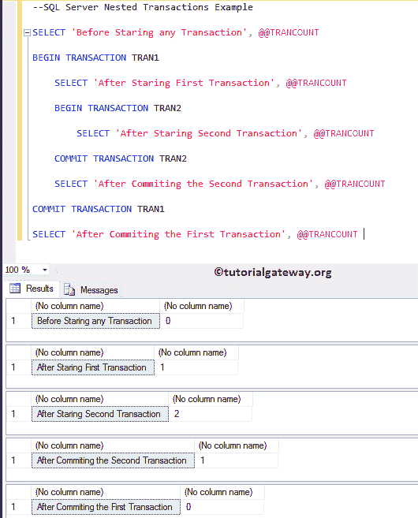

让我向您展示这个 SQL Server 嵌套事务的实际例子。在这个例子中，我们使用了两个 [`INSERT`语句](https://www.tutorialgateway.org/sql-insert-statement/)。一个在主事务中，另一个在嵌套事务中。

```
USE [SQLTEST]
GO

BEGIN TRANSACTION TRAN1

	INSERT INTO [dbo].[Nested Transactions] 
				([Transaction], [Desription])
	VALUES		('Tran1', 'This is Outer Transaction 1')

	BEGIN TRANSACTION TRAN2 
		INSERT INTO [dbo].[Nested Transactions] 
					([Transaction], [Desription])
		VALUES		('Tran2', 'This is Inner Transaction 1')

	COMMIT TRANSACTION TRAN2

COMMIT TRANSACTION TRAN1

SELECT [EmpID], [Transaction], [Desription]
FROM [Nested Transactions]
```

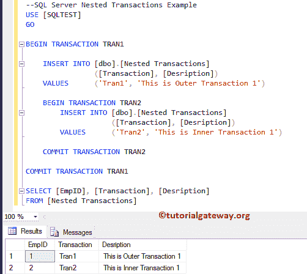

## SQL Server 中的嵌套事务示例 2

在这个例子中，我们正在检查如果我们使用回滚事务作为嵌套事务会发生什么。

```
SELECT 'Before Staring any Transaction', @@TRANCOUNT 

BEGIN TRANSACTION TRAN1

	SELECT 'After Staring First Transaction', @@TRANCOUNT 

	BEGIN TRANSACTION 		
		SELECT 'After Staring Second Transaction', @@TRANCOUNT 
	ROLLBACK TRANSACTION

	SELECT 'After Rollback the Second Transaction', @@TRANCOUNT 

COMMIT TRANSACTION TRAN1

SELECT 'After Commiting the First Transaction', @@TRANCOUNT
```

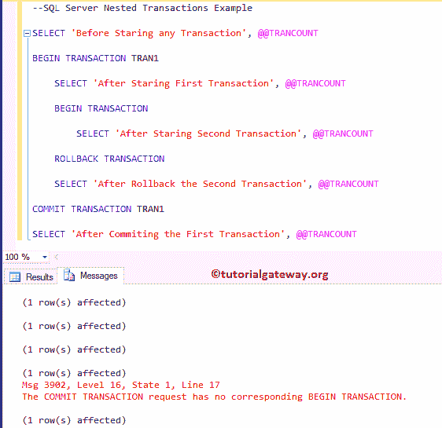

如您所见，它为最后一次提交事务 TRAN1 语句抛出了一条错误消息。因为 ROLLBACK 将回滚所有语句。

您可以观察到，在执行回滚之后，没有任何事务在运行。

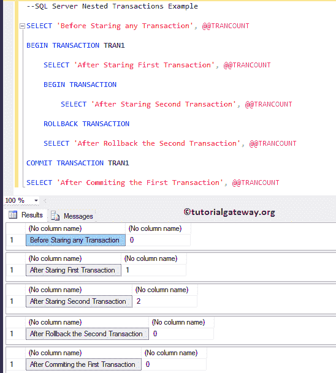

在这个例子中，我们使用了两个 [`INSERT`语句](https://www.tutorialgateway.org/sql-insert-statement/)。一个在主事务中，另一个在嵌套事务中。

```
USE [SQLTEST]
GO

BEGIN TRANSACTION TRAN1

	INSERT INTO [dbo].[Nested Transactions] 
				([Transaction], [Desription])
	VALUES		('Tran3', 'This is Outer Transaction 2')

	BEGIN TRANSACTION 
		INSERT INTO [dbo].[Nested Transactions] 
					([Transaction], [Desription])
		VALUES		('Tran4', 'This is Inner Transaction 2')

	ROLLBACK TRANSACTION 

COMMIT TRANSACTION TRAN1

SELECT [EmpID], [Transaction], [Desription]
FROM [Nested Transactions]
```

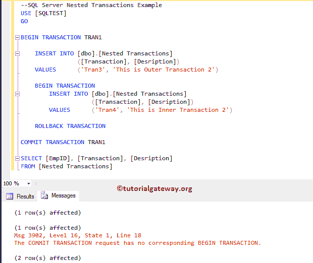

从下面的截图看，没有发生插入。

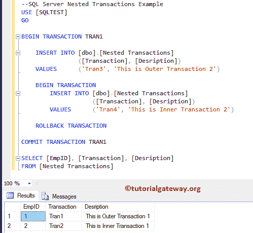

## SQL 嵌套事务示例 3

这里，我们正在检查如果我们使用回滚事务作为外部事务会发生什么。

```
SELECT 'Before Staring any Transaction', @@TRANCOUNT 

BEGIN TRANSACTION 

	SELECT 'After Staring First Transaction', @@TRANCOUNT 

	BEGIN TRANSACTION TRAN2 
		SELECT 'After Staring Second Transaction', @@TRANCOUNT 
	COMMIT TRANSACTION TRAN2

	SELECT 'After Commiting the Second Transaction', @@TRANCOUNT 

ROLLBACK TRANSACTION 

SELECT 'After the First Transaction is Rollbacked', @@TRANCOUNT
```

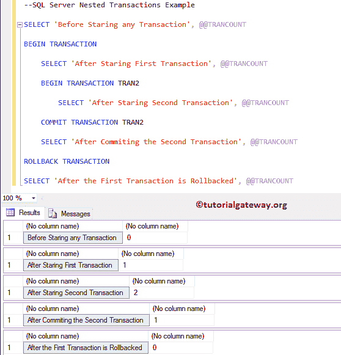

让我向您展示一个实用的 SQL 嵌套事务示例。

```
USE [SQLTEST]
GO

BEGIN TRANSACTION

	INSERT INTO [dbo].[Nested Transactions] 
				([Transaction], [Desription])
	VALUES		('Tran4', 'This is Outer Transaction 4')

	BEGIN TRANSACTION 
		INSERT INTO [dbo].[Nested Transactions] 
					([Transaction], [Desription])
		VALUES		('Tran5', 'This is Inner Transaction 5')

	COMMIT TRANSACTION 

ROLLBACK TRANSACTION

SELECT [EmpID], [Transaction], [Desription]
FROM [Nested Transactions]
```

它将回滚第一个事务和第二个事务中的所有内容。

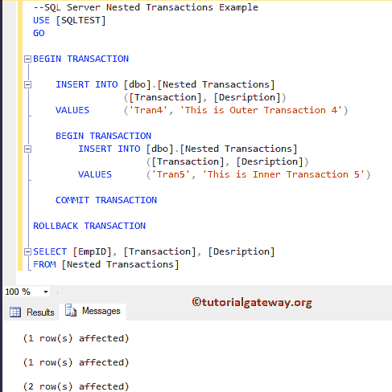

## SQL Server 事务保存点示例

让我们看看 SQL 事务保存点的工作功能。在下面的代码片段中，我们有 SAVE TRAN，这个命令将保存到那时的数据。

例如，如果在该点之后发生任何灾难，或者执行的任何回滚命令都不会在 SQL 事务保存点之前删除数据。

```
SELECT 'Before Staring any Transaction', @@TRANCOUNT 

BEGIN TRANSACTION TRAN1

 SELECT 'After Staring First Transaction', @@TRANCOUNT 

 SAVE TRAN TRAN2  
 SELECT 'Within the Save Transaction', @@TRANCOUNT 
 ROLLBACK TRAN TRAN2

 SELECT 'After Rollback th Save Transaction', @@TRANCOUNT 

COMMIT TRANSACTION TRAN1

SELECT 'After the First Transaction is Commited', @@TRANCOUNT 
```

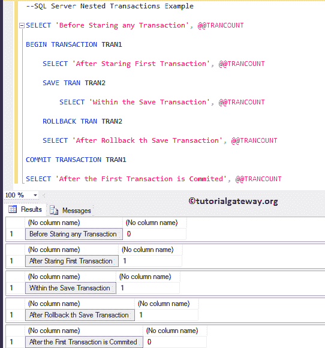

Sql Server 事务保存点的实例。

```
USE [SQLTEST]
GO

BEGIN TRANSACTION TRAN1

	INSERT INTO [dbo].[Nested Transactions] 
				([Transaction], [Desription])
	VALUES		('Tran6', 'This is Outer Transaction 6')

	SAVE TRANSACTION TRAN2
		INSERT INTO [dbo].[Nested Transactions] 
					([Transaction], [Desription])
		VALUES		('Tran7', 'This is Inner Transaction 7')

	ROLLBACK TRANSACTION TRAN2

COMMIT TRANSACTION TRAN2

SELECT [EmpID], [Transaction], [Desription]
FROM [Nested Transactions]
```

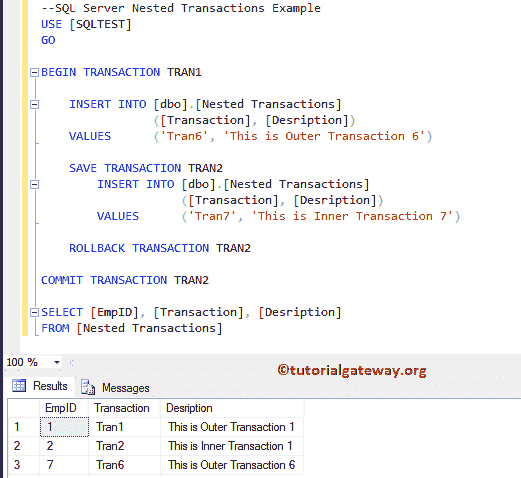