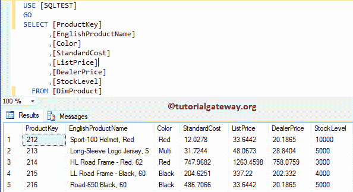
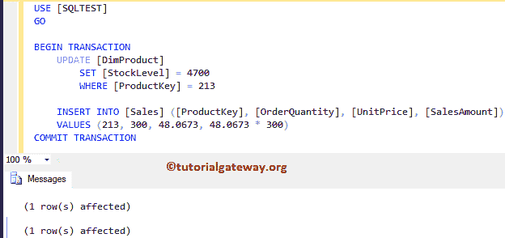
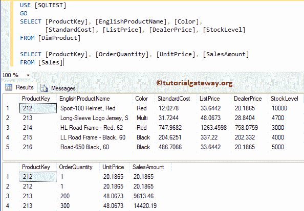
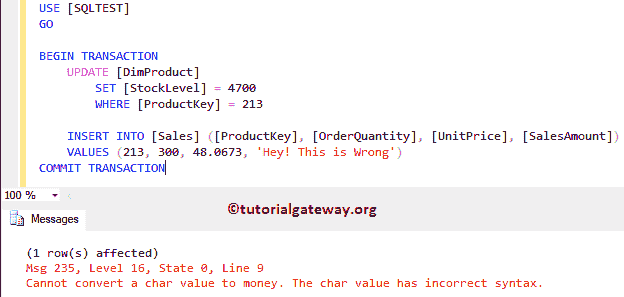
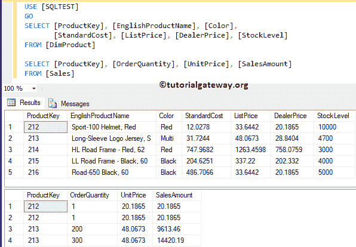
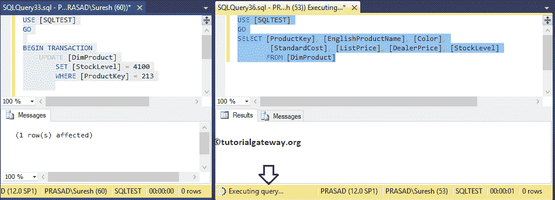
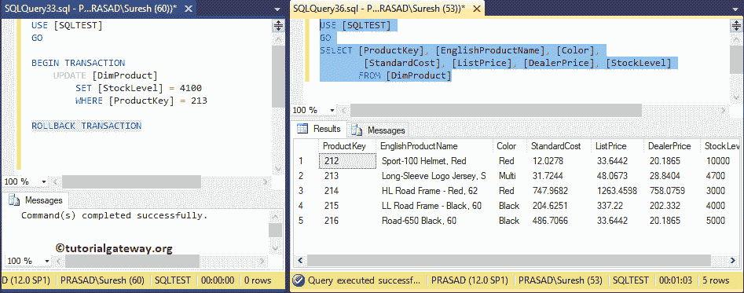

# SQL 服务器中的酸性属性

> 原文：<https://www.tutorialgateway.org/acid-properties-in-sql-server/>

SQL Server 中的 ACID 属性可确保事务期间的数据完整性。SQL ACID 是原子性、一致性、隔离性、持久性的缩写。

在前一篇文章中，我们已经解释了事务和嵌套事务。所以，在 SQL Server 中的这些 ACID 属性之前，我建议你参考一下。在本文中，让我定义 SQL Server 中的每个 ACID 属性:

*   原子性:SQL 中原子性的酸性。这意味着事务中的所有操作(插入、更新、删除)要么发生，要么不发生。或者你可以说，事务中的所有语句(插入、更新、删除)要么完成，要么回滚。
*   一致性:这个 SQL ACID 属性确保了数据库的一致性。这意味着，无论事务中间发生什么，这个 acid 属性都不会让您的数据库处于半完成状态。
    *   如果事务成功完成，那么它会将所有更改应用到数据库。
    *   如果事务中有错误，那么已经进行的所有更改都将自动回滚。这意味着数据库将恢复到事务开始之前的状态。
    *   如果在事务处理过程中出现系统故障，那么已经进行的所有更改也会自动回滚。
*   隔离:每个事务都是独立的，一个事务在完成之前不能访问其他事务的结果。或者，您不能同时使用多个事务执行相同的操作。我们将在另一篇文章中解释这个 SQL acid 属性。
*   持久性:一旦事务完成，它对数据库所做的更改将是永久性的。即使出现系统故障或任何异常变化，该 SQL acid 属性也将保护提交的数据。

## SQL 服务器示例中的 ACID 属性

我们将使用 Dim 产品和销售表来解释 Sql Server ACID 属性。下面截图会给大家展示 DimProduct 表



里面的数据

而一张销售表里面的数据是:


对于这个 SQL Acid 属性演示，每当销售发生时，我们必须根据订单数量更新库存水平。例如，如果 A 订购了十种产品(产品密钥= 216)，那么将库存水平更新为 4990，并在销售表中插入一条新记录。

### SQL ACID 中的原子性

这意味着事务内部的所有语句应该作为一个单元成功或失败。为了演示这个 SQL 原子性 Acid 属性，我们在事务内部使用了一个 [UPDATE](https://www.tutorialgateway.org/sql-update-statement/) 和一个 [INSERT](https://www.tutorialgateway.org/sql-insert-statement/) 语句。请参考[交易](https://www.tutorialgateway.org/sql-transaction/)和[嵌套交易](https://www.tutorialgateway.org/nested-transactions-in-sql-server/)文章。

```
USE [SQLTEST]
GO
BEGIN TRANSACTION
	UPDATE [DimProduct]
		SET [StockLevel] = 4700
		WHERE [ProductKey] = 213

	INSERT INTO [Sales] ([ProductKey], [OrderQuantity], [UnitPrice], [SalesAmount])
	VALUES (213, 300, 48.0673, 48.0673 * 300)
COMMIT TRANSACTION
```



交易后，让我给你看一下“产品”和“销售”表中的记录。



这一次，我们将在销售表中插入错误的信息，以故意使插入失败。

```
USE [SQLTEST]
GO

BEGIN TRANSACTION
	UPDATE [DimProduct]
		SET [StockLevel] = 4700
		WHERE [ProductKey] = 213

	INSERT INTO [Sales] ([ProductKey], [OrderQuantity], [UnitPrice], [SalesAmount])
	VALUES (213, 300, 48.0673, 'Hey! This is Wrong')
COMMIT TRANSACTION
```



让我给你看看那笔交易后点心产品和销售表中的记录。从上面的 acid 属性截图中可以看到，一个提交的行(更新语句)已经回滚。



### SQL Server ACID 中的一致性

让我用上面的例子来解释这个 SQL ACID 属性。比方说，交易用新数据更新了股票，突然出现了系统故障(就在插入销售之前或中间)。在这种情况下，系统将回滚更新。否则，你无法追踪股票信息。

### SQL Server ACID 中的隔离

在事务完成之前，一个事务不能访问其他事务的结果。对于 [SQL Server](https://www.tutorialgateway.org/sql/) 中的这个 Acid 属性，它使用锁来锁定表。如您所见，我们使用两个独立的实例:

*   第一个实例:我们启动了事务并更新了记录，但是我们还没有提交或回滚事务。
*   第二种情况:使用 [Select 语句](https://www.tutorialgateway.org/sql-select-statement/)选择 Dim Product 表中存在的记录。

从下面的 acid 属性截图中可以看到，select 语句没有返回任何信息。因为我们不能在不完成交易的情况下访问一个交易结果。



让我执行回滚事务。它将立即显示 Select 语句的结果，因为锁已从 Dim Product 表中释放。



希望你了解 SQL Server 中的 ACID 属性。