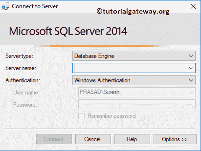
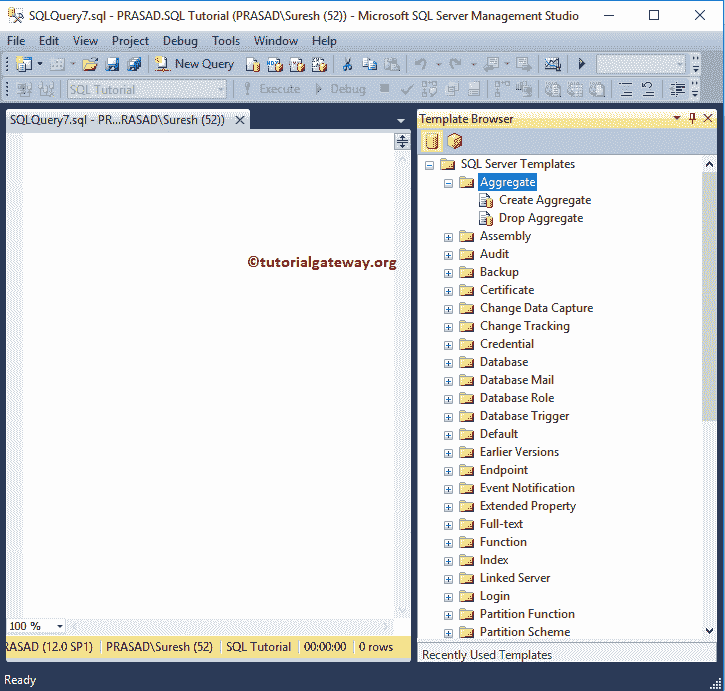
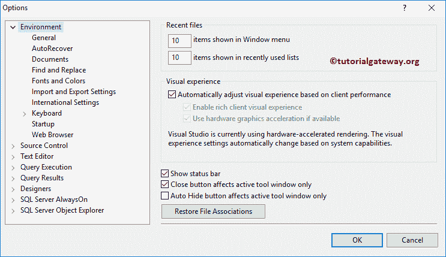

# SQL Server 管理工作室

> 原文：<https://www.tutorialgateway.org/sql-server-management-studio/>

微软的 SQL Server 管理工作室，简称 SSMS，是一个灵活的和最强大的工具来使用 SQL Server。SQL Server 管理工作室不是真正的服务器，但它提供了一个连接和优雅工作的机会。在本节中，我们将介绍这个 SQL management studio 工具中可用的大多数选项。

## 如何启动 SQL Server 管理工作室？

要打开或启动 SSMS，请在起始页上键入 SQL Server Management Studio，或打开运行对话框并键入 SSMS.exe

或者，您可以导航到 C:\ ProgramData \ Microsoft \ Windows \开始菜单\程序\ Microsoft SQL server 2014(64 位)和 C:\ ProgramData(x86)\ Microsoft \ Windows \开始菜单\程序\ Microsoft SQL server 2014(32 位)，然后单击应用程序。

单击 SQL 管理工作室后，将打开一个名为“连接到服务器”的新窗口。

提示:请参考[安装 SQL](https://www.tutorialgateway.org/install-sql-server/) 完整了解安装 [SQL Server](https://www.tutorialgateway.org/sql/) 涉及的步骤。请参考[安装 SSMS](https://www.tutorialgateway.org/install-sql-server-management-studio/) 以遵循仅安装 SQL Server Management Studio 所涉及的步骤。

SQL 管理工作室将帮助您连接四种不同的服务器类型

1.  数据库引擎:使用关系数据库。这里，我们使用 Transact-sql 查询与服务器通信。
2.  分析服务:这是为了配合[分析服务](https://www.tutorialgateway.org/ssas/) (SSAS)。
3.  报告服务:此类型用于[报告服务](https://www.tutorialgateway.org/ssrs/) (SSRS)。
4.  集成服务:与[集成服务](https://www.tutorialgateway.org/ssis/) (SSIS)合作。

让我选择服务器类型为数据库引擎

服务器名:它只是一个实例名。

*   默认实例:如果安装了默认实例，则可以使用本地主机、系统 IP 地址。，计算机名。
*   命名实例:如果安装了命名实例，则必须指定实例名称。例如，如果您的系统名是 PRASAD，而实例名是 John，则使用 PRASAD\John

SQL Server Management Studio 身份验证:您必须选择要用于连接到服务器的身份验证。

*   窗口身份验证:如果您是系统管理员，并且安装在本地计算机上，则可以使用此选项。
*   SQL Server 身份验证:在实时中，我们总是必须使用这种身份验证模式。它将要求用户输入用户名和密码进行连接。

这里我使用的是 SQL Server 身份验证，并提供了我的登录凭据

### SQL Server 管理工作室界面

通过单击连接，将打开下面显示的窗口。这就是我们所说的 SQL Server 管理工作室或 SSMS。如果我们想针对任何数据库编写查询，那么您必须单击“新建查询”按钮。

单击“新建查询”按钮后，查询窗口将在 SQL Server 管理工作室中打开。

1.  对象资源管理器:它是一个树形视图结构，将显示服务器中的所有数据库对象。
    *   数据库:保存服务器上可用的数据库。它包括属于数据库引擎、分析服务、报告服务和集成服务的数据库。
    *   安全性:它包含所有与安全性相关的内容。使用此文件夹[创建登录](https://www.tutorialgateway.org/create-sql-server-login/)、[服务器角色](https://www.tutorialgateway.org/create-sql-server-roles/)等。
    *   服务器对象:该文件夹包含有关链接服务器、服务代理、系统端点、数据库镜像等的信息。
    *   复制:此文件夹包含有关订阅和发布的信息。
    *   管理:使用此文件夹进行维护，如检查服务器日志、会话运行状况等。该文件夹用于创建[维护计划](https://www.tutorialgateway.org/sql-maintenance-plan/)
2.  查询窗口:针对任何数据库编写查询。或者您可以使用[查询生成器](https://www.tutorialgateway.org/sql-query-builder/)以图形方式构建您的查询

让我向您展示数据库文件夹中的数据库列表

从 SQL Server 管理工作室对象资源管理器中，您还可以连接和断开它。这里有一个 Refresh 按钮，如果没有找到

所做的修改，可以使用这个按钮

### SQL Server 管理工作室标准工具栏

SQL Server 管理工作室中可用按钮的列表及其在标准工具栏中的使用

1.  新项目:这将创建一个新项目，如黑色解决方案、脚本和分析服务脚本
2.  打开文件:在文件系统中导航以选择脚本文件
3.  保存查询:使用此选项将当前查询窗口保存在文件系统中。
4.  全部保存:这将保存文件系统中的所有查询窗口。
5.  新查询:如果我们想针对任何数据库编写查询，那么您必须单击这个新查询
6.  可用数据库:此下拉列表将显示此服务器上可用的所有数据库。您可以选择要使用的数据库。
7.  数据库引擎查询:打开“新建查询”窗口和“连接到数据库引擎”窗口。首先，您必须连接到数据库引擎，然后可以使用查询窗口编写查询。
8.  分析服务 MDX 查询:打开一个新的 [MDX](https://www.tutorialgateway.org/mdx/) 窗口以及连接到分析服务窗口。首先，您必须连接到[分析服务](https://www.tutorialgateway.org/ssas/)，然后使用 MDX 查询窗口针对[立方体](https://www.tutorialgateway.org/create-cube-dimension-in-ssas/)编写您的 MDX 查询。
9.  分析服务 DMX 查询:打开“新建 DMX”窗口和“连接到分析服务”窗口。
10.  SSAS XMLA 查询:它打开一个新的 XMLA 窗口以及连接到分析服务窗口。
11.  剪切:此按钮将剪切选定的文本。
12.  复制选定的文本。
13.  粘贴剪切或复制的内容
14.  撤消更改
15.  在查询窗口中重做更改
16.  向后导航:使用此按钮向后导航
17.  向前导航:向前导航
18.  活动监视器:请点击此按钮查看活动监视器。它包含关于流程、资源、数据文件等的信息。
19.  开始调试:调试代码。
20.  在文件中查找:用它来查找您的文件。
21.  查找:在查询窗口中查找所需文本
22.  解决方案资源管理器:通过单击此按钮，解决方案资源管理器窗口被添加到 SSMS
23.  属性窗口:通过单击此按钮，属性窗口被添加到 SSMS
24.  工具箱:通过单击此按钮，工具箱被添加到左侧

如前所述，如果您点击新建项目按钮，将打开以下窗口。在这里，您可以选择脚本、分析服务脚本或黑色解决方案

当您单击“查找和替换”按钮时，将打开以下窗口。用这个代替任何东西。

解决方案资源管理器将向您显示文件信息。属性窗口将显示查询的所有信息，如连接、查询执行时间、持续时间、返回的行等。

### SQL Server 管理工作室编辑器工具栏

让我向您展示 SQL Management Studio 中可用按钮的列表以及它们在编辑器工具栏中的用途

1.  连接:用于连接到服务器
2.  更改连接:您可以通过单击此按钮来更改现有连接
3.  可用数据库:该下拉列表将显示该服务器上可用的所有[数据库](https://www.tutorialgateway.org/how-to-create-database-in-sql-server/)。您可以选择要使用的数据库。
4.  执行:它在查询窗口中执行查询，并在结果窗格中返回结果。
5.  调试:帮助你首次展示你的代码。
6.  停止:它将停止正在运行的查询。它将帮助您停止长时间运行的查询。
7.  解析:用它来检查查询是否被解析。
8.  显示预计执行计划:这将显示此特定查询的预计执行计划
9.  查询选项:使用此按钮设置行计数、文本大小和执行超时。
10.  启用智能感知:通过单击此选项，您可以为此查询窗口启用 SQL Server Management Studio 智能感知。它将帮助您找到语法错误，并自动建议函数名。
11.  包括实际执行计划:启用此选项将包括实际执行计划以及查询结果。它会帮助你理解执行
12.  包含客户端统计信息:启用此选项将包含客户端统计信息(执行类型、发送和接收的字节等)以及查询结果。它会帮助你理解执行
13.  结果到文本:结果将显示为文本。
14.  结果到网格:结果将以表格格式或网格格式显示。这是默认的
15.  结果到文件:使用此选项将查询结果保存在文本文件中。
16.  注释掉所选行:单击此按钮对当前行进行注释。
17.  取消对选定行的注释:单击此按钮取消对当前行或选定行的注释。
18.  减少缩进:用于减少距离
19.  增加缩进:用它来增加距离。使用减少缩进和增加缩进来准确地组织代码。
20.  指定模板参数的值:用于指定模板参数的值

### SQL Server 管理工作室文件菜单

使用“文件”菜单连接对象资源管理器，创建新项目，打开现有项目和文件，保存查询并关闭。

### SQL Server 管理工作室编辑菜单

用于执行剪切、复制、粘贴、删除、替换等操作。我们已经在标准工具栏部分解释过了

### SQL Server 管理工作室视图菜单

它是 SQL Server 管理工作室中的关键菜单之一。下面的截图将向您展示该菜单上可用选项的列表。

如果您的 SSMS 没有显示对象资源管理器窗口，则单击对象资源管理器子菜单将为您恢复该窗口。SQL Server Management Studio 可以显示您选择的每个对象的报告。要获取这些信息，您必须选择 SSMS

的对象浏览器详细信息子菜单

使用向前和向后导航向前和向后移动。

让我从查看菜单

中选择注册服务器子菜单

它显示您经常管理的服务器。通过单击立方体，您可以看到分析。单击报告按钮将显示报告，最后一个按钮是显示集成。

让我从“SQL Server 管理工作室视图”菜单中选择“模板浏览器”子菜单

选择模板资源管理器子菜单后，模板浏览器将添加到 SQL Server 管理工作室

在 SQL Server Management Studio 模板浏览器下，您可以看到所有现有模板及其定义。

在分析服务模板下，您可以看到 DMX 模板、XMLA 模板和 MDX 模板。通过单击单个项目，您可以看到它们的定义。

### SQL Server 管理工作室查询菜单

我们已经在编辑器工具栏部分

解释了所有这些选项

### SQL Server 管理工作室调试菜单

使用“调试”菜单开始调试并使用 SQL Server 管理工作室中的断点。

### SQL Server 管理工作室工具菜单

使用此菜单可以个性化设计器视图，或者选择第三方工具箱项等。现在，我们将探索选项…子菜单，所以，让我选择相同的

通过单击选项..将打开以下窗口。使用此窗口更改默认颜色、字体类型、大小、粗细、键盘快捷键等。

我建议你探索所有的选择，但是记得记下你所做的改变。如果出了什么问题，那么这将帮助你快速恢复。或者，使用每页上的“恢复默认值”按钮将设置恢复为默认设置。

查询执行:可以设置默认的[行数](https://www.tutorialgateway.org/sql-rowcount/)、TEXTSIZE 和执行超时。

查询结果:您可以更改查询结果的默认目标

*   结果到文本:结果将显示为文本。
*   结果到网格:结果以表格格式或网格格式显示。这是默认的
*   结果到文件:使用此选项将查询结果保存在文本文件中。

设计者:使用此页面更改表格选项

### SQL Server 管理工作室窗口菜单

如果您是新用户，您可能会不小心将一些窗口(窗格)放在了错误的位置。在这种情况下，您可以使用重置窗口布局将 SQL Server 管理工作室恢复到其原始位置。

提示:请参考[卸载 SSMS](https://www.tutorialgateway.org/uninstall-sql-server-management-studio/) 了解仅删除或卸载 SQL Management Studio 所涉及的步骤。