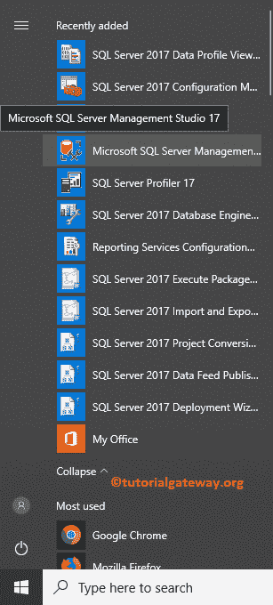

# 安装 SQL Server 管理工作室

> 原文：<https://www.tutorialgateway.org/install-sql-server-management-studio/>

在本文中，我们将通过截图向您展示安装 SQL Server Management Studio 的分步过程。如果您的系统有 SQL Server 实例，并且您想要控制来自 SSMS 的数据，那么 SQL Management Studio 将非常有用。

## 安装 SQL Server 管理工作室–第一种方法

如果您有安装光盘，请将安装介质插入驱动器以安装 SQL Server Management Studio。在根文件夹中，双击 setup.exe，如下所示。

单击 setup.exe 后，将会打开一个名为安装中心的新安装向导，如下所示。接下来，转到安装选项卡，单击新建 [SQL Server](https://www.tutorialgateway.org/sql/) 独立安装或向现有安装超链接添加功能

首先，流程将检查更新

接下来，它将进入“安装规则”窗口。在这里，安装程序将自动前进并执行操作。在这里，它必须通过这些窗口中存在的所有规则，但是您可以保留此 windows 防火墙警告。

单击“下一步”按钮后，它将进入设置页面。请选择第二个选项，即向现有实例添加功能，因为我们希望向现有实例添加 SQL Server 管理工作室。请参考 [InstallSQL](https://www.tutorialgateway.org/install-sql-server/) 文章了解第一个选项。

功能选择:请选择要安装到计算机中的功能。从下面的截图，所有灰色的功能之前安装在我们的本地系统。

要安装它，请选中管理工具基本和完整功能，然后单击下一步按钮。

点击安装按钮安装 SQL Server 管理工作室

留出几分钟时间来完成该过程。从下面的截图中可以看到，我们在本地系统中成功安装了 SQL Server Management Studio。

## 安装 SQL 管理工作室第二种方法

我必须说，这是直接的方法。点击[下载](https://docs.microsoft.com/en-us/sql/ssms/download-sql-server-management-studio-ssms)超链接，进入下图窗口。接下来，请点击下载 SQL Server 管理工作室 17.4 超链接开始下载

SSMS 设置文件

请点击【保存文件】将设置文件保存到本地硬盘

点击【安装】按钮

留出几分钟时间加载 SSMS 所需的包，另外几分钟时间完成 SQL Server Management Studio 的安装

让我检查一下我们是否成功安装了 [SSMS](https://www.tutorialgateway.org/sql-server-management-studio/) 。从下面的截图中，你可以看到 SSMS 在最近增加的节目。

