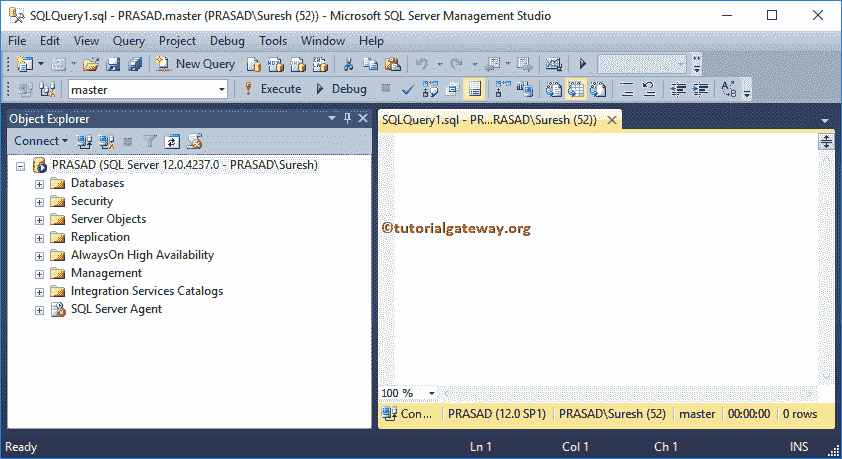
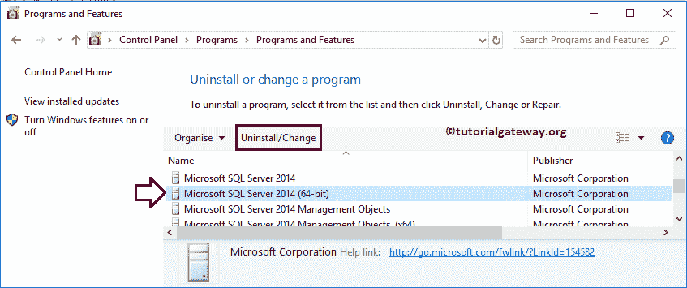
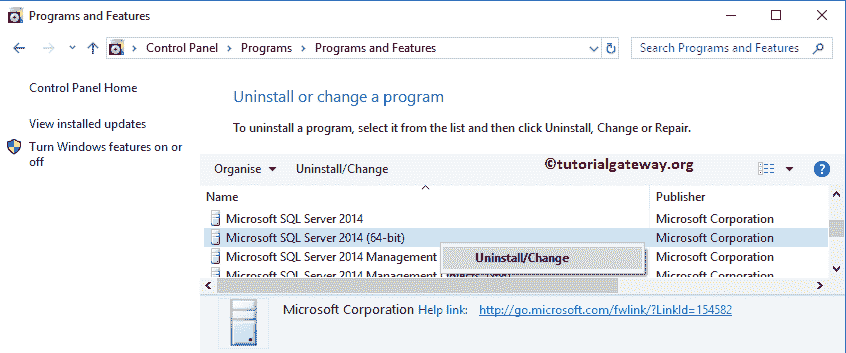
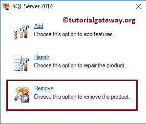
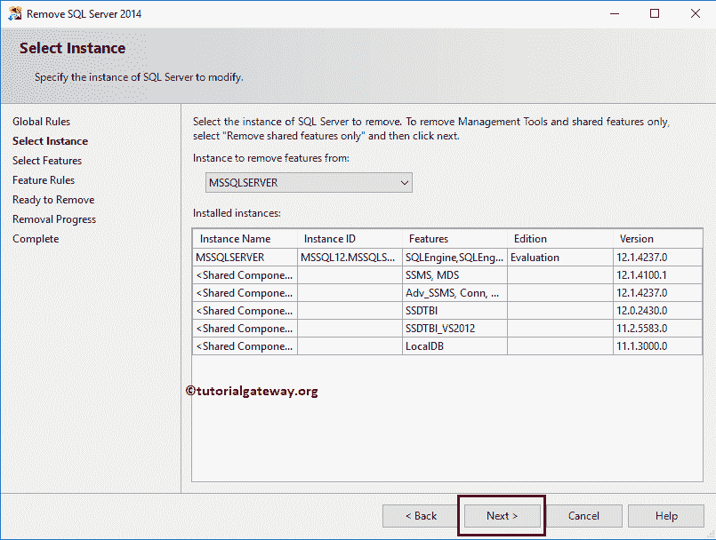
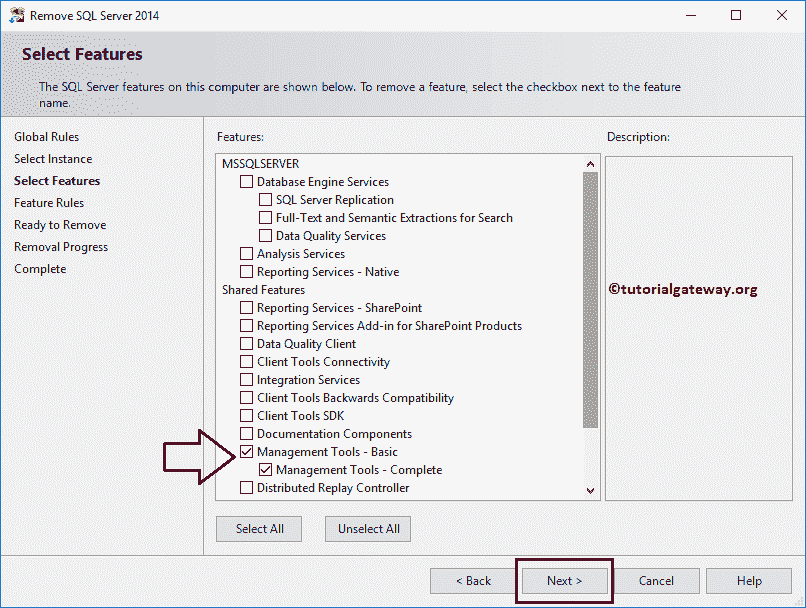
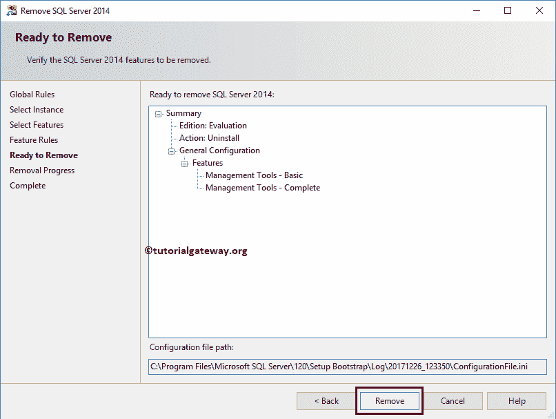
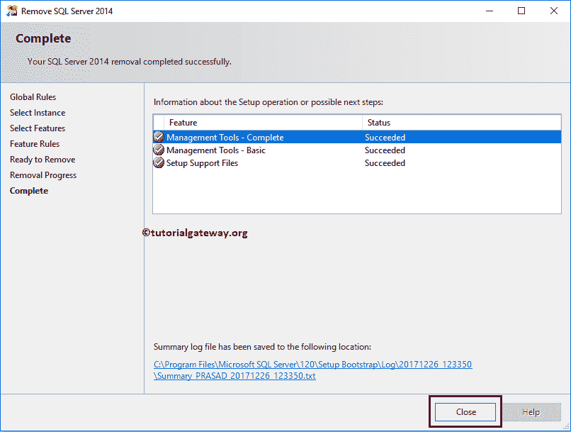
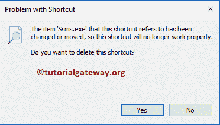

# 卸载 SSMS

> 原文：<https://www.tutorialgateway.org/uninstall-sql-server-management-studio/>

在本文中，我们将通过截图向您展示卸载 SSMS 的分步方法。请记住，这只会卸载 SSMS，而不会卸载 SQL Server 实例。在我们开始删除之前，让我向您展示一下，SSMS 的外观。

## 卸载 SSMS

从您的计算机上完全卸载 SSMS 或任何现有的 SQL Server 组件。首先，转到控制面板->添加或删除程序，并找到微软 SQL Server(在您的情况下，版本和位可能不同)。接下来，单击卸载/更改按钮。

或者右键单击它将打开上下文菜单。请选择卸载/更改选项

提示:请参考[安装 SQL Server](https://www.tutorialgateway.org/install-sql-server/) 了解安装 [SQL Server](https://www.tutorialgateway.org/sql/) 涉及的步骤。

上述任一方法都将打开以下窗口。请点击删除超链接

它会打开“删除 SQL Server”窗口。这里，MSSQL Server 是我们之前在系统中安装的默认实例。如果使用命名实例安装 SQL Server，则选择该命名实例。

选择功能:请选择要从计算机上卸载的功能。下面的截图将向您展示我们本地系统中预先安装的功能列表。

要卸载 SSMS，请选中管理工具-基本和管理工具-完整功能。

点击

移除按钮

请花几分钟时间完全删除 SSMS。从下面的截图中可以看到，我们完全从本地系统中删除了 SSMS。

让我试着打开 SSMS。如您所见，它表示 ssms.exe 不再工作(完全删除了 SSMS)。

