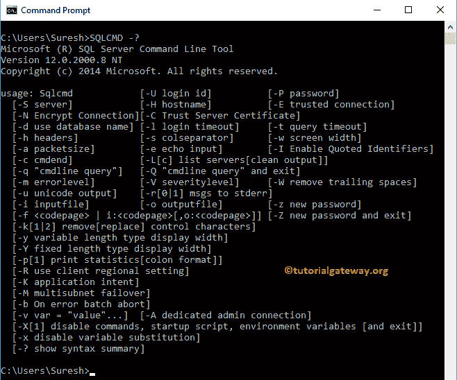
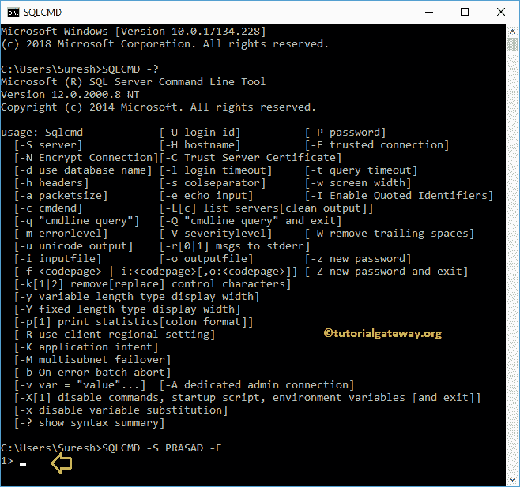
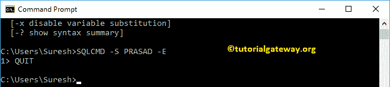
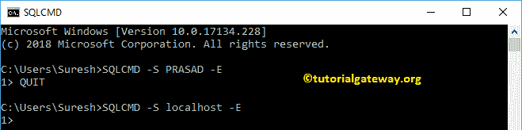
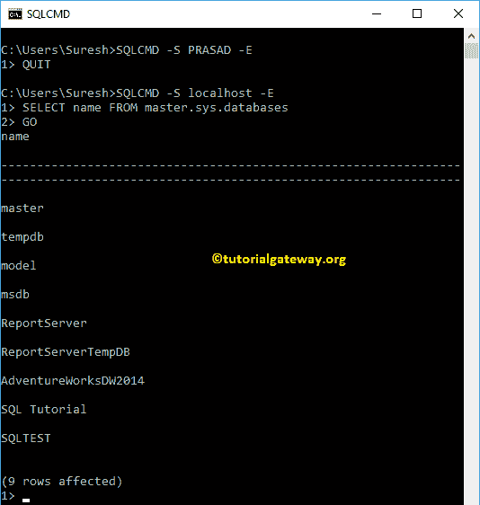
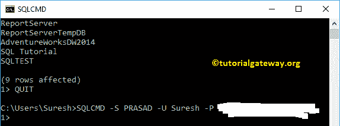
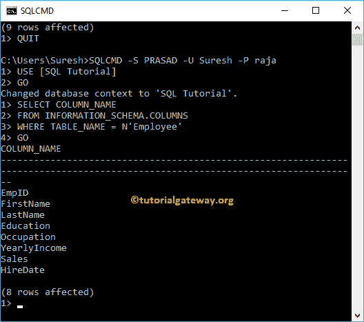

# 使用 sqlcmd 实用程序连接到 SQL Server

> 原文：<https://www.tutorialgateway.org/connect-to-sql-server-using-sqlcmd-utility/>

在本文中，我们将通过实例向您展示如何使用 sqlcmd 实用程序连接到 SQL Server。开始使用命令提示符连接到 Sql Server 之前。首先，使用 SQLCMD 帮助命令查看可用选项列表

```
SQLCMD -?
```



## 使用 sqlcmd 实用程序连接–Windows 身份验证

您可以通过多种方式进行连接。

```
-- Connect Default Instance using Windows Authentication
SQLCMD -S SERVERNAME -E

-- Connect Named Instance using Windows Authentication
SQLCMD -S SERVERNAME\INSTANCE -E

-- Connecting Named Instance with port using Windows Authentication
SQLCMD -S SERVERNAME\INSTANCE, 1919 -E
```

在这个 [Sql Server](https://www.tutorialgateway.org/sql/) 示例中，我们将使用 windows 身份验证进行连接

```
SQLCMD -S PRASAD -E

```



使用 SQLCMD QUIT 关键字退出或关闭连接

```
QUIT

```



如果您的 SQL 服务器有 localhost 实例，您可以使用该 localhost 与服务器连接

```
SQLCMD -S localhost -E

```



以下查询将返回服务器中所有可用的数据库

```
SELECT name FROM master.sys.databases

```



## 使用 sqlcmd 实用程序和 SQL 身份验证进行连接

您可以通过多种方式连接到 Sql 身份验证。

```
-- Connect Default Instance using SQL Authentication
SQLCMD -S SERVERNAME -U Username -P password

-- Connect Named Instance using user Authentication
SQLCMD -S SERVERNAME\INSTANCE -U Username -P password

-- Connecting Named Instance with port using SQL. Authentication
SQLCMD -S SERVERNAME\INSTANCE, 1919 -U Username -P password
```

让我连接 Sql 身份验证

```
SQLCMD -S PRASAD -U Suresh -P yourpassword
```



让我从员工表中选择[列名](https://www.tutorialgateway.org/get-column-names-from-table-in-sql/)

```
SELECT COLUMN_NAME
FROM INFORMATION_SCHEMA.COLUMNS
WHERE TABLE_NAME = N'Employee'
GO
```

