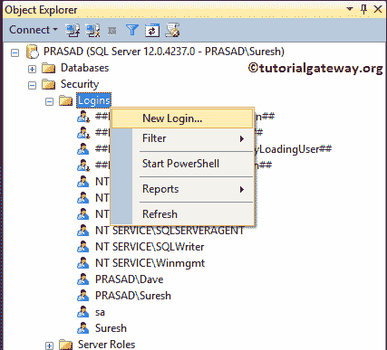
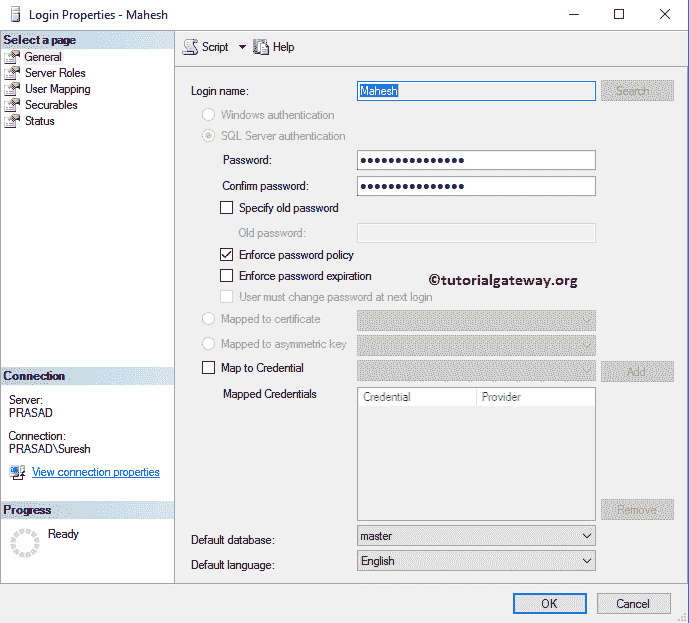

# 创建 SQL Server 登录

> 原文：<https://www.tutorialgateway.org/create-sql-server-login/>

在本文中，我们将向您展示使用 Management Studio 创建 SQL Server 登录和事务处理查询的分步方法。在我们开始创建新的 SQL 登录之前，让我向您展示我们 Management Studio 中的可用登录列表

## 使用 SSMS 创建 SQL Server 登录

要创建新的，请展开“安全性”文件夹，并右键单击“SQL Server 登录”文件夹以打开上下文菜单。请选择新登录..选项创建它



选择“新建”选项后，将打开以下窗口。默认情况下，选择了 Windows 身份验证，因此，让我将其更改为 SQL Server 身份验证。

*   登录名:请为这个新创建的 SQL Server 登录名使用唯一的名称。它是您将用于数据库引擎的那个。
*   密码:在这里，您必须为上面指定的用户名指定密码。
*   强制密码策略:如果选中此选项，您的密码应该遵循标准的 SQL Server 密码策略。
*   强制密码过期:密码将在一定时间后过期。
*   用户下次登录必须更改密码:当用户使用这个新创建的凭据登录时， [SQL Server](https://www.tutorialgateway.org/sql/) 会要求更改密码。


我们把名字指定为约翰，并随机分配了一些密码。

默认数据库:在这里，您必须选择您想要为此用户分配的默认[数据库](https://www.tutorialgateway.org/how-to-create-database-in-sql-server/)名称。目前，我们正在选择 SQL 教程数据库。

默认语言:您可以根据自己的要求选择语言。目前，我们将默认为英语。


服务器角色:使用此页面可将服务器角色分配给此用户。我们已经在[创建角色](https://www.tutorialgateway.org/create-sql-server-roles/)中解释了关于服务器角色的所有内容。现在，让我选择默认的公共选项。


用户映射:使用此“SQL Server 登录”页选择数据库，并将数据库角色分配给此用户。因为我们选择了 SQL 教程作为默认数据库，所以登录会自动将用户映射到该数据库。

同样，我们将写一篇专门的文章来解释每个数据库角色。现在，让我选择默认的公共和数据库所有者选项。


安全对象:此页面用于选择对象。请单击“搜索”按钮搜索对象。


现在，让我选择服务器


您可以使用“授予”、“允许授予”和“拒绝”选项来授予或拒绝权限。目前，我们不做任何改变。


状态:它有两个选项:

*   连接到数据库引擎的权限:如果要提供，则选择授予；否则，选择“拒绝”。
*   登录:如果您希望此用户作为数据库管理器，请选择启用，否则选择禁用。


在 SSMS 中查看我们新创建的登录。请点击连接按钮，使用约翰


连接数据库引擎

请将身份验证模式从 Windows 身份验证更改为 SQL 身份验证，并提供用户名和密码。


我们已经使用新创建的登录名成功登录到数据库引擎。


## 使用查询创建 SQL Server 登录

创建 SQL 登录的基本语法是:

```sql
-- Create Syntax
CREATE LOGIN [LoginName] -- This is the User 
WITH PASSWORD = 'provide_password' MUST_CHANGE,
CHECK_EXPIRATION = ON, -- This is Optional
CHECK_POLICY = ON, -- This is Optional
DEFAULT_DATABASE = [Database Name], -- This is Optional
DEFAULT_LANGUAGE = [Language Name];-- This is Optional
```

它将创建一个新的名为 Mahesh 的默认设置。

```sql
CREATE LOGIN Mahesh
WITH PASSWORD = 'password'
```

运行上面的查询

```sql
Messages
--------
Command(s) completed successfully.
```

它将显示我们新创建的马赫什


请转到其属性以查看或编辑登录属性。如您所见，该登录指向主数据库。



它将创建一个新的签名 Rob，他的默认数据库是 SQL 教程，默认语言是英语。

```sql
CREATE LOGIN Rob
WITH PASSWORD = 'password', 
DEFAULT_DATABASE = [SQL Tutorial], -- This is Optional
DEFAULT_LANGUAGE = [English];-- This is Optional
```


你可以在它的属性中看到同样的东西。


下面的 Sql Server 代码片段将创建一个新的登录 Christy。

*   当她开始登录时，她的密码必须改变，
*   密码将在一定时间后过期。
*   给定的密码应符合标准密码策略。
*   而她的默认数据库是 SQL 教程，默认语言是英语。

```sql
CREATE LOGIN Christy
WITH PASSWORD = 'password' MUST_CHANGE, 
CHECK_EXPIRATION = ON, -- This is Optional
CHECK_POLICY = ON, -- This is Optional
DEFAULT_DATABASE = [SQL Tutorial], -- This is Optional
DEFAULT_LANGUAGE = [English];-- This is Optional
```


参见


一节中的克里斯蒂

您可以通过进入它们的属性来查看属性。


让我试着和克里斯蒂联系


一旦你点击连接按钮，SSMS 会要求你输入一个新的密码。这是因为我们在查询中使用了 MUST_CHANGE。仅当您选中用户下次登录时必须更改密码选项


时才会发生

## 编辑 SQL Server 登录

要编辑现有名称，请转到“Sql Server 登录名”文件夹，选择所需的名称。右键单击该名称并选择属性选项。


使用此属性窗口可以更改服务器角色、用户映射、状态、安全对象等。


## 使用 SSMS 删除 SQL Server 登录

请转到登录文件夹选择所需的名称。右键单击要删除的名称，并从中选择删除选项。


选择删除选项后，将打开如下所示的窗口。点击【确定】删除现有的


SQL Server 登录

## 使用事务处理查询删除 SQL Server 登录

要删除 SQL Server 登录名的查询。

```sql
DROP LOGIN Rob
```

运行上面的查询

```sql
Messages
--------
Command(s) completed successfully.
```

看到我们的 [SQL Server](https://www.tutorialgateway.org/sql/) 没有 Rob 用户。

