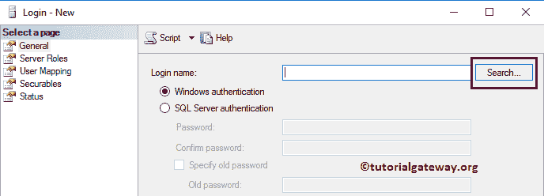
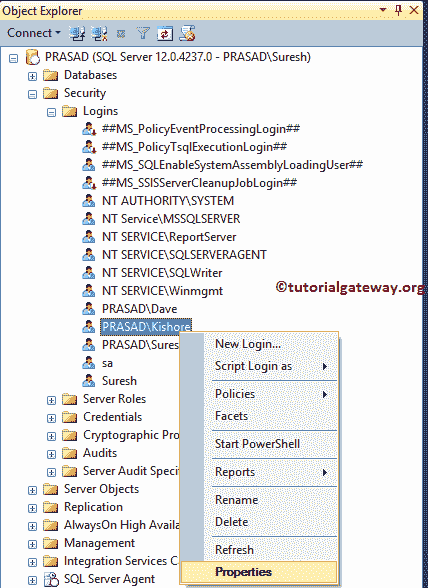

# 在 SQL Server 中创建窗口登录

> 原文：<https://www.tutorialgateway.org/create-windows-login-in-sql-server/>

有两种方法可以创建 SQL Server 寡妇登录身份验证:SSMS 和 Transact SQL 查询。本文用一个例子解释了这两种方法。在我们开始在 SQL Server 中创建新的窗口登录之前，让我向您展示一下我们的 SSMS 中的可用登录列表。


## 在 SSMS 中创建窗口登录

要创建 SQL Server 窗口登录，请展开“安全性”文件夹，然后右键单击“登录”文件夹以打开上下文菜单。请选择新登录..选项创建登录


选择“新登录”后..选项，下面显示的窗口将会打开。默认情况下，Windows 身份验证由 SQL Server 选择，您不需要更改任何内容。

*   登录名:请选择要用来登录数据库引擎的 Windows 用户。


如果您知道登录名，请在登录名文本框中键入该名称。否则，点击登录名



旁边的搜索按钮

单击搜索按钮后，将打开以下窗口。


如果要更改对象类型，请单击对象类型..

按钮

如果你知道名字，把它写在文本框内，点击【检查名字】按钮


可以看到， [SQL Server](https://www.tutorialgateway.org/sql/) 正在自动检索 windows 账号信息


如果您不知道名称，请单击“高级”按钮，然后单击“立即查找”按钮。它显示所有现有用户


默认数据库:选择需要分配给该 SQL Server Windows 登录用户的默认[数据库](https://www.tutorialgateway.org/how-to-create-database-in-sql-server/)。目前，我们正在选择 SQL 测试数据库。


默认语言:选择默认语言。现在，让我们保持默认，这是英语。


服务器角色:使用此选项指定服务器角色。请参考[创建 SQL Server 角色](https://www.tutorialgateway.org/create-sql-server-roles/)一文。目前，我们选择了默认的公共选项。


用户映射:使用它选择数据库并分配数据库角色。因为我们选择了 SQL Test 作为默认数据库，所以 SQL Server Windows 登录会自动将用户映射到该数据库。

让我选择数据库角色作为默认的公共、数据库数据读取器和数据库所有者选项。


安全对象:使用“搜索”按钮搜索对象。


现在，我们选择类型的所有对象..选项


然后，我们选择服务器角色。这意味着这个特定的服务器角色将控制所有的服务器角色。


您可以选择服务器角色，并使用授予、允许和拒绝选项来授予或拒绝权限。目前，我们不做任何改变。


状态:在此选项卡中，我们有两个选项:

*   连接到数据库引擎的权限:如果要授予，则选择授予；否则，拒绝。
*   登录:如果您需要此用户登录到数据库管理器，请选择启用，否则选择禁用。


从下面的截图可以看到我们新创建的寡妇登录 [SQL Server](https://www.tutorialgateway.org/sql/) 。


## 使用创建登录在 SQL Server 中创建窗口登录

在 SQL Server 中创建窗口登录的基本语法是:

```
-- Create Windows Login in SQL Server Syntax
CREATE LOGIN [Domain_Name\Login_Name] -- This is the User that you use for login 
FROM WINDOWS
DEFAULT_DATABASE = [Database Name], -- This is Optional
DEFAULT_LANGUAGE = [Language Name];-- This is Optional
```

下面的代码片段将使用默认设置创建一个新的登录 Kishore。

```
-- Create Windows Login in SQL Server Syntax
CREATE LOGIN [PRASAD\Kishore] -- This is the User that you use for login 
FROM WINDOWS
```

运行上面的创建登录查询

```
Messages
--------
Command(s) completed successfully.
```

下面截图会显示我们新创建的窗口登录


请转到其属性以查看或编辑登录属性。如您所见，该登录指向主数据库。


下面的代码片段将创建一个新的 windows 登录 PRASAD\Kishore，他的默认数据库是 SQL 教程。

```
-- Create Windows Login in SQL Server Syntax
CREATE LOGIN [PRASAD\Kishore] -- This is the User that you use for login 
FROM WINDOWS
DEFAULT_DATABASE = [SQL Tutorial] -- This is Optional
```

执行上面的为 windows 查询创建登录

```
Messages
--------
Command(s) completed successfully.
```

你可以在它的属性中看到同样的东西。


## 在 SQL Server 中编辑窗口登录

要编辑现有的 SQL Server 寡妇登录，请转到登录文件夹选择所需的登录名。右键单击要编辑的寡妇登录名，然后选择属性选项。



选择“属性”选项后，将打开以下窗口。使用此窗口可以更改默认语言、默认数据库、用户映射、服务器角色、安全对象和状态。


## 使用 SSMS 删除 SQL Server 中的窗口登录

请扩展“SQL Server 登录名”文件夹，以选择所需的窗口登录名。右键单击要删除的名称，然后从上下文菜单中选择删除选项。


选择“删除”选项后，将打开如下所示的窗口。点击【确定】删除登录


的窗口

## 使用删除登录在 SQL Server 中删除窗口登录

在本例中，我们向您展示了如何使用 DROP LOGIN 语句删除 SQL Server 中的窗口登录。

```
-- Delete Windows Login in SQL Server
DROP LOGIN [PRASAD\Kishore]
```

执行结果

```
Messages
--------
Command(s) completed successfully.
```