# 创建 SQLServer 角色

> 原文：<https://www.tutorialgateway.org/create-sql-server-roles/>

使用 SSMS 创建 SQL Server 角色和处理 SQL 查询的分步方法。在我们开始配置新的服务器角色之前，让我向您展示我们的 SSMS

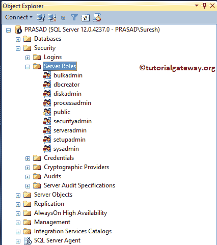

中的默认服务器角色列表

以下是 [SQL Server](https://www.tutorialgateway.org/sql/) 中可用的服务器角色列表

*   bulkadmin:该成员可以运行[批量插入](https://www.tutorialgateway.org/bulk-insert-in-sql-server/)语句。
*   数据库创建者:该成员可以创建、更改、恢复和删除 SQL 中的任何[数据库](https://www.tutorialgateway.org/how-to-create-database-in-sql-server/)。
*   磁盘管理:磁盘管理用户用于管理磁盘文件。
*   processadmin:这个服务器角色可以结束一个 SQL 实例中所有正在运行的进程。
*   公共:默认情况下，每次登录都属于公共服务器。
*   securityadmin:该成员授予、拒绝、撤销服务器级权限和数据库级权限。他们也可以重置所有的 [SQL 登录](https://www.tutorialgateway.org/create-sql-server-login/)。
*   服务器管理员:服务器管理员成员可以关闭服务器，也可以更改服务器范围内的配置。
*   setupadmin:具有此权限的成员可以使用 Transact-SQL 查询删除或添加链接的服务器。
*   sysadmin:成员可以在服务器中执行任何活动。该成员也绕过了其他人提供的任何限制。

## 使用 SSMS 创建 SQL Server 角色

要重新创建，请展开“SQL Server 角色”文件夹，并右键单击该文件夹以打开上下文菜单。请选择新的服务器角色..选择权

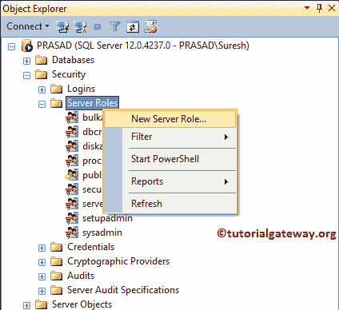

选择“新建”选项后，将打开以下窗口。

*   服务器角色名称:请使用唯一的名称。通过看到这个名字，你必须了解它的功能。
*   所有者:您必须指定所有者名称。此人可以根据他/她的要求对此进行更改。
*   安全对象:请指定必须处理的安全对象。例如，您使用端点或登录等。

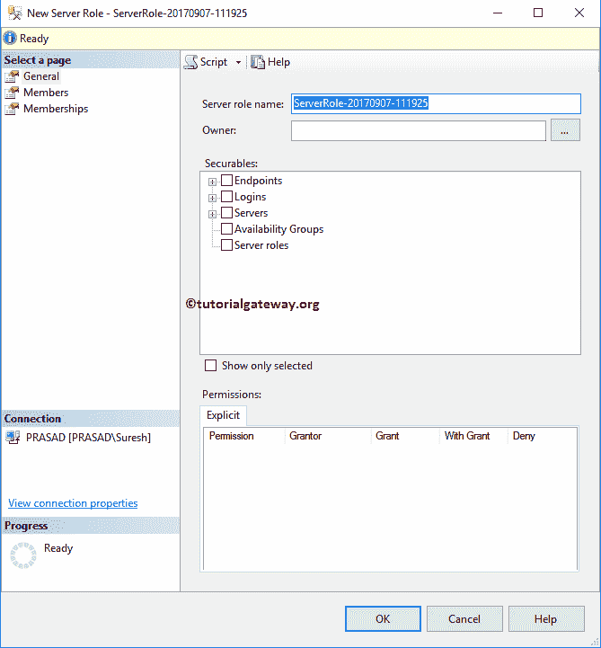

从下面的截图中可以看到，我们分配了 udr_MasterServerRole 作为服务器角色名称。让我点击…(浏览)按钮选择所有者。请参考[创建 Windows 登录](https://www.tutorialgateway.org/create-windows-login-in-sql-server/)或[创建 SQL Server 登录](https://www.tutorialgateway.org/create-sql-server-login/)了解创建登录所涉及的步骤。

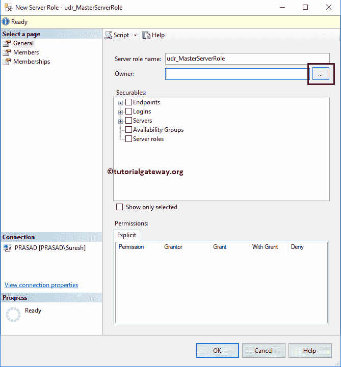

一旦你点击了…按钮，下面的窗口打开。如果你知道名字，把名字写在文本框里，然后点击检查名字按钮

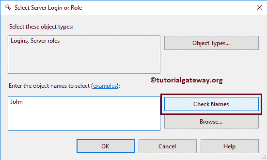

正如您所注意到的，它已经自动恢复了帐户信息。如果不记得名字，请点按“浏览”按钮。

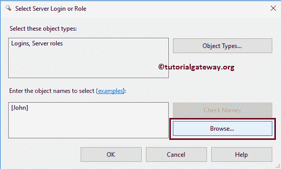

它展示了所有现有的用户。请从该列表中选择用户。

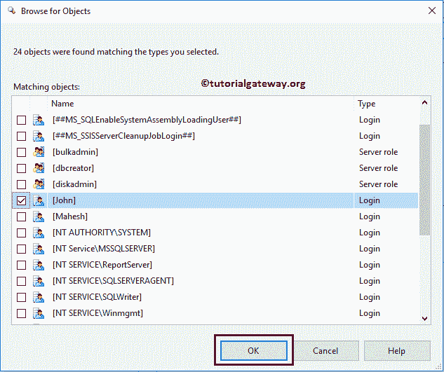

单击确定关闭此窗口

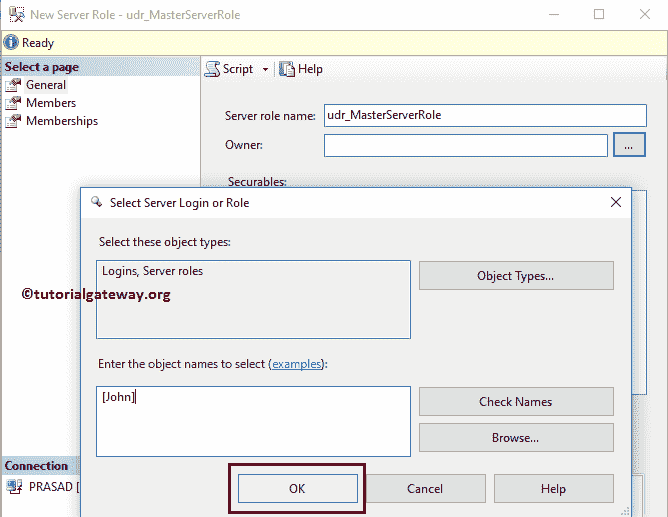

目前，我们选择服务器角色作为安全对象

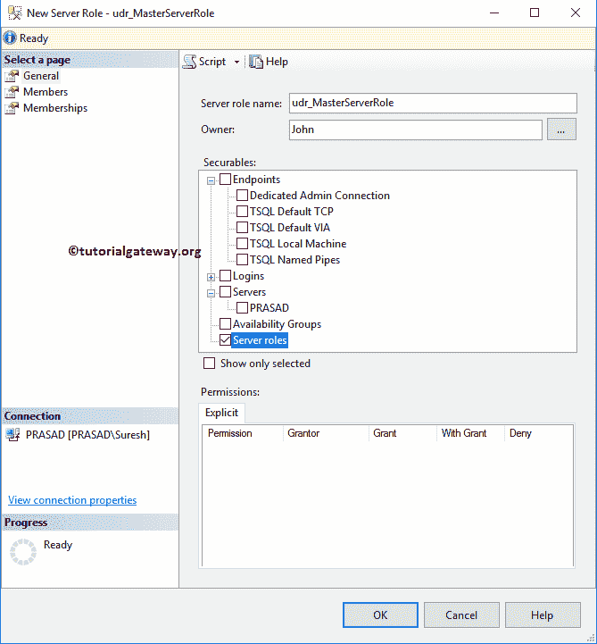

在“成员”选项卡中，您可以向该服务器角色添加成员。比如添加您的团队成员。

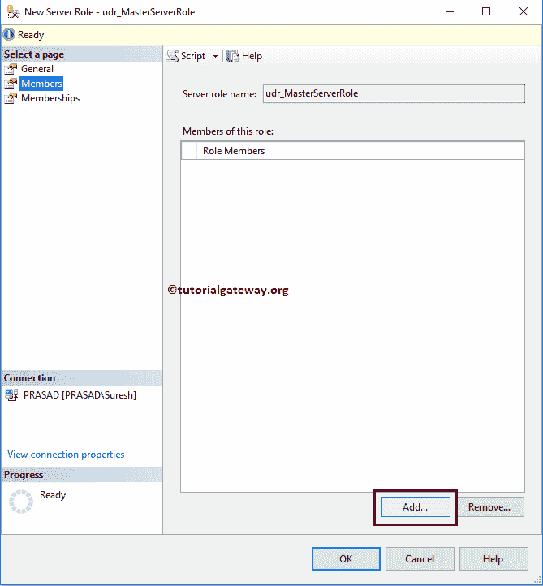

使用上面指定的技术添加成员。从下面的截图可以看到，我们正在添加 Mahesh 登录。

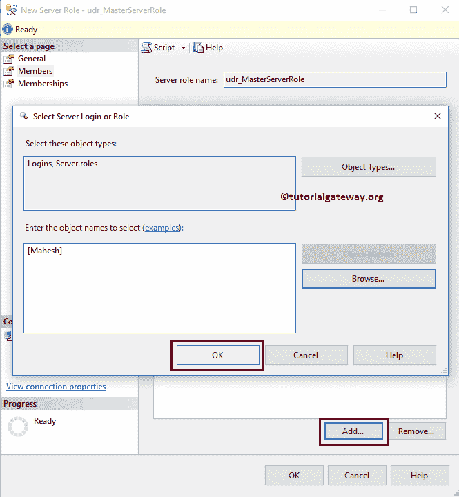

现在，您可以看到我们的新角色成员。

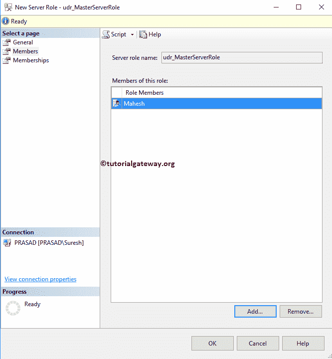

在“成员资格”选项卡中，您可以为此分配一个或多个默认服务器角色。目前，我们正在选择所有的。

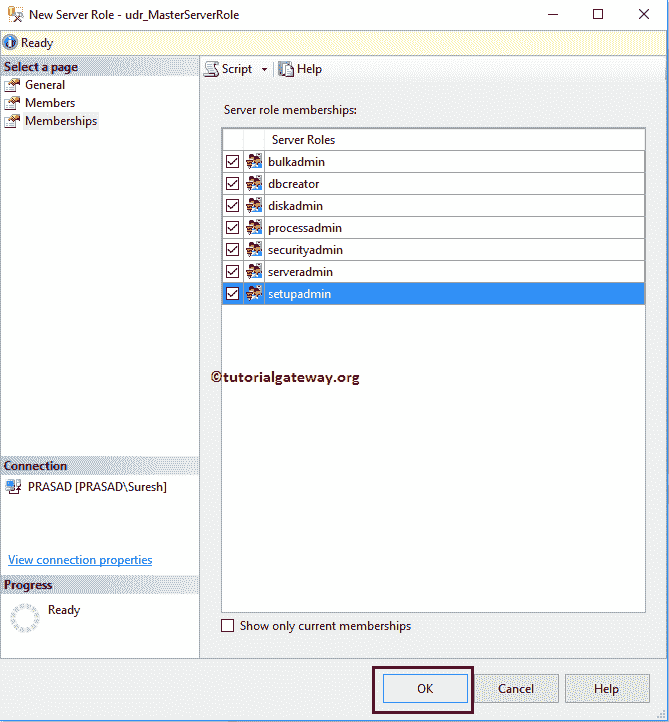

从下面的截图中，可以看到我们在 [SSMS](https://www.tutorialgateway.org/sql/)中新创建的服务器角色。

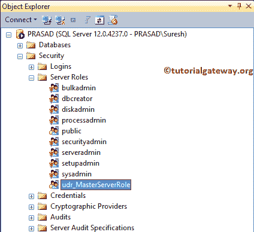

### 创建服务器角色

SQL Server 提供了一个 CREATE SERVER ROLE 命令来创建一个新的角色。下面的代码片段显示了创建 SQL Server 角色的语法。

```
USE [master]
GO
CREATE SERVER ROLE [Role Name] [ AUTHORIZATION User_Name];
GO
```

下面的代码片段将创建一个新的服务器角色 udr_SecurityAdmin。

```
USE [master]
GO
CREATE SERVER ROLE [udr_SecurityAdmin];
GO
```

运行上面的查询

```
Messages
--------
Command(s) completed successfully.
```

从下面的截图中，可以看到我们在对象资源管理器中新创建的服务器角色。

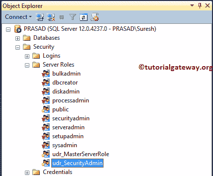

请转到其属性以编辑或查看角色设置。默认情况下，它将当前用户指定为所有者，因为我们没有在声明中提供关于所有者的信息。

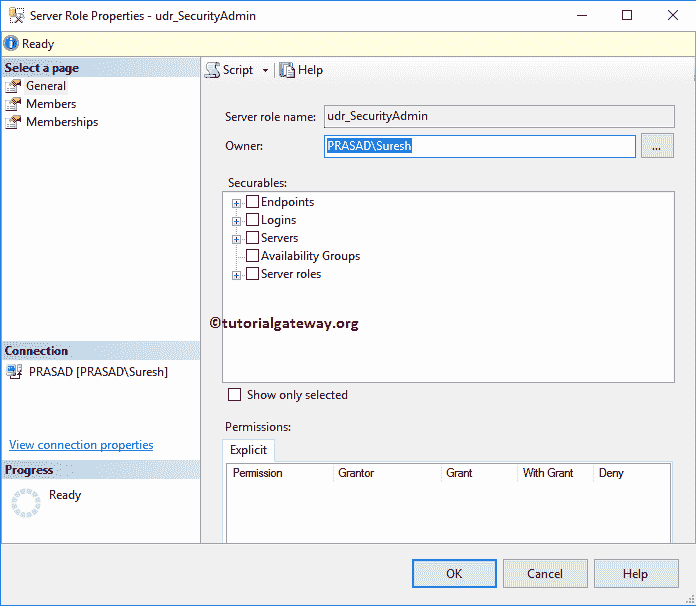

让我以约翰的身份提供业主

```
USE [master]
GO
CREATE SERVER ROLE [udr_dbcreator] 
        AUTHORIZATION John;
GO
```

运行上面的查询

```
Messages
--------
Command(s) completed successfully.
```

你可以看到新的。

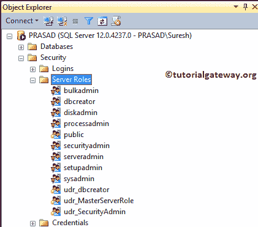

从属性中，可以看到所有者为约翰

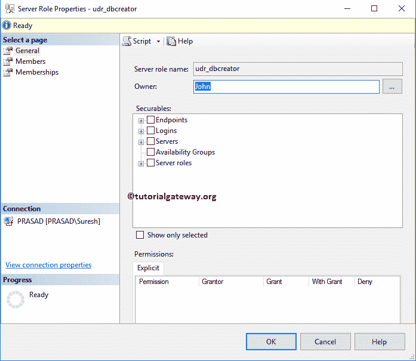

## 使用 SSMS 编辑 SQL Server 角色

要编辑现有名称，请转到“SQL Server 角色”文件夹选择所需的名称。右键单击要编辑的名称，然后从上下文菜单中选择属性选项。

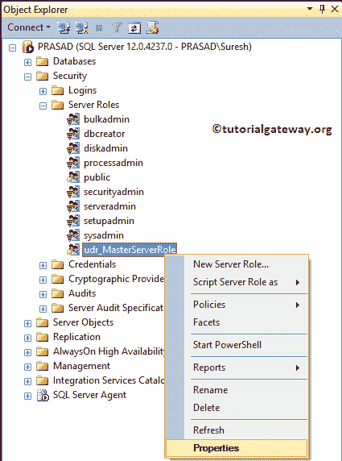

选择属性后，将打开以下窗口。使用此选项可以更改所有者、安全对象、成员和成员资格。

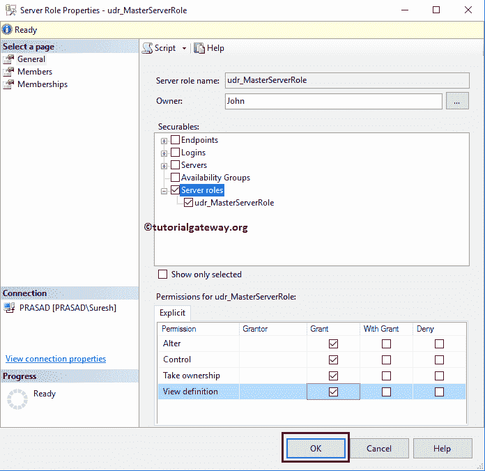

## 使用事务处理查询编辑 SQL Server 角色

使用 ALTER SERVER ROLE 命令编辑属性。下面的代码片段将把 udr_SecurityAdmin 重命名为 udr _ NewSecurityAdmin

```
USE [master]
GO
ALTER SERVER ROLE [udr_SecurityAdmin]
WITH NAME = [udr_NewSecurityAdmin] 
GO
```

执行 alter 查询

```
Messages
--------
Command(s) completed successfully.
```

你可以看到更新的。

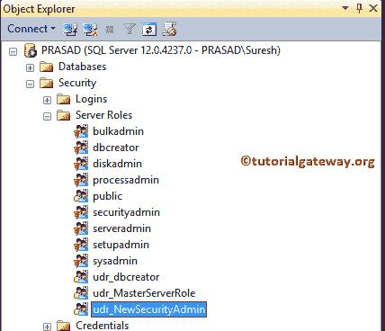

### 添加角色成员

下面的代码片段将向现有的服务器角色添加新的 SQL 成员

```
USE [master]
GO
ALTER SERVER ROLE [udr_NewSecurityAdmin]
ADD MEMBER [Mahesh];
GO
```

运行向服务器添加成员查询

```
Messages
--------
Command(s) completed successfully.
```

下面的代码将向现有的服务器角色添加新的 Windows 登录[PRASAD\Dave]

```
USE [master]
GO
ALTER SERVER ROLE [udr_NewSecurityAdmin]
ADD MEMBER [PRASAD\Dave];
GO
```

运行以上新的 windows 登录查询

```
Messages
--------
Command(s) completed successfully.
```

从属性中，您可以看到我们之前添加的新角色成员。

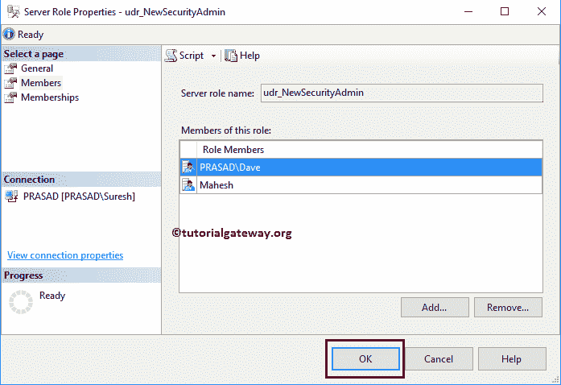

### 删除角色成员

下面的代码将从 udr_NewSecurityAdmin 中删除 PRASAD\Dave 角色成员

```
USE [master]
GO
ALTER SERVER ROLE [udr_NewSecurityAdmin]
DROP MEMBER [PRASAD\Dave];
GO
```

执行删除成员查询

```
Messages
--------
Command(s) completed successfully.
```

你可以在属性中找到相同的内容。

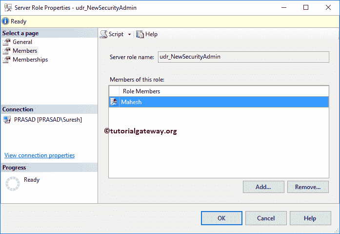

您也可以使用查询授予权限。我们将写一篇关于权限的专门文章。

```
USE [master]
GO
GRANT ALTER ON 
	SERVER ROLE::[udr_NewSecurityAdmin] TO [PRASAD\Dave];  
GO
```

运行授予权限查询

```
Messages
--------
Command(s) completed successfully.
```

## 使用 SSMS 删除 SQL Server 角色

要删除现有的服务器角色，请展开“服务器角色”文件夹以选择所需的名称。右键点击要删除的名称，选择

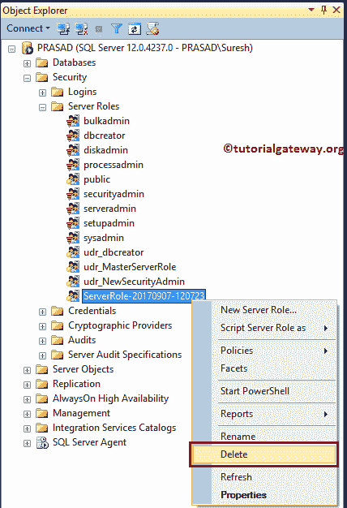

删除选项

选择删除选项后，将打开以下窗口。单击确定删除服务器角色。

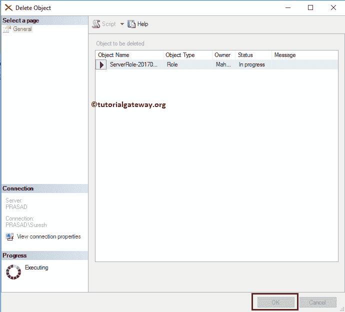

### 删除或删除服务器角色

SQL Server 提供了删除服务器角色命令来删除现有的

```
USE [master]
GO
DROP SERVER ROLE [udr_dbcreator]; -- This is Role Name
GO
```

```
Messages
--------
Command(s) completed successfully.
```

现在可以看到没有名为 udr_dbcreator

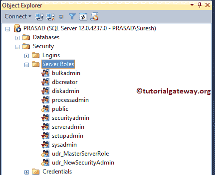

的服务器角色