# SQL 服务器登录错误

> 原文:[https://www.tutorialgateway.org/sql-server-login-error/](https://www.tutorialgateway.org/sql-server-login-error/)

使用 SQL Server 身份验证登录时出现错误是一个标准的面试问题。因此，在本文中，我们将向您展示解决 SQL Server 登录错误的分步方法。首先，让我给你看看错误。从下面的截图可以看到用户 Suresh

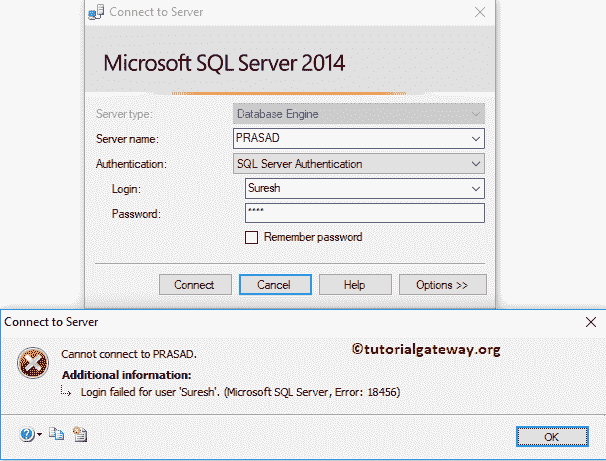

的 SQL Server 登录错误

在我们开始解决 SQL Server 登录错误之前，让我向您展示我们的[管理工作室](https://www.tutorialgateway.org/sql-server-management-studio/)中的可用登录列表。从下面的截图可以看到 [Sql Server](https://www.tutorialgateway.org/sql/) 用户是存在的。建议大家参考[创建登录](https://www.tutorialgateway.org/create-sql-server-login/)文章，了解创建用户的步骤。

## 要访问的 SQL Server 登录错误

如果您的帐户没有登录权限，右键单击用户名并从上下文菜单

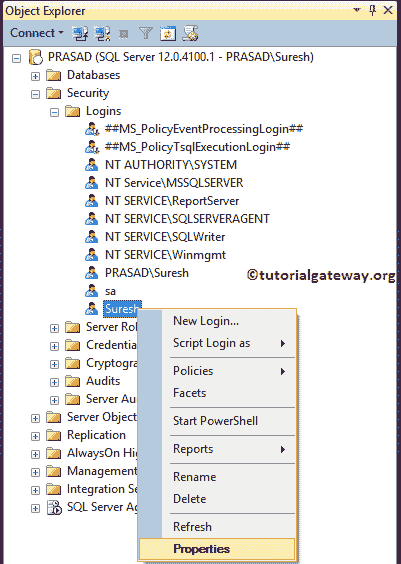

中选择属性

选择属性选项将打开以下窗口

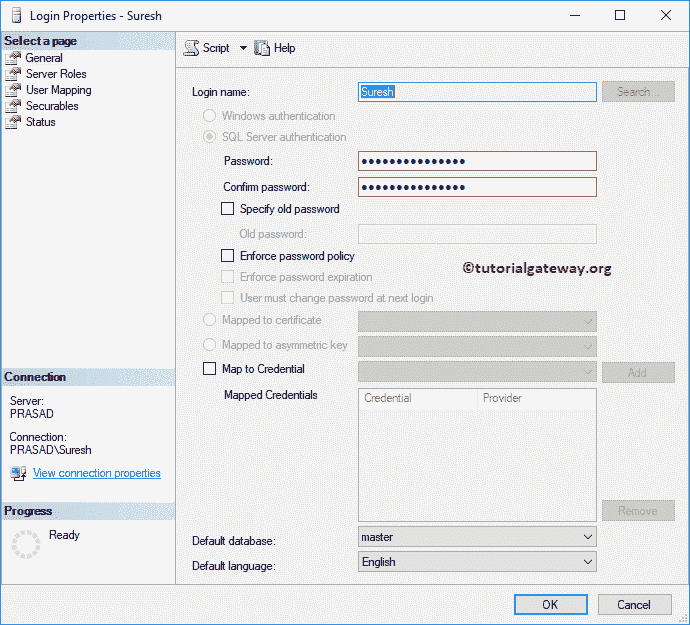

在状态选项卡下，检查权限

*   授予:授予用户连接数据库引擎的权限
*   已启用:允许该用户使用他/她的详细信息登录

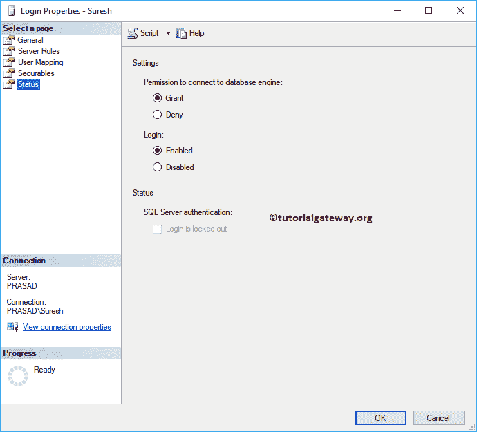

在大多数情况下，上述方法将解决错误。

## Sql Server 身份验证登录错误

在某些情况下，您的数据库将只接受 windows 身份验证。在这些情况下，您必须将身份验证模式更改为双重。右键单击实例名称，并从上下文菜单

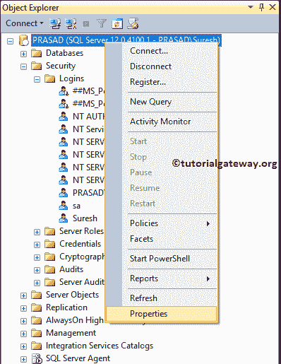

中选择属性选项

它会打开一个属性窗口

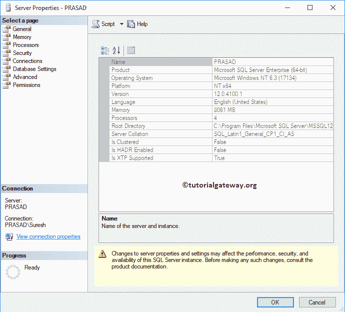

请自行导航到“安全性”选项卡。从下面的截图中，您可以看到服务器身份验证选择了 Windows 身份验证模式。这意味着它只接受本地 windows 用户。

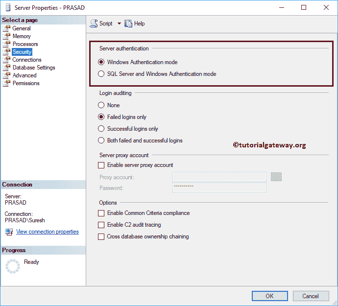

请将选项更改为 SQL Server 和 Windows 身份验证模式选项

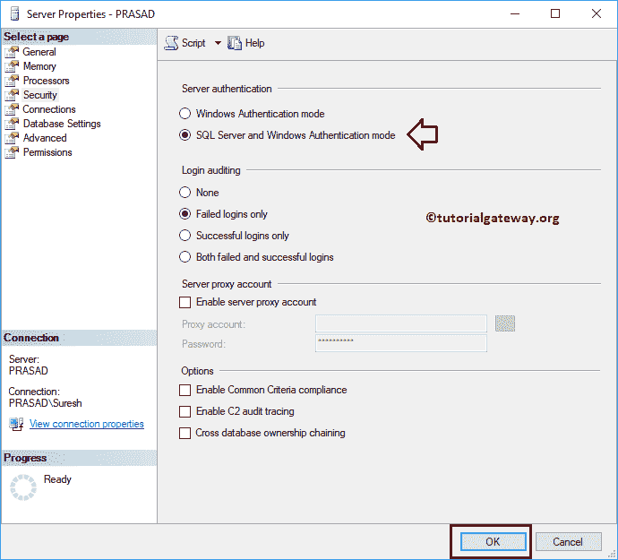

单击确定。请记住，配置更改只有在重新启动后才会生效。所以，重启实例

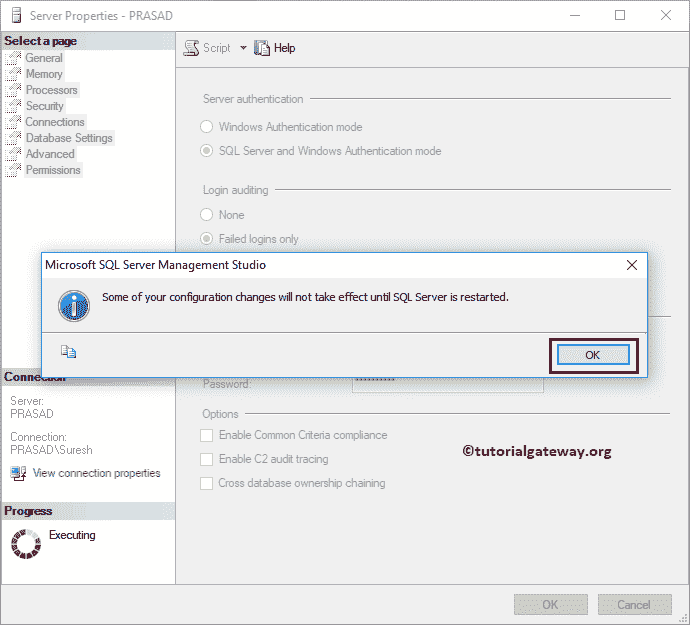

试试用户名 Suresh

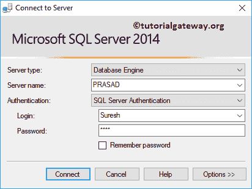

我们成功地进入了它。

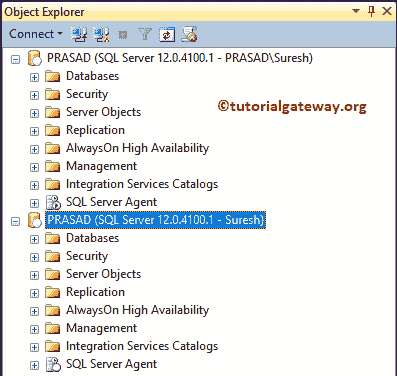