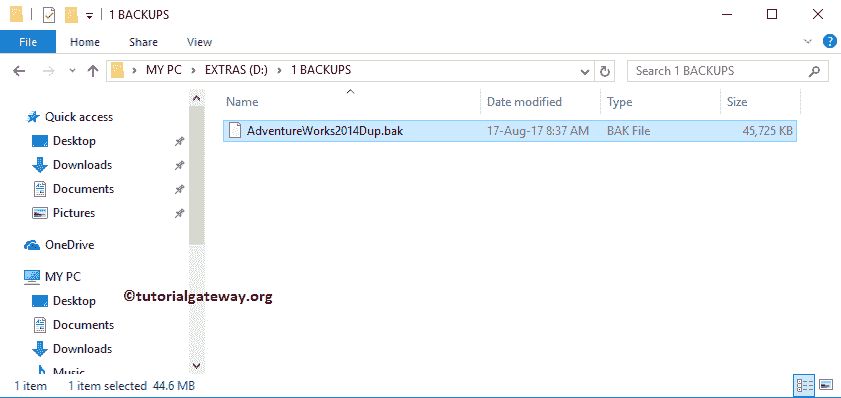

# 备份 SQL 数据库

> 原文：<https://www.tutorialgateway.org/backup-sql-database/>

让我们看看使用 SSMS 和 SQL 查询备份 SQL 数据库的分步方法。在这个备份 SQL 数据库演示中，我们将在我们的 SQL Server 中使用 Adventure Works 数据库。

在我们开始执行 SQL Server 备份之前，让我向您展示一下数据库的实际大小。为此，右键单击[SQL Server](https://www.tutorialgateway.org/sql/)Adventure Works[数据库](https://www.tutorialgateway.org/how-to-create-database-in-sql-server/)，并选择属性。


是 207.25 MB。使用此属性窗口也可以检查权限。


或者可以使用这个[存储过程](https://www.tutorialgateway.org/stored-procedures-in-sql/)来检查数据库大小。

```
USE [AdventureWorks2014]
GO
EXEC sp_spaceused;
```


## 使用事务查询备份数据库

以下 SQL 示例将帮助您理解使用 transact SQL 查询创建文件系统的数据库备份文件所涉及的步骤。

### 将 SQL 数据库备份到默认位置

本示例将在默认位置创建文件系统的备份文件。位置是 C:\程序文件\微软 SQL Server\ MSSQL12。MSSQLSERVER\ MSSQL\Backup。在这里，你的道路可能会不同。这完全取决于 SQL 版本和安装位置

```
BACKUP DATABASE AdventureWorks2014
     TO DISK = 'AdventureWorks2014Dup3.bak'
GO
```

```
Processed 24328 pages for database 'AdventureWorks2014', file 'AdventureWorks2014_Data' on file 1.
Processed 2 pages for database 'AdventureWorks2014', file 'AdventureWorks2014_Log' on file 1.
BACKUP DATABASE successfully processed 24330 pages in 6.411 seconds (29.647 MB/sec).
```


见文件

### 将 SQL 数据库备份到自定义位置

本示例将创建文件系统的备份文件。这里我们将使用自定义位置。请根据您的要求更改位置。

```
BACKUP DATABASE AdventureWorks2014
     TO DISK = 'D:\1 BACKUPS\AdventureWorks2014Dup4.bak'
GO
```

```
Processed 24328 pages for database 'AdventureWorks2014', file 'AdventureWorks2014_Data' on file 1.
Processed 2 pages for database 'AdventureWorks2014', file 'AdventureWorks2014_Log' on file 1.
BACKUP DATABASE successfully processed 24330 pages in 7.658 seconds (24.819 MB/sec).
```

查看 D 文件夹中的文件。


### 将 SQL 数据库差异备份到自定义位置

本示例将创建差异备份，并将 bak 保存到文件系统中。

```
BACKUP DATABASE AdventureWorks2014
     TO DISK = 'D:\1 BACKUPS\AdventureWorks2014_Differential.bak'
GO
```

```
Processed 40 pages for database 'AdventureWorks2014', file 'AdventureWorks2014_Data' on file 1.
Processed 1 pages for database 'AdventureWorks2014', file 'AdventureWorks2014_Log' on file 1.
BACKUP DATABASE WITH DIFFERENTIAL successfully processed 41 pages in 0.197 seconds (1.625 MB/sec).
```

请参见 D 文件夹中的差异备份数据库文件。


## 使用 Management Studio 备份 SQL 数据库

要备份 SQL 数据库，右键单击 Adventure Works，选择任务选项，然后选择备份..选项。


选择备份后..选项，将打开一个名为“备份数据库”的新窗口。

数据库:您可以使用下拉列表随时更改要备份的数据库。


类型:有两种类型的 SQL 数据库备份，它们是完全备份和差异备份。目前，我们选择完整版。


备份到:该属性有两个选项:磁盘和网址。这意味着您可以将 bak 文件保存在网址(公司网站)或磁盘中。目前，我们保留默认磁盘。

如您所见，SSMS 自动提供了默认路径作为保存 bak 文件的位置。您可以使用添加、删除按钮来添加新路径和删除现有路径。首先，让我通过选择路径并单击移除按钮来移除默认路径。


要添加新路径，请单击添加按钮。单击该按钮，将打开一个新窗口。默认情况下，它指向默认备份路径。单击…按钮更改目的地位置


我们选择 D 驱动器-> 1 备份文件夹-> AdventureWorks2014Dup 作为文件名


在我们进入下一个选项卡之前，请交叉检查所有字段。


媒体选项:在“覆盖媒体”部分，请将“备份到现有媒体集”选项从“附加到现有媒体集”更改为“覆盖所有现有备份”。


选项:使用此选项卡，设置到期日期和时间，或使用自定义证书加密 bak。如果您的数据库很大，请选择压缩备份选项。


请单击“确定”创建。


让我打开文件夹看看 bak 文件。



### 创建 SQL 数据库的加密备份

首先，让我将目标文件夹和文件名更改为 adventureworks 2014 dup2


媒体选项:要在 SQL Server 中创建加密的数据库备份，您必须选择“备份到新媒体集并擦除所有现有媒体集”选项。

*   新媒体集名称:bak 文件的名称。
*   新媒体集描述:有效的描述。


选项:在“算法”属性下，您可以选择算法。我们正在选择 AES 256 算法


目前，我们没有证书；这就是为什么它显示为空。但是实时情况下，您可能没有多少证书可供选择。接下来，单击确定关闭备份 sql 数据库窗口。

