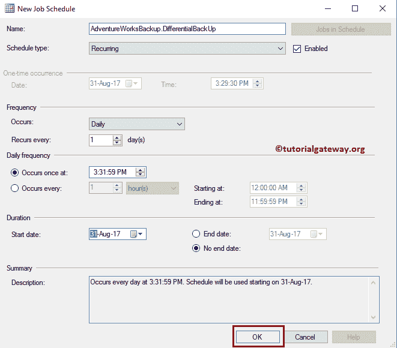

# SQL 维护计划

> 原文:[https://www.tutorialgateway.org/sql-maintenance-plan/](https://www.tutorialgateway.org/sql-maintenance-plan/)

在本文中，我们将通过示例展示如何创建一个新的 SQL 维护计划，该计划将每天和每周备份数据库。为了演示 SQL 维护计划，我们使用了我们的 SQL Server 中的 Adventure Works 数据库。

在我们进入示例之前，让我向您展示一下 SQL Server 中现有的维护计划。要访问相同内容，请转到对象资源管理器->展开管理文件夹，然后展开维护计划。从下面的截图可以看出，我们在 SQL Server 中没有任何现有的维护计划。

## 创建 SQL 维护计划

在本例中，我们将创建一个执行常规数据库备份的 SQL Server 维护计划。为此，我们使用两种类型的备份:完整备份(每周)和差异备份(每天)

要创建 SQL 维护计划，请右键单击维护计划，并从上下文菜单中选择新建维护计划…选项。

选择“新建维护计划...”选项后，将打开一个新窗口，为该计划分配一个新的。在这个 SQL 维护计划演示中，我们将名称指定为 AdventureWorksBackup。

单击确定按钮后，将出现以下窗口以及工具箱。

双击 Subplan_1 将其重命名。从下面的截图中可以看出，我们指定了一个名称作为完整备份和有效描述。

让我为差异备份添加另一个子计划。要在 [SQL Server](https://www.tutorialgateway.org/sql/) 中创建新的子计划，请单击添加子计划选项卡，如下所示。

并且，我们为这个 SQL 维护计划分配了一个名为差异备份的名称。

请选择完全备份子计划，并将备份数据库任务拖放到设计器区域。

右键单击任务将打开上下文菜单。请选择编辑..选项来配置任务。

选择编辑后..选项，将打开以下窗口。

备份类型:请从下拉列表中选择备份类型。

数据库:这里可以选择[管理工作室](https://www.tutorialgateway.org/sql-server-management-studio/)中存在的一个或全部数据库。目前我们选择的是[冒险作品](https://www.tutorialgateway.org/download-and-install-adventureworks-database/)2014

T5

请交叉检查所有选项，然后单击目标选项卡来配置目标。

以下是“SQL 维护计划目标”选项卡中可用的属性列表。如您所见，我们正在选择保存备份文件的 D 文件夹，其扩展名为 bak。你可以用…(浏览)按钮选择路径。

在选项选项卡中，您可以设置到期时间、加密等。目前，我们不需要任何压缩或加密。让我选择验证备份完整性，然后单击确定按钮。

您必须遵循相同的步骤来创建差异备份，唯一的更改是将备份类型更改为差异。

让我关闭 SQL Server 维护计划并保存它。

请转到 SQL 对象资源管理器->展开管理文件夹，然后展开维护计划以查看新创建的维护计划。接下来，展开 SQL Server 代理->作业文件夹，检查新创建的作业(完整和差异)。

选择并右键单击两个作业中的任意一个，然后从菜单中选择属性选项。接下来，在“计划”选项卡下，您可以看到没有运行此作业的计划时间。这是因为我们错过了备份计划。

您可以通过单击“新建”按钮来安排它们，但是我们将在“SQL 维护计划”部分进行安排。这有助于你完全理解这个话题。

### 修改 SQL 维护计划

右键单击在 SQL Server 中新创建的维护计划将打开上下文菜单。请选择修改选项。

要安排备份，请点击微小的日历符号，如我们这里所示。

如您所见，我们计划在每周一上午 12 点

运行此作业

接下来，我们计划每天下午 3:31:59

运行差异备份作业

现在，如果打开作业属性中的计划选项卡，您可以看到计划列表。

我们没有时间等工作日和周末。让我通过右键单击作业并选择在步骤开始作业来开始作业..选项。

如您所见，我们的作业执行成功。

从文件系统中，您可以看到，我们有一个完整备份和一个差异备份。

