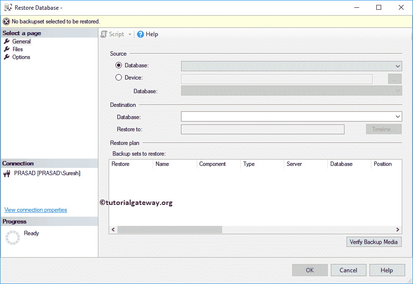

# 使用 BAK 还原数据库

> 原文：<https://www.tutorialgateway.org/restore-database-in-sql-server-using-bak/>

如何用 BAK 文件还原数据库？。在本演示中，我们将使用 SSMS从还原 SQL 数据库。bak 文件。

## 使用 BAK 文件还原数据库

可以看到，SQL server 没有 AdventureWorks2017 数据库

请注意，对应于 AdventureWorks2017 的 Mdf 和 ldf 文件不在 c 盘中

提示:创建数据库备份请参考[备份数据库](https://www.tutorialgateway.org/backup-sql-database/)，在 [SQL Server](https://www.tutorialgateway.org/sql/) 中创建定期数据库备份请参考[维护计划](https://www.tutorialgateway.org/sql-maintenance-plan/)。

我们的硬盘里有一个备份文件，我们用这个文件来恢复

右键单击数据库文件夹并选择恢复数据库…选项。

选择还原数据库..选项，它将打开以下窗口。

在本例中，我们希望从文件系统中恢复数据库。所以，让我选择设备选项。接下来，点击…按钮将打开以下窗口。

单击添加按钮，通过导航到文件位置选择备份文件。

点击【确定】恢复冒险家数据库

请等到恢复完成。

单击“确定”使用 bak 文件在 SQL Server 中还原数据库。

现在可以在[Management Studio](https://www.tutorialgateway.org/sql-server-management-studio/)看到冒险作品 2017 数据库。

以上过程已经自动将 Mdf、ldf 文件添加到

c 盘