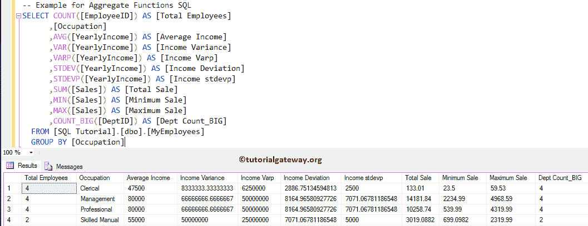
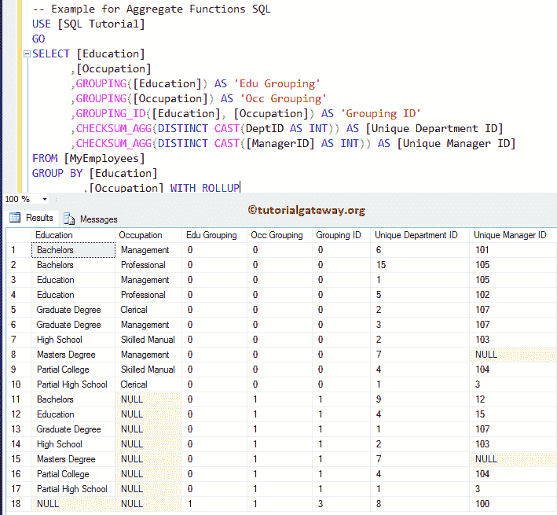

# SQL 聚合函数

> 原文：<https://www.tutorialgateway.org/sql-aggregate-functions/>

SQL Server 提供了各种 SQL 聚合函数，允许我们执行聚合，例如计算平均值、总和、最小值、最大值等。

## SQL 聚合函数

SQL 聚合函数用于提取累积数据、总计数据或高级数据。例如，一个地区的总销售额、按国家划分的产品销售额等。要使用这些 SQL 聚合函数，您必须对非聚集列使用 Group By 子句。否则，它将抛出一个错误。

下表将显示 SQL 聚合函数的列表。如果要使用任何表达式来限制记录，则使用 [Having 子句](https://www.tutorialgateway.org/sql-having-clause/)，而不是 [Where 子句](https://www.tutorialgateway.org/sql-where-clause/)。

| 功能 | 描述 |
| 平均值 | 它将计算由 SQL`SELECT`语句选择的所有记录(或行)的平均值 |
| 校验和 _ ag | 它用于返回组中值的校验和 |
| [计数](https://www.tutorialgateway.org/sql-count-function/) | 它将计算[`SELECT`语句](https://www.tutorialgateway.org/sql-select-statement/)选择的记录数。 |
| [COUNT_BIG](https://www.tutorialgateway.org/sql-count_big-function/) | 它的工作原理与 [COUNT](https://www.tutorialgateway.org/sql-count-function/) 函数相同，但它返回 bigint |
| [分组](https://www.tutorialgateway.org/sql-grouping-function/) | 用于表示[分组依据条款](https://www.tutorialgateway.org/sql-group-by-clause/)中的指定列是否聚合 |
| [分组 _ 标识](https://www.tutorialgateway.org/sql-grouping_id-function/) | 这个 [SQL Server](https://www.tutorialgateway.org/sql/) 函数用来返回分组的级别。 |
| [最大值](https://www.tutorialgateway.org/sql-max-function/) | 它从选定的总记录中返回最大值。 |
| [分钟](https://www.tutorialgateway.org/sql-min-function/) | 它返回所选行总数的最小值。 |
| [STDEV](https://www.tutorialgateway.org/sql-stdev-function/) | 计算选定记录的标准偏差 |
| [技术开发方案](https://www.tutorialgateway.org/sql-stdevp-function/) | 它用于计算总体的标准偏差 |
| [SUM](https://www.tutorialgateway.org/sql-sum-function/) | `SELECT`语句选择的行的总和 |
| [在](https://www.tutorialgateway.org/sql-var-function/)处 | 所选记录的统计方差 |
| [跳绳](https://www.tutorialgateway.org/sql-varp-function/)跳绳 | 总体的统计方差 |

## SQL 聚合函数示例

下面的查询将向您展示一些 SQL Server 聚合函数。

```
SELECT COUNT([EmployeeID]) AS [Total Employees]
      ,[Occupation]
      ,AVG([YearlyIncome]) AS [Average Income]
      ,VAR([YearlyIncome]) AS [Income Variance]
      ,VARP([YearlyIncome]) AS [Income Varp]
      ,STDEV([YearlyIncome]) AS [Income Deviation]
      ,STDEVP([YearlyIncome]) AS [Income stdevp]
      ,SUM([Sales]) AS [Total Sale]
      ,MIN([Sales]) AS [Minimum Sale]
      ,MAX([Sales]) AS [Maximum Sale]
      ,COUNT_BIG([DeptID]) AS [Dept Count_BIG]
  FROM [SQL Tutorial].[dbo].[MyEmployees]
  GROUP BY [Occupation]
```



### SQL 聚合函数示例 2

Sql Server 中剩余的聚合函数列表如下:

```
SELECT [Education]
      ,[Occupation]
      ,GROUPING([Education]) AS 'Edu Grouping'
      ,GROUPING([Occupation]) AS 'Occ Grouping'
      ,GROUPING_ID([Education], [Occupation]) AS 'Grouping ID'
  	  ,CHECKSUM_AGG(DISTINCT CAST(DeptID AS INT)) AS [Unique Department ID] 
	  ,CHECKSUM_AGG(DISTINCT CAST([ManagerID] AS INT)) AS [Unique Manager ID]
FROM [MyEmployees]
GROUP BY [Education]
        ,[Occupation] WITH ROLLUP
```

