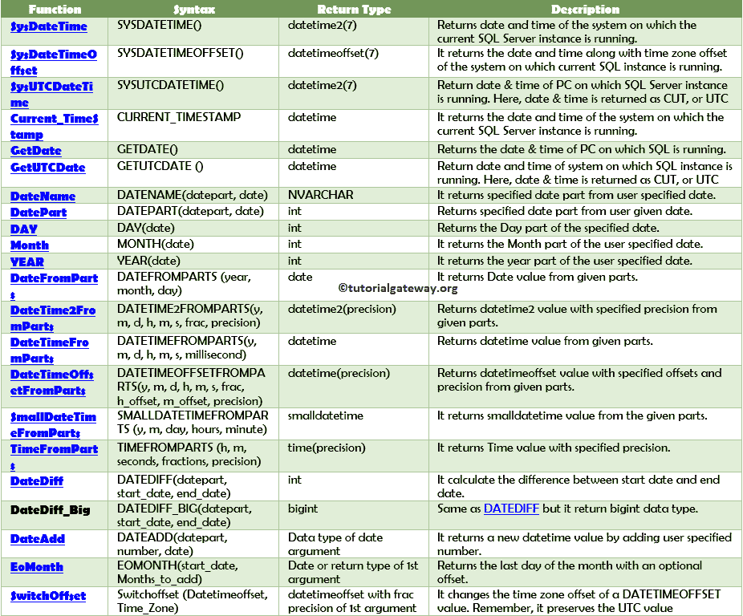

# SQL 日期函数

> 原文：<https://www.tutorialgateway.org/sql-date-functions/>

SQL 日期函数帮助我们处理日期和时间值。例如，获取当前日期或从列中提取年或月等。，您需要这些 SQL server 函数。在本文中，我们将向您展示可用的 SQL Server 日期函数列表及其描述。

## SQL 日期函数

一般来说，SQL Date 将以 dd-mm-yyyy hh:mm:ss 格式或任何其他特定于系统的格式存储。有些情况下，我们必须提取单个部分，如月、月名、年、日等。在其他时候，我们可能不得不格式化 SQL Date，从原始数据中增加或减去几天。在所有这些场景中，我们可以使用内置的标准 SQL Server 函数来操作日期。

下表将向您显示可用的函数列表。使用这些链接学习 Sql Server 数据函数，包括获取数据、格式化日期时间等。

### 更高精度的 SQL 日期和时间函数

以下是 [SQL Server](https://www.tutorialgateway.org/sql/) 中的高精度函数。

| 功能 | 句法 | 返回数据类型 | 描述 |
| [sysdate](https://www.tutorialgateway.org/sql-sysdatetime-function/) | SYSDATETIME() | 日期时间 2(7) | 它返回运行当前服务器实例的系统的日期和时间。 |
| [系统日期时间偏移](https://www.tutorialgateway.org/sql-sysdatetimeoffset-function/) | SYSDATETIMEOFFSET() | datetimeoffset(7) | 当前运行 SQL Server 实例的系统的日期和时间以及时区偏移量。 |
| [系统输出时间](https://www.tutorialgateway.org/sql-sysutcdatetime-function/) | SYSUTCDATETIME() | 日期时间 2(7) | 这将返回运行服务器实例的计算机的日期和时间。这里，格式返回为协调世界时或世界协调时 |

### 低精度 SQL 日期和时间函数

低精度 Sql Server 数据和时间函数列表。

| 功能 | 句法 | 返回数据类型 | 描述 |
| [Current_TimeStamp](https://www.tutorialgateway.org/sql-current_timestamp/) | 当前时间戳 | 日期时间 | 它返回运行当前服务器实例的系统的日期时间。 |
| get data | 获取日期（） | 日期时间 | 返回运行服务器实例的计算机的日期时间。 |
| 获取 TCDate | getutcdate() | 日期时间 | 返回运行服务器实例的系统的日期时间。这里，它返回协调世界时或世界协调时的格式 |

### 获取日期和时间部分

以下 SQL 函数帮助您从用户指定的中提取日期部分和时间部分。

| 功能 | 句法 | 返回数据类型 | 描述 |
| 数据名称 | 数据名称(datepart、dt) | 类型 | 从用户指定的返回指定的日期名称。 |
| 约会部分 | DATEPART (datepart，dt) | （同 Internationalorganizations）国际组织 | 从给定用户返回指定的 datepart。 |
| [日](https://www.tutorialgateway.org/sql-day-function/) | 日(dt) | （同 Internationalorganizations）国际组织 | 返回日部分。 |
| [月](https://www.tutorialgateway.org/sql-month-function/) | 月(dt) | （同 Internationalorganizations）国际组织 | 用户指定的月份部分。 |
| [年](https://www.tutorialgateway.org/sql-year-function/) | 年份(dt) | （同 Internationalorganizations）国际组织 | 它返回用户指定的年份部分。 |

### 从零件中获取日期和时间值的 SQL 函数

下面的 SQL 函数将从用户指定的部分返回日期和时间，或者你可以说，构造日期和时间。

| 函数名 | 句法 | 返回数据类型 | 描述 |
| 约会对象 | 日期零件(年、月、日) | 日期 | 它返回给定部分的日期值。 |
| [日期时间 2FromParts](https://www.tutorialgateway.org/sql-datetime2fromparts/) | datetime2fromparts(年、月、日、小时、分钟、秒、分数、精度) | datetime2(精度) | 从给定部分返回具有指定精度的 datetime2 值。 |
| [date fromparts](https://www.tutorialgateway.org/sql-datetimefromparts/) | datetimefromparts(年、月、日、小时、分钟、秒、毫秒) | 日期时间 | 给定部分的日期时间值。 |
| [日期时间偏离部分](https://www.tutorialgateway.org/sql-datetimeoffestfromparts/) | datetimeoffsetfroomparts(年、月、日、小时、分钟、秒、分数、小时偏移、分钟偏移、精度) | 日期时间(精度) | 具有指定偏移量和给定零件精度的 datetimeoffset 值。 |
| [小约会时间起的部分](https://www.tutorialgateway.org/sql-smalldatetimefromparts/) | smalldatetimefromparts(年、月、日、小时、分钟) | 日期时间型 | 它从给定的部分返回 smalldatetime 值。 |
| [时令零件](https://www.tutorialgateway.org/sql-timefromparts/) | 时间从零件(小时、分钟、秒、分数、精度) | 时间(精度) | 它以指定的精度返回时间值。 |

### 获取日期和时差的 SQL 函数

以下 SQL 日期函数将帮助您找到两个日期之间的差异。

| 名字 | 句法 | 数据类型 | 描述 |
| [DateDiff](https://www.tutorialgateway.org/sql-datediff/) | DATEDIFF (datepart，startdate，enddate) | （同 Internationalorganizations）国际组织 | 它将计算开始日期和结束日期之间的差异。 |
| date diff _ big-日期差异 | DATEDIFF_BIG (datepart，startdate，enddate) | 比吉斯本 | 与 [DATEDIFF](https://www.tutorialgateway.org/sql-datediff/) 相同，但它返回 bigint 数据类型。 |

### 修改日期和时间值的 SQL 函数

以下 SQL 日期函数可帮助您更改或修改用户指定的日期。

| 函数名 | 句法 | 返回数据类型 | 描述 |
| [日期添加](https://www.tutorialgateway.org/sql-dateadd/) | DATEADD(datepart，number，dt) | 日期参数的数据类型 | 此日期函数通过添加用户指定的数字返回新的日期时间值。 |
| eomonth | EOMONTH(开始日期，添加月份) | 日期，或第一个参数的返回类型。 | 返回带有可选偏移量的月份的最后一天。 |
| 开关偏移 | SWITCHOFFSET (DATETIMEOFFSET，Time_Zone) | 第一个参数的小数精度的 datetimeoffset。 | 它更改 DATETIMEOFFSET 值的时区偏移量。请记住，它会保留世界协调时值 |
| todatetimeoffset | TODATETIMEOFFSET(表达式，时区) | 第一个参数的小数精度的 datetimeoffset。 | 它将 datetime2 值转换为 datetimeofset 值。 |

### 获取或设置会话格式的 SQL 日期函数

下面显示的 SQL Server 日期和时间函数将更改默认格式。这样，您可以更改日期和时间的默认返回格式。

| 名字 | 句法 | 返回数据类型 | 描述 |
| 【date first】 | DATEFIRST(日期优先) | 微缩 | 会话的当前值。 |
| [设置日期第一](https://www.tutorialgateway.org/sql-datefirst/) | 设置日期第一个特定数字 | 不适用 | 您可以将一周的第一天从数字 1 设置为 7 |
| 设置日期格式 | 设置日期格式特定格式 | 不适用 | 您可以设置日期的格式。 |
| [@ @语言](https://www.tutorialgateway.org/sql-language/) | @@LANGUAGE | 不适用 | 该函数返回当前使用的语言。 |
| [设置语言](https://www.tutorialgateway.org/sql-language-2/) | 设置语言语言名称 | 不适用 | 您可以根据需要设置或更改默认语言。 |
| [sp_helplanguage](https://www.tutorialgateway.org/sql-sp_helplanguage/) | sp_helplanguage 语言 _ 名称 | 不适用 | 它返回给定语言及其格式的所有信息。 |

### 验证日期和时间值的 SQL 函数

我们可以使用下图来验证给定的值。

| 名字 | 句法 | 返回数据类型 | 描述 |
| isdate | 表达式 | （同 Internationalorganizations）国际组织 | 它确定输入表达式是否有效。 |

