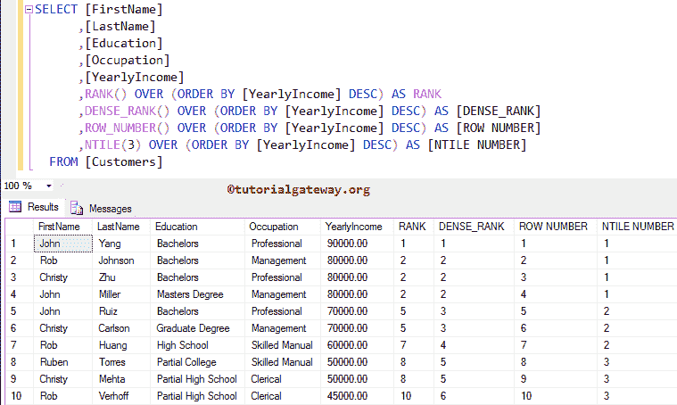

# SQL Server 中的排序函数

> 原文：<https://www.tutorialgateway.org/ranking-functions-in-sql-server/>

SQL Server 中的排名函数为分区中的每一行返回排名值。SQL Server 提供了各种等级函数，允许我们分配不同的等级。根据您选择的功能，它们返回不同的数字。下表将向您显示可用排名函数的列表

| 功能 | 描述 |
| [等级](https://www.tutorialgateway.org/sql-rank-function/) | 它将为分区中的每个记录分配等级号。 |
| [DENSE_RANK](https://www.tutorialgateway.org/sql-dense_rank/) | 它将为分区内的每条记录分配编号，而不会跳过等级编号 |
| [NTILE](https://www.tutorialgateway.org/sql-ntile-function/) | 这将为分区中的每个记录分配等级号。 |
| [行号](https://www.tutorialgateway.org/sql-row_number/) | 它将为分区中的每个唯一记录分配序列号。 |

## SQL Server 示例中的排名函数

在这个[服务器](https://www.tutorialgateway.org/sql/)的例子中，我们将在一个地方向您展示所有等级函数的功能

```
SELECT [FirstName]
      ,[LastName]
      ,[Education]
      ,[Occupation]
      ,[YearlyIncome]
      ,RANK() OVER (ORDER BY [YearlyIncome] DESC) AS RANK
      ,DENSE_RANK() OVER (ORDER BY [YearlyIncome] DESC) AS [DENSE_RANK]
      ,ROW_NUMBER() OVER (ORDER BY [YearlyIncome] DESC) AS [ROW NUMBER]
      ,NTILE(3) OVER (ORDER BY [YearlyIncome] DESC) AS [NTILE NUMBER]
  FROM [Customers]
```

