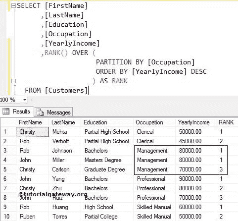
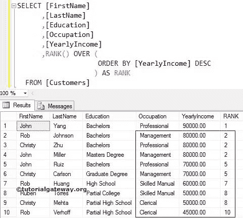
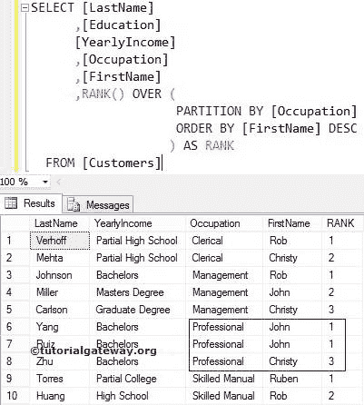

# SQL 秩函数

> 原文：<https://www.tutorialgateway.org/sql-rank-function/>

SQL `RANK()`函数将为分区中的每条记录分配一个秩号。如果 SQL Server `RANK()`函数在同一个分区中遇到两个相等的值，那么它将为这两个值分配相同的数字。它会跳过下一个数字。

## SQL 秩函数语法

SQL Server 等级函数的语法是

```
SELECT RANK() OVER (PARTITION_BY_Clause ORDER_BY_Clause)
FROM [Source]
```

Partition _ By _ 子句:这将把`SELECT`语句选择的记录划分为多个分区。如果您指定了分区依据子句，那么 SQL `RANK()`函数将为每个分区分配编号。如果没有，它会将所有记录视为一个单独的部分。所以，它会从上到下分配数字。

对于这个 SQL `RANK()`函数示例，我们将使用下表数据


## SQL 秩函数示例

它允许您为分区中的每个记录分配编号。在本例中，我们将向您展示如何对[服务器](https://www.tutorialgateway.org/sql/)表中的分区行进行排序。以下[选择报表](https://www.tutorialgateway.org/sql-select-statement/)将按职业对数据进行分类，并使用年收入分配数字。

```
SELECT [FirstName]
      ,[LastName]
      ,[Education]
      ,[Occupation]
      ,[YearlyIncome]
      ,RANK() OVER (
                     PARTITION BY [Occupation] 
                     ORDER BY [YearlyIncome] DESC
             ) AS RANK
  FROM [Customers]
```



它使用所选数据的占用情况将其划分为分区。从上面的示例输出中，您可以观察到，我们有四个部分。

```
PARTITION BY [Occupation]
```

在[下方，Order By](https://www.tutorialgateway.org/sql-order-by-clause/) 语句将使用分区数据的【年收入】对其进行降序排序

```
ORDER BY [YearlyIncome] DESC
```

我们使用了带有分区依据子句的 SQL Server `RANK()`函数。所以，它会给每个职业分配号码。

```
RANK() OVER (
              PARTITION BY [Occupation] 
              ORDER BY [YearlyIncome] DESC
             ) AS RANK
```

它给了 3 和 4 张唱片同样的数字，因为它们的年收入是一样的。接下来，它跳过一个数字，将第三个数字分配给下一个记录。

### 不带分区依据子句的 SQL `RANK()`函数

在这个 SQL 排名函数示例中，我们将向您展示，如果我们错过或没有 Partition By 子句会发生什么。例如，它使用了上面没有 Partition by 子句的示例查询。

```
SELECT [FirstName]
      ,[LastName]
      ,[Education]
      ,[Occupation]
      ,[YearlyIncome]
      ,RANK() OVER (
                     ORDER BY [YearlyIncome] DESC
              ) AS RANK
  FROM [Customers]
```



我们使用了不带分区依据子句的 SQL `RANK()`函数。因此，该函数将它们视为一个单一的类别，并从头到尾分配数字。

```
RANK() OVER (
              ORDER BY [YearlyIncome] DESC
            ) AS RANK
```

它给了 2、3 和 4 张唱片同样的数字，因为它们的年收入是一样的。接下来，它跳过了这两个记录(3，4)的两个数字，并将 5 分配给下一个记录。

## 字符串列

它还允许您对字符串列进行排序。在这个示例查询中，我们使用这个函数为名字分配数字。

```
SELECT [LastName]
      ,[Education]
      ,[YearlyIncome]
      ,[Occupation]
      ,[FirstName]
      ,RANK() OVER (
                    PARTITION BY [Occupation] 
                    ORDER BY [FirstName] DESC
                   ) AS RANK
  FROM [Customers]
```

它给了 6 和 7 条记录相同的数字，因为它们的名字是相同的。接下来，它跳过一个数字，将第三个数字分配给下一个记录。

