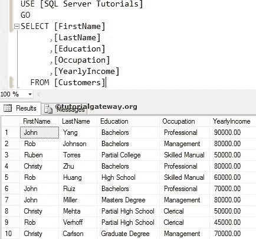
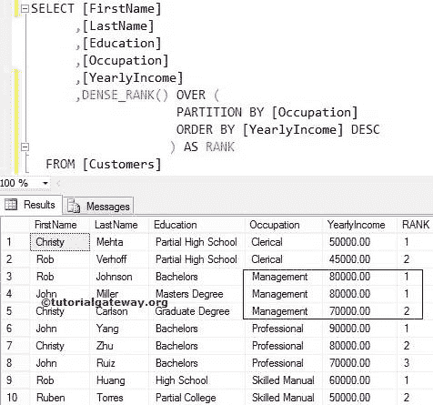
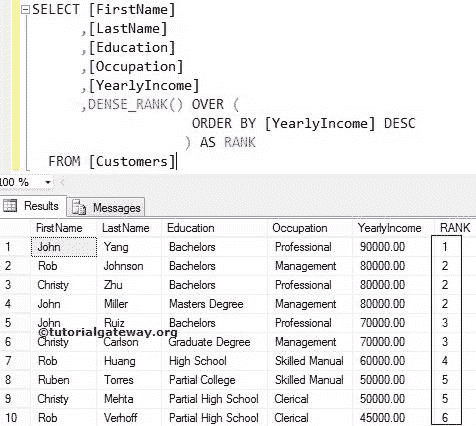

# SQL 密集 _ 秩函数

> 原文：<https://www.tutorialgateway.org/sql-dense_rank/>

SQL 密集`sort()`函数是`sort()`函数之一。函数的作用是:为分区中的每条记录分配一个等级号，而不跳过等级号。

如果 SQL `DENSE_RANK()`函数在同一个分区中遇到两个相等的值，它将为这两个值分配相同的秩数。在本文中，我们将通过一个例子向您展示如何编写 Sql DENSE _`RANK()`函数。

## SQL 密集 _ 秩语法

SQL Server 密集排名函数的语法是:

```sql
SELECT DENSE_RANK() OVER (PARTITION_BY_Clause ORDER_BY_Clause)
FROM [Source]
```

Partition _ By _ 子句:这将把记录分成多个分区。

*   如果您指定了“分区依据”子句，密集等级函数将为每个分区分配等级号。
*   如果您还没有指定，那么密集等级函数会将所有记录视为一个分区。

对于这个查询，我们使用下面的数据



## SQL 密集 _ 秩函数示例

在这个例子中，我们展示了如何对表中的分区记录进行密集排序。以下[排名功能](https://www.tutorialgateway.org/ranking-functions-in-sql-server/)查询将按职业对数据进行划分，并使用年收入分配一个密集的排名号。

```sql
SELECT [FirstName]
      ,[LastName]
      ,[Education]
      ,[Occupation]
      ,[YearlyIncome]
      ,DENSE_RANK() OVER (
                     PARTITION BY [Occupation] 
                     ORDER BY [YearlyIncome] DESC
             ) AS RANK
  FROM [Customers]
```



下面的 [SQL Server](https://www.tutorialgateway.org/sql/) 语句使用所选数据的占用情况将其划分为分区。从上面你可以看到，我们有四个分区

```sql
PARTITION BY [Occupation]
```

在下面的语句中，我们使用了带有分区依据子句的密集秩函数。因此，该函数将为每个单独的分区分配一个密集的秩数。

```sql
DENSE_RANK() OVER (
              PARTITION BY [Occupation] 
              ORDER BY [YearlyIncome] DESC
             ) AS RANK
```

它给了 3 和 4 张唱片同样的排名，因为它们的年收入是一样的。接下来，它将第二个等级分配给下一个记录(它不会跳过任何数字)。

### 不带分区依据子句的 SQL 密集排序

在这个例子中，我们展示了如果我们错过了 SQL Server 中密集排序中的分区依据子句会发生什么。例如，下面的[`SELECT`语句](https://www.tutorialgateway.org/sql-select-statement/)将使用上面没有 Partition by 子句的例子。

```sql
SELECT [FirstName]
      ,[LastName]
      ,[Education]
      ,[Occupation]
      ,[YearlyIncome]
      ,DENSE_RANK() OVER (
                     ORDER BY [YearlyIncome] DESC
              ) AS RANK
  FROM [Customers]
```



在本例中，下面的语句将以降序对年收入数据进行排序

```sql
ORDER BY [YearlyIncome] DESC
```

在下面的语句中，我们使用了不带 Partition by 子句的`DENSE_RANK()`函数。因此，它会将它们视为一个单独的部分，并从头到尾分配等级编号。

```sql
DENSE_RANK() OVER (
              ORDER BY [YearlyIncome] DESC
            ) AS RANK
```

因为他们的年收入相同(80000 英镑)，所以给了 2、3 和 4 张唱片相同的排名。接下来，它给了 5 和 6 条记录相同的数字，因为它们的年收入相同，以此类推。

### 在字符串列上

SQL Server 密集`sort()`函数还允许您对字符串列进行排序。在这个例子中，我们将使用这个来分配[名字]的数字

```sql
SELECT [LastName]
      ,[Education]
      ,[YearlyIncome]
      ,[Occupation]
      ,[FirstName]
      ,DENSE_RANK() OVER (
                         PARTITION BY [Occupation] 
                         ORDER BY [FirstName] DESC
                         ) AS RANK
  FROM [Customers]
```

如果你观察下面的截图，这个函数给了 6 条和 7 条记录相同的排名，因为它们的名字是相同的。接下来，它将第二个等级分配给下一个记录。

