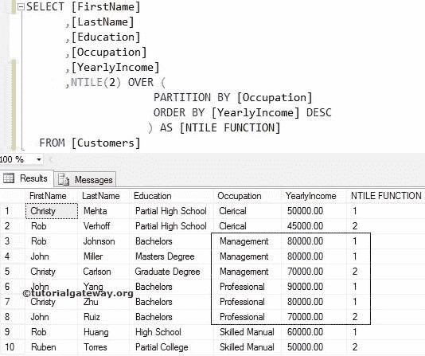
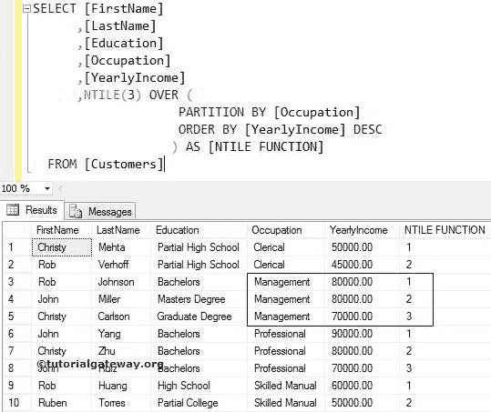
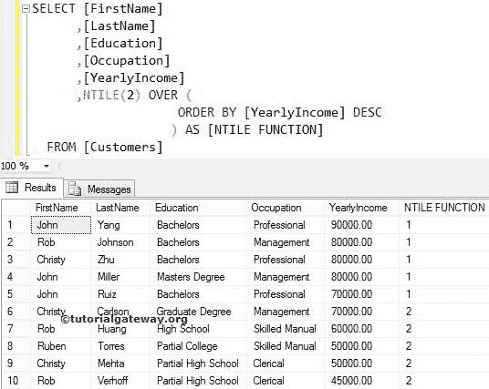
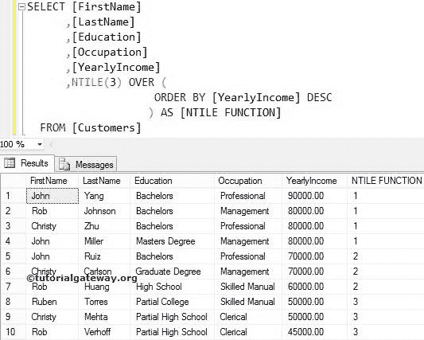

# SQL `NTILE()`函数

> 原文：<https://www.tutorialgateway.org/sql-ntile-function/>

SQL `NTILE()`函数是 SQL 排名函数之一。此`NTILE()`函数将为分区中的每个记录分配等级号。SQL Server `NTILE()`函数的语法是:

```
SELECT NTILE(Interger_Value) OVER (PARTITION_BY_Clause ORDER_BY_Clause)
FROM [Source]
```

Integer_Value:它将使用这个整数值来决定它必须为每个分区分配的等级数。例如，如果我们指定 2，SQL `NTILE()`函数将为每个类别分配 2 个等级号。

Partition _ By _ 子句:这将把`SELECT`语句选择的记录划分为多个分区。

*   如果您指定了“分区依据”子句，它将为每个部分分配等级编号。
*   如果没有，SQL `NTILE()`函数会将所有记录视为一个单独的部分。因此，它将从上到下分配等级编号。

对于这个 SQL `NTILE()`函数示例，我们将使用[等级表](https://www.tutorialgateway.org/sql-data/)数据

## SQL `NTILE()`函数示例

SQL `NTILE()`函数允许您为分区中的每条记录分配等级号。在这个[`sort()`函数](https://www.tutorialgateway.org/ranking-functions-in-sql-server/)的例子中，我们将向您展示如何对 [SQL Server](https://www.tutorialgateway.org/sql/) 表中可用的分区记录进行排序。以下 SQL [`SELECT`语句](https://www.tutorialgateway.org/sql-select-statement/)查询将按职业分离数据，并使用年收入分配等级号。

```
SELECT [FirstName]
      ,[LastName]
      ,[Education]
      ,[Occupation]
      ,[YearlyIncome]
      ,NTILE(2) OVER (
                     PARTITION BY [Occupation] 
                     ORDER BY [YearlyIncome] DESC
         	   ) AS [NTILE NUMBER]
  FROM [Customers]
```



下面的 PARTITION BY[占领]语句使用“占领”列将所选数据分成一个分区。从上图中，您可以看到我们有四个分区

这个[`ORDER BY`](https://www.tutorialgateway.org/sql-order-by-clause/)使用他们的【年收入】对数据进行降序排序

在下面的语句中，我们使用了带有 Partition by 子句的 NTILE(2)函数。这里的整数值是 2。这意味着 SQL `NTILE()`函数将为每个分区分配两个秩数(4 个部分)。

虽然 6 张和 7 张唱片(90000 张和 80000 张)的年收入并不相同，但它给了它们相同的排名。因为 NTILE(2)只能分配两个等级进行分离。

## SQL `NTILE()`函数示例 2

在这个 SQL 实例中，我们向您展示了如果我们在 Integer_Valueposition 处分配一个不同的值会发生什么。下面的示例使用了上面的示例查询，但是我们将数字从 2 更改为 NTILE(3)。

```
SELECT [FirstName]
      ,[LastName]
      ,[Education]
      ,[Occupation]
      ,[YearlyIncome]
      ,NTILE(3) OVER (
                     PARTITION BY [Occupation] 
                     ORDER BY [YearlyIncome] DESC
         	   ) AS [NTILE NUMBER]
  FROM [Customers]
```

上面的查询将为每个职业分配三个等级编号。



这里，3 张和 4 张唱片的年收入是一样的(80000)。然而，它给了他们不同的等级，因为 NTILE(3)将为一个职业分配三个等级。

## 没有分区依据子句 1 的 SQL `NTILE()`函数

如果我们错过了 SQL Server 中`NTILE()`函数的 Partition By 子句，会发生什么？。例如，下面的 SQL NTILE 查询将使用上面的不带分区依据子句的示例查询。

这里的整数值是 2。这意味着 SQL `NTILE()`函数将为每个部分分配两个秩数。

因为我们没有使用任何分区，所以它会将所有十条记录视为一个单独的分区。接下来，它将为这十条记录分配两个等级编号。

```
SELECT [LastName]
      ,[Education]
      ,[YearlyIncome]
      ,[Occupation]
      ,[FirstName]
      ,NTILE(2) OVER (
                       ORDER BY [YearlyIncome] DESC
                     ) AS [NTILE NUMBER]
  FROM [Customers]
```



## 没有按子句划分的 SQL NTILE

在这个 SQL `NTILE()`函数示例中，我们在 Integer_Value 位置分配了一个不同的值。例如，在这里，我们将 2 改为 3。

```
SELECT [LastName]
      ,[Education]
      ,[YearlyIncome]
      ,[Occupation]
      ,[FirstName]
      ,NTILE(3) OVER (
                       ORDER BY [YearlyIncome] DESC
                     ) AS [NTILE NUMBER]
  FROM [Customers]
```



这里我们没有使用任何 partition 子句。这意味着该函数将把所有 10 条记录视为一个分区。接下来，它将为这 10 条记录分配 3 个等级编号，因为我们给 Integer_Value 的值是 3。