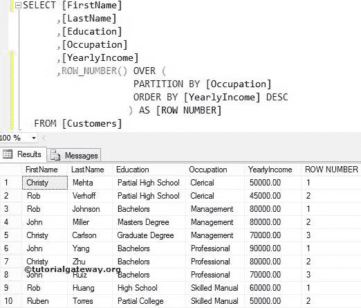
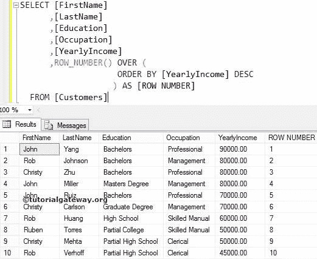
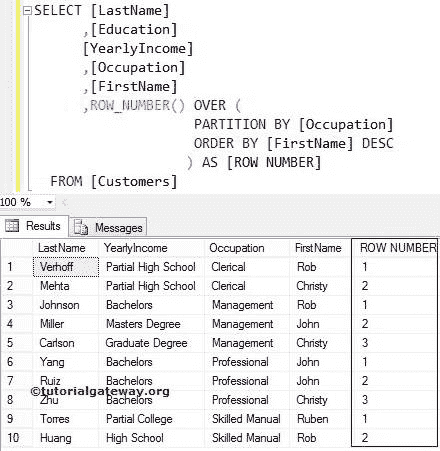

# SQL 行 _ 编号

> 原文：<https://www.tutorialgateway.org/sql-row_number/>

函数是一个 SQL 服务器排名函数。这个 SQL`row_number()`函数为分区中的每个唯一记录分配一个连续的秩号。

如果 SQL Server`ROW_NUMBER()`函数在同一个分区中遇到两个相等的值，它将为这两个值分配不同的秩数。这里的排名将取决于他们显示的顺序。

## SQL 行 _ 号语法

函数的语法是:

```
SELECT ROW_NUMBER() OVER (PARTITION_BY_Clause ORDER_BY_Clause)
FROM [Source]
```

Partition _ By _ 子句:将记录划分为分区。

*   如果您指定了分区依据子句，SQL`ROW_NUMBER()`函数将为每个分区分配等级号。
*   如果您没有定义分区依据，那么`ROW_NUMBER()`函数会将所有记录视为一个分区。因此，ROW_NUMBER 将从上到下分配等级编号。

对于这个函数示例，我们使用[等级表](https://www.tutorialgateway.org/sql-data/)数据

## SQL 行号函数示例

该函数为分区中的每条记录分配行号或等级号。在这个[`sort()`函数](https://www.tutorialgateway.org/ranking-functions-in-sql-server/)的例子中，我们展示了如何对存在于[服务器](https://www.tutorialgateway.org/sql/)表中的分区记录进行排序。

SQL Server 查询中的以下 row_number 将按职业对数据进行分区，并使用年收入分配行号。

```
SELECT [FirstName]
      ,[LastName]
      ,[Education]
      ,[Occupation]
      ,[YearlyIncome]
      ,ROW_NUMBER() OVER (
                     PARTITION BY [Occupation] 
                     ORDER BY [YearlyIncome] DESC
             ) AS [ROW NUMBER]
  FROM [Customers]
```



在这个示例查询中，下面的语句使用数据的占用情况将数据划分为分区。从上面你可以看到，我们有四个分区

```
PARTITION BY [Occupation]
```

在下面的语句中，我们使用了带有分区依据子句的 SQL Server`ROW_NUMBER()`函数。因此，它将为每个分区分配行号。

```
ROW_NUMBER() OVER (
              PARTITION BY [Occupation] 
              ORDER BY [YearlyIncome] DESC
             ) AS [ROW NUMBER]
```

虽然 3 张和 4 张唱片(80000 张)的年收入是一样的，但给了他们不同的排名。因为 ROW_NUMBER 为每条记录分配了不同的等级。

## 不带分区依据子句的 SQL 行编号

这个例子显示了如果我们错过了`ROW_NUMBER()`函数中的分区依据会发生什么。例如，下面的查询使用上面的不带 Partition by 子句的 SQL 行号查询。

```
SELECT [FirstName]
      ,[LastName]
      ,[Education]
      ,[Occupation]
      ,[YearlyIncome]
      ,ROW_NUMBER() OVER (
                     ORDER BY [YearlyIncome] DESC
              ) AS [ROW NUMBER]
  FROM [Customers]
```



下面的语句将以降序对年收入数据进行排序

```
ORDER BY [YearlyIncome] DESC
```

在下面的语句中，我们使用了不带 Partition by 子句的 Sql Server 行号函数。因此，行号函数会将它们视为一个分区，并从头到尾分配行号。

```
ROW_NUMBER() OVER (
              ORDER BY [YearlyIncome] DESC
            ) AS [ROW_NUMBER]
```

## 字符串列

它还允许您对字符串列进行排序。在本例中，我们将使用 SQL Server`ROW_NUMBER()`函数为[名字]列分配排名编号。

```
SELECT [LastName]
      ,[Education]
      ,[YearlyIncome]
      ,[Occupation]
      ,[FirstName]
      ,ROW_NUMBER() OVER (
                    PARTITION BY [Occupation] 
                    ORDER BY [FirstName] DESC
                   ) AS [ROW NUMBER]
  FROM [Customers]
```



如果观察上面的截图，虽然第 6 条和第 7 条记录(John)的名字相同， [`SELECT`语句](https://www.tutorialgateway.org/sql-select-statement/)给了它们不同的行号。因为 SQL Server 行号为列中的每条记录分配唯一的等级。