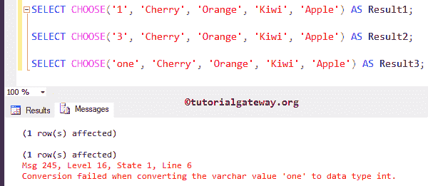

# 选择函数

> 原文：<https://www.tutorialgateway.org/sql-choose-function/>

SQL CHOOSE 函数是 SQL Server 2012 中引入的新的内置逻辑函数。这个函数从项目列表中返回指定索引处的项目。

## 选择逻辑函数语法

在 SQL Server 中选择的语法是

```
CHOOSE (Index, Value1, Value2, ....,ValueN)
```

索引:请指定所需项目的索引位置。索引位置应该从 1 开始。

*   如果指定的索引值具有整数以外的数字数据类型，则数字值将隐式转换为整数类型。例如，10.68 将转换为 10。
*   如果指定索引中没有项目或索引超出范围，则 CHOOSE 函数返回空值

值 1、值 2…、值 n 是项目的数组

### SQL 选择函数示例

这个例子将向你展示，选择功能的工作功能

```
SELECT CHOOSE(1, 'Apple', 'Orange', 'Kiwi', 'Cherry') AS Result1;

SELECT CHOOSE(2, 'Apple', 'Orange', 'Kiwi', 'Cherry') AS Result2;

SELECT CHOOSE(3, 'Apple', 'Orange', 'Kiwi', 'Cherry') AS Result3;

SELECT CHOOSE(4, 'Apple', 'Orange', 'Kiwi', 'Cherry') AS Result4;
```


## SQL select 函数索引超出范围

在本例中，我们将使用索引值为 0、负索引值和非索引值的 CHOOSE 函数。

```
SELECT CHOOSE(0, 'Apple', 'Orange', 'Kiwi', 'Cherry') AS Result1;

SELECT CHOOSE(-2, 'Apple', 'Orange', 'Kiwi', 'Cherry') AS Result2;

SELECT CHOOSE(6, 'Apple', 'Orange', 'Kiwi', 'Cherry') AS Result3;
```


在这个选择函数示例中，下面的语句返回空值，因为索引值应该以 1 或大于 1 开头

```
SELECT CHOOSE(0, 'Apple', 'Orange', 'Kiwi', 'Cherry') AS Result1;

SELECT CHOOSE(-2, 'Apple', 'Orange', 'Kiwi', 'Cherry') AS Result2;
```

在[下面，SQL Server](https://www.tutorialgateway.org/sql/) 语句正在返回空值，因为我们将索引值作为六传递，并且在第六个位置没有任何项目

```
SELECT CHOOSE(6, 'Apple', 'Orange', 'Kiwi', 'Cherry') AS Result3;
```

## 选择函数十进制值

在本例中，我们将使用带有数值的 SQL Server CHOOSE 函数。这里，十进制值四舍五入为整数。这意味着 1.95 将四舍五入为 1，2.05 和 2.99 四舍五入为 2。

```
SELECT CHOOSE(1.95, 'Cherry', 'Orange', 'Kiwi', 'Apple') AS Result1;

SELECT CHOOSE(2.05, 'Cherry', 'Orange', 'Kiwi', 'Apple') AS Result2;

SELECT CHOOSE(2.99, 'Cherry', 'Orange', 'Kiwi', 'Apple') AS Result3;
```


## 选择函数字符串值

在这个例子中，我们使用了带有字符串值的 CHOOSE 函数。这里 varchar 1 和 3 将被转换为整数数据类型。

```
SELECT CHOOSE('1', 'Cherry', 'Orange', 'Kiwi', 'Apple') AS Result1;

SELECT CHOOSE('3', 'Cherry', 'Orange', 'Kiwi', 'Apple') AS Result2;
```


这里，SQL Server 无法将 Varchar 值一转换为整数数据类型。所以，它抛出了一个错误。

```
SELECT CHOOSE('one', 'Cherry', 'Orange', 'Kiwi', 'Apple') AS Result3;
```



## 选择函数实例

在本例中，我们使用的是 AdventureWorks 数据库，用于提取数据的查询如下所示:

```
SELECT TOP 10 
       [NationalIDNumber]
      ,[LoginID]
      ,[JobTitle]
      ,[BirthDate]
      ,[Gender]
      ,[HireDate]
  FROM [AdventureWorks2014].[HumanResources].[Employee]
```

下面的截图将显示表格中的数据。在本例中，我们将使用 SQL server CHOOSE 函数将月份数字转换为一月、二月等。


从下面的代码片段中，您可以观察到我们可以使用内置函数 [MONTH](https://www.tutorialgateway.org/sql-month-function/) 和 [DATEPART](https://www.tutorialgateway.org/sql-datepart/) 提取月号。这就是我们使用这两个函数的原因

```
SELECT [NationalIDNumber]
      ,[LoginID]
      ,[JobTitle]
      ,[BirthDate]
      ,CHOOSE(MONTH([BirthDate]),'January','February','March','April','May','June',
          'July','August','September','October','November','December') AS Birth_Month
      ,[Gender]
      ,[HireDate]
      ,CHOOSE(DATEPART(MM, [HireDate]),'January','February','March','April','May','June',
	  'July','August','September','October','November','December') AS Hire_Month
  FROM [SQL Tutorial].[dbo].[SQL Choose]
```

