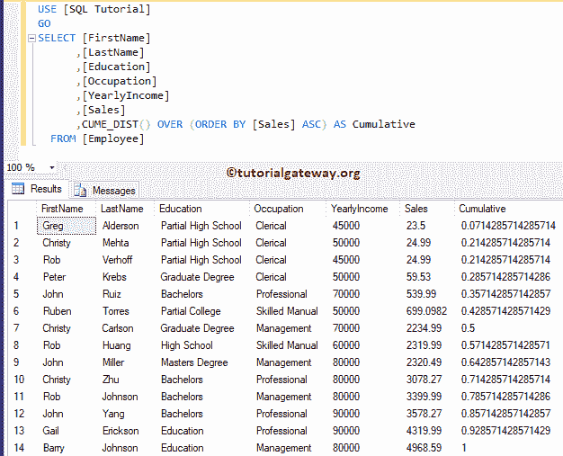
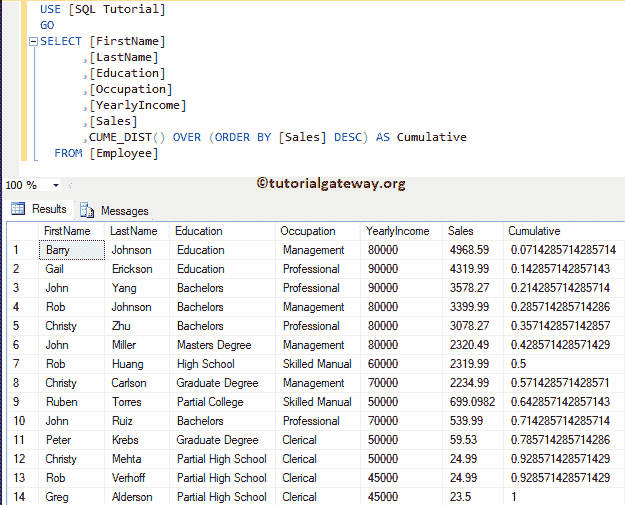
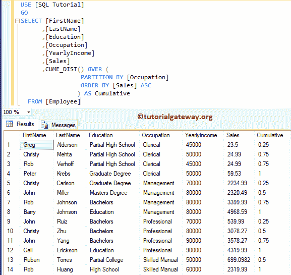

# sql cume _ dist

> 原文：<https://www.tutorialgateway.org/sql-cume_dist/>

SQL CUME_DIST 是 SQL Server 中的分析函数之一，用于计算分区或整个行集中的行的累积分布。SQL Server 中 CUME_DIST 的基本语法如下所示:

```
SELECT CUME_DIST() 
           OVER ( PARTITION_BY_Clause 
                  ORDER_BY_Clause
                )
FROM [Source]
```

*   Partition _ By _ 子句:将 [SELECT 语句](https://www.tutorialgateway.org/sql-select-statement/)选择的记录划分为分区。
    *   如果您给了它，那么`CUME_DIST()`函数将计算每个分区中的行在 SQL Server 中的累积分布。
    *   如果您没有指定，那么它会将所有行视为一个分区。
*   Order _ By _ 子句:此[服务器](https://www.tutorialgateway.org/sql/)子句用于将分区数据按指定顺序排序。请参考[订单条款](https://www.tutorialgateway.org/sql-order-by-clause/)。

我们将使用下面显示的数据进行这个 SQL CUME_DIST 演示


## 没有分区依据子句的 SQL CUME_DIST

在这个例子中，我们向您展示了如果我们避免在 SQL server 的`CUME_DIST()`函数中使用分区依据子句会发生什么。

```
SELECT [FirstName]
      ,[LastName]
      ,[Education]
      ,[Occupation]
      ,[YearlyIncome]
      ,[Sales]
      ,CUME_DIST() OVER (ORDER BY [Sales] ASC) AS Cumulative 
  FROM [Employee]
```



让我把 Order by 子句从升序改为降序。

```
SELECT [FirstName]
      ,[LastName]
      ,[Education]
      ,[Occupation]
      ,[YearlyIncome]
      ,[Sales]
      ,CUME_DIST() OVER (ORDER BY [Sales] ASC) AS Cumulative 
  FROM [Employee]
```



## 带分区的 SQL CUME_DIST 示例

此示例说明如何返回表中已分区记录的 SQL Server 累积分布。以下查询将使用销售额按职业对数据进行分类。然后独立写出每个类别的累计分布。

```
SELECT [FirstName]
      ,[LastName]
      ,[Education]
      ,[Occupation]
      ,[YearlyIncome]
      ,[Sales]
      ,CUME_DIST() OVER ( PARTITION BY [Occupation]
			  ORDER BY [Sales] ASC
			) AS Cumulative
  FROM [Employee]
```

