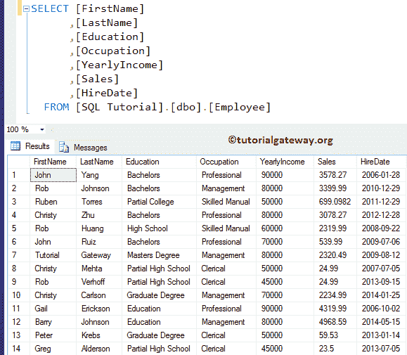

# SQL `FIRST_VALUE()`

> 原文：<https://www.tutorialgateway.org/sql-first_value/>

`FIRST_VALUE()`是`PARSE()`函数之一。这个函数将返回每个分区中的第一个值。SQL Server 中 FIRST_VALUE 的基本语法如下所示:

```sql
SELECT FIRST VALUE([Scalar Expression]) 
                  OVER (
                         PARTITION_BY_Clause 
                         ORDER_BY_Clause
                        )
FROM [Source]
```

对于这个 SQL FIRST_VALUE 演示，我们将使用下面显示的数据



## 没有分区依据子句的 SQL FIRST_VALUE

如果我们在这个函数中避免了 Partition By 子句，会发生什么？

```sql
SELECT [FirstName]
      ,[LastName]
      ,[Education]
      ,[Occupation]
      ,[YearlyIncome]
      ,[Sales]
      ,[HireDate]
      ,FIRST_VALUE([Sales]) OVER (ORDER BY [HireDate] ASC) AS LeastSale  
      ,FIRST_VALUE([Occupation]) OVER (ORDER BY [HireDate] ASC) AS Profession   
  FROM [Employee]
```


FIRST_VALUE 代码上方是一个常见的[`SELECT`语句](https://www.tutorialgateway.org/sql-select-statement/)，我们正在根据“雇佣日期”列编写“销售”、“职业”的第一个值。

下面的 [SQL Server](https://www.tutorialgateway.org/sql/) 语句根据升序中的 HireDate 对雇员表进行排序。让我给你看同样的

```sql
SELECT [FirstName]
      ,[LastName]
      ,[Education]
      ,[Occupation]
      ,[YearlyIncome]
      ,[Sales]
      ,[HireDate]
  FROM [Employee]
  ORDER BY [HireDate] ASC
```


从上面的截图可以观察到，Employee 表的第一列值是职业=专业，销售= 3578.27。现在，下面查询中的 SQL `FIRST_VALUE()`函数返回这些值作为输出。

```sql
,FIRST_VALUE([Sales]) 
                  OVER (ORDER BY [HireDate] ASC) AS LeastSale  
,FIRST_VALUE([Occupation]) 
                  OVER (ORDER BY [HireDate] ASC) AS Profession
```

让我把 [`ORDER BY`子句](https://www.tutorialgateway.org/sql-order-by-clause/)改为降序，以便进一步澄清

```sql
SELECT [FirstName]
      ,[LastName]
      ,[Education]
      ,[Occupation]
      ,[YearlyIncome]
      ,[Sales]
      ,[HireDate]
      ,FIRST_VALUE([Sales]) OVER (ORDER BY [HireDate] ASC) AS LeastSale  
      ,FIRST_VALUE([Occupation]) OVER (ORDER BY [HireDate] ASC) AS Profession   
  FROM [Employee]
```


## 带分区的 SQL FIRST_VALUE 示例

SQL Server 中的第一个值允许您选择每个分区中的第一个值。以下查询按职业对数据进行分区，并按销售额降序对数据进行排序。然后选择每个分区中的第一个[名字]值或第一个值。

```sql
SELECT [FirstName]
      ,[LastName]
      ,[Education]
      ,[Occupation]
      ,[YearlyIncome]
      ,[Sales]
      ,FIRST_VALUE([FirstName]) OVER (
                                       PARTITION BY [Occupation] 
    				       ORDER BY [Sales] DESC
				      ) AS BestCustomer   
      ,[HireDate]
  FROM [Employee]
```

