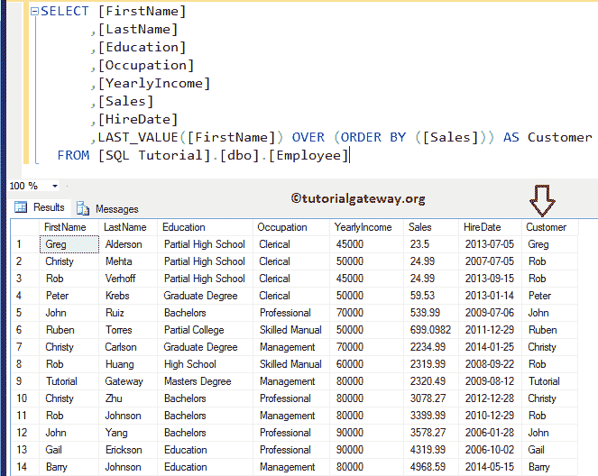
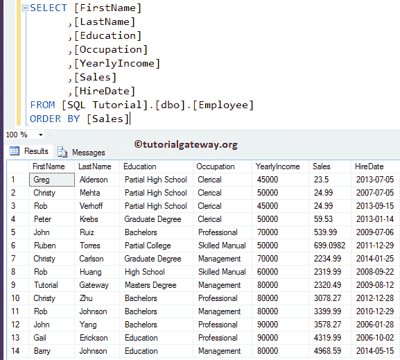
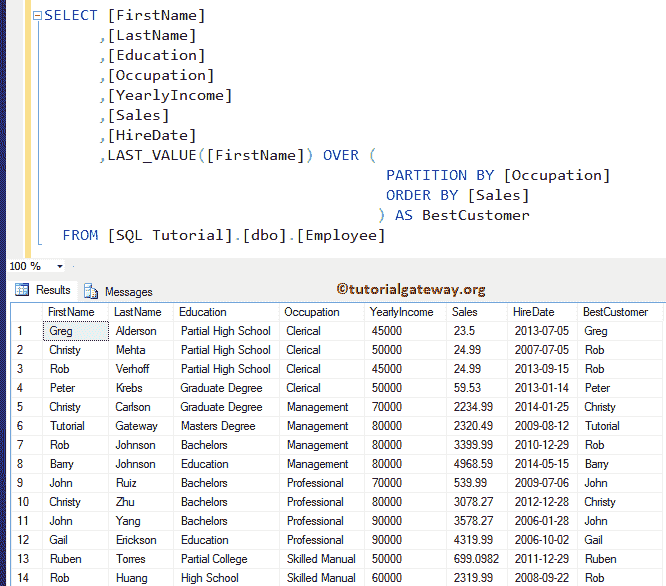

# SQL LAST_VALUE

> 原文:[https://www.tutorialgateway.org/sql-last_value/](https://www.tutorialgateway.org/sql-last_value/)

SQL LAST_VALUE 是一个分析函数，它返回有序值集中的最后一个值。SQL Server 中 LAST_VALUE 的基本语法如下所示:

```
SELECT LAST VALUE([Scalar Expression]) 
                  OVER (
                         PARTITION_BY_Clause 
                         ORDER_BY_Clause
                        )
FROM [Source]
```

对于这个 SQL LAST_VALUE 的演示，我们使用如下所示的数据


## 没有分区依据子句的 SQL LAST_VALUE

如果我们错过了函数中的 Partition By 子句，该怎么办？

```
SELECT [FirstName]
      ,[LastName]
      ,[Education]
      ,[Occupation]
      ,[YearlyIncome]
      ,[Sales]
      ,[HireDate]
      ,LAST_VALUE([FirstName]) OVER (ORDER BY ([Sales])) AS Customer 
  FROM [Employee]
```

上面的 SQL LAST_VALUE 代码根据 Sales 列返回名字的最后一个值。



[SQL Server](https://www.tutorialgateway.org/sql/) 代码的下一行根据销售数据以升序对表格数据进行排序。让我给你看同样的

```
SELECT [FirstName]
      ,[LastName]
      ,[Education]
      ,[Occupation]
      ,[YearlyIncome]
      ,[Sales]
      ,[HireDate]
FROM [Employee]
ORDER BY [Sales]
```



下面代码中的分析函数根据销售额返回独立的最后一个值。在上面的例子中，你可以看到克里斯蒂和罗布的 24.99。从这两个名字中，姓氏将选择罗布并返回相同的名字

```
LAST_VALUE([FirstName]) OVER (ORDER BY ([Sales])) AS Customer
```

所有剩余的值都是独立的，所以这个函数返回的是相同的。

## 带分区的 SQL LAST_VALUE 示例

此示例显示如何从分区记录中选择最后一个值。首先，last_value 查询将根据销售额按职业对数据进行分区，然后在每个分区中选择 Last[名字]值。

```
SELECT [FirstName]
      ,[LastName]
      ,[Education]
      ,[Occupation]
      ,[YearlyIncome]
      ,[Sales]
      ,[HireDate]
      ,LAST_VALUE([FirstName]) OVER (
                                      PARTITION BY [Occupation] 
				      ORDER BY [Sales]
				     ) AS BestCustomer   
FROM [Employee]
```

