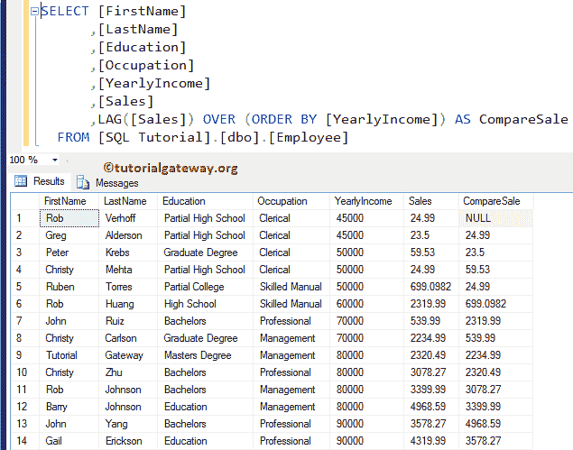
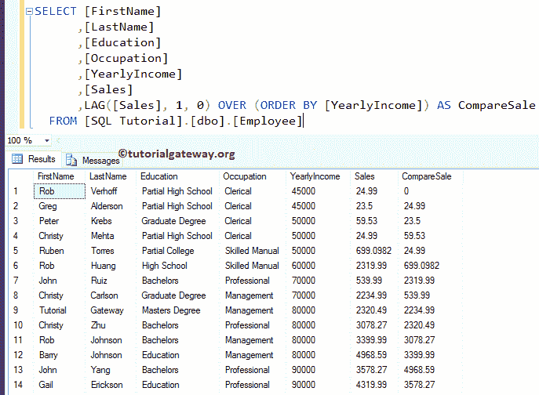
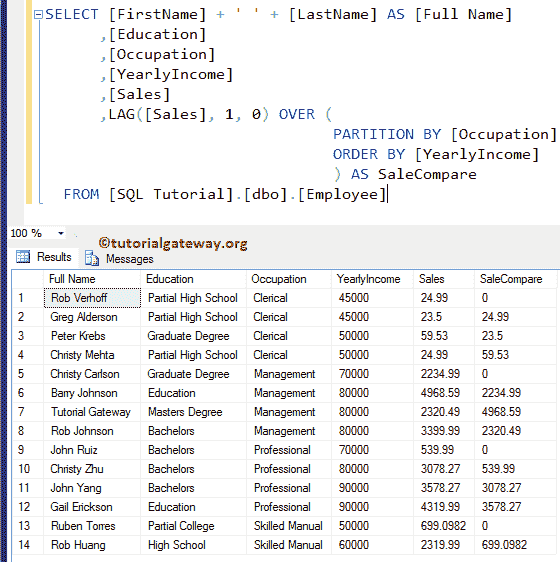
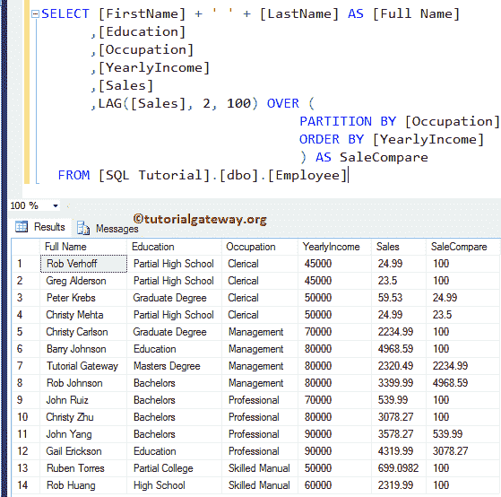

# SQL `LAG()`函数

> 原文：<https://www.tutorialgateway.org/sql-lag-function/>

SQL LAG 是`PARSE()`函数之一，与 LEAD 完全相反。此 SQL Server 滞后函数允许您访问前一行的数据，而无需使用任何 SELF JOIN。SQL Server 中 LAG 的基本语法如下所示:

```
SELECT LAG([Scalar Expression], [Offset], [Default]) 
                  OVER (
                         PARTITION_BY_Clause 
                         ORDER_BY_Clause
                        )
FROM [Source]
```

*   标量表达式:它可以是返回单个值的列、表达式或子查询。
*   偏移量:请定义要向后移动的行数。例如，如果它是 3，那么它将选择前面的第三行(-3)作为结果—使用列、[子查询](https://www.tutorialgateway.org/sql-subquery/)或任何返回单个值的表达式。
*   默认值:您可以定义默认值。如果忽略，将返回空值。
*   Order _ By _ 子句:用于对分区数据进行排序。请参考 [SQL Server](https://www.tutorialgateway.org/sql/) 中的[订单依据条款](https://www.tutorialgateway.org/sql-order-by-clause/)。
*   Partition _ By _ 子句:它将[选择的](https://www.tutorialgateway.org/sql-select-statement/)记录分成分区。
    *   如果指定了分区依据子句，SQL Server `LAG()`函数将开始选取每个分区中的前几行。
    *   如果您没有指定分区依据，它会将所有行视为一个分区。

对于这个 LAG 演示，我们将使用下面显示的数据


## 不带分区依据子句的 SQL LAG

当我们忽略 SQLServer中`LAG()`函数中的 Partition By 子句时会发生什么？

```
SELECT [FirstName]
      ,[LastName]
      ,[Education]
      ,[Occupation]
      ,[YearlyIncome]
      ,[Sales]
      ,LAG([Sales]) OVER (ORDER BY [YearlyIncome]) AS CompareSale 
  FROM [Employee]
```

如您所见，滞后函数返回空值作为第一条记录的输出。因为那个记录没有上一行(确实是第一个记录)



此语句根据员工的年收入按升序对员工记录进行排序

```
ORDER BY [YearlyIncome]
```

接下来，该函数将返回该行的前一个值(之前的记录)作为输出。如果没有要返回的行，SQL Server `Lag()`函数将返回空值，因为我们没有设置任何默认值

```
LAG([Sales]) OVER (ORDER BY [YearlyIncome]) AS CompareSale
```

让我定义偏移值=1，默认值= 0

```
SELECT [FirstName]
      ,[LastName]
      ,[Education]
      ,[Occupation]
      ,[YearlyIncome]
      ,[Sales]
      ,LAG([Sales], 1, 0) OVER (ORDER BY [YearlyIncome]) AS CompareSale 
FROM [Employee]
```



现在您可以看到，滞后函数正在用 0 替换空值。请参考 [LEAD](https://www.tutorialgateway.org/sql-lead-function/) 和 [SELF JOIN](https://www.tutorialgateway.org/sql-self-join/) 文章。

## 带分区的 SQL LAG 示例

如何从分区记录中写入以前的值？。下面的 SQL Server 滞后查询使用年收入按职业对数据进行分区。然后，SQL `lag()`函数返回每个分区中以前的 Sales 值。

```
SELECT [FirstName] + ' ' + [LastName] AS [Full Name]
      ,[LastName]
      ,[Education]
      ,[Occupation]
      ,[YearlyIncome]
      ,[Sales]
      ,LAG([Sales], 1, 0) OVER (
   PARTITION BY [Occupation]
   ORDER BY [YearlyIncome]
 ) AS SaleCompare 
FROM [Employee]
```

如果您看到，对于第 1、5、9、13 条记录，SQL `Lag()`函数分配了 0，因为该分区中没有以前的记录。



## 带偏移值的滞后

在上面的语句中，我们将其与 Partition by 子句一起使用。它将选择具有单个分区的前几行。

让我们看看当我们将 SQL `LAG()`函数偏移值从 1 更改为 2 并将默认值更改为 100 时会发生什么。

```
SELECT [FirstName] + ' ' + [LastName] AS [Full Name]
      ,[Education]
      ,[Occupation]
      ,[YearlyIncome]
      ,[Sales]
      ,LAG([Sales], 2, 100) OVER (
   PARTITION BY [Occupation]
   ORDER BY [YearlyIncome]
          ) AS SaleCompare  
FROM [Employee]
```

这个函数选择的是第二行(前面两行)，而不是前一行。如果您将该值修改为 3，那么它将通过跳转最后两行来选择最后第三行(-第三行)，以此类推。

