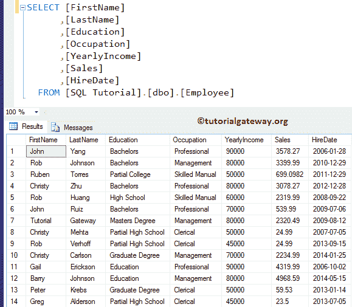
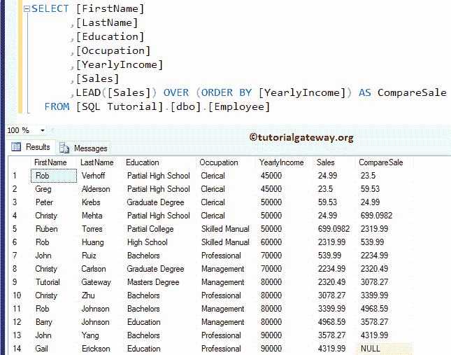
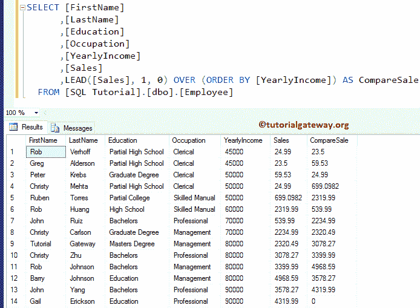
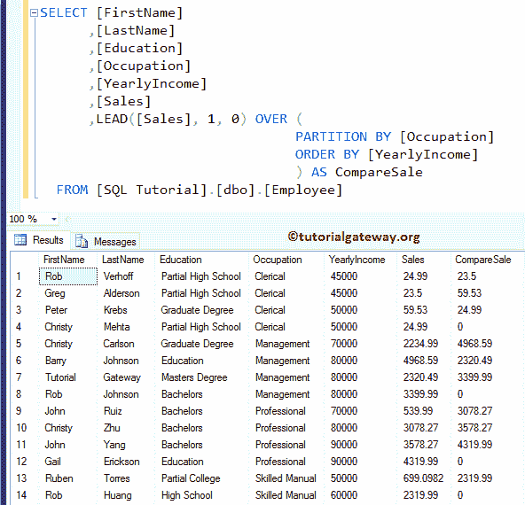
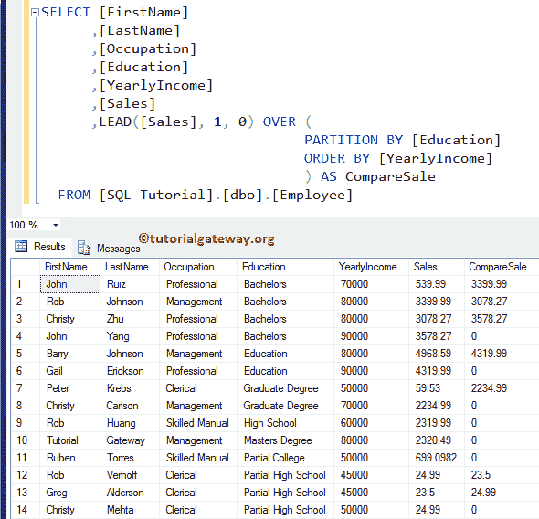
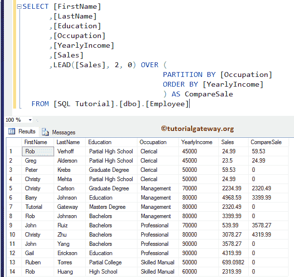

# SQL `LEAD()`函数

> 原文：<https://www.tutorialgateway.org/sql-lead-function/>

SQL LEAD 是分析函数之一。此函数允许您在不使用任何 SELF JOIN 的情况下访问后续行中的数据。SQL Server 中 LEAD 的基本语法如下所示:

```sql
SELECT LEAD([Scalar Expression], [Offset], [Default]) 
                  OVER (
                         PARTITION_BY_Clause 
                         ORDER_BY_Clause
                        )
FROM [Source]
```

*   标量表达式:在 SQL Server 中返回单个值的列、子查询或表达式。
*   默认值:指定默认值。如果省略，SQL 会写空
*   偏移量:要转发的行数。例如，如果它是 2，那么它选择第二行作为结果。同样，它可以是一个列、[子查询](https://www.tutorialgateway.org/sql-subquery/)，或者返回单个值的表达式。
*   Order _ By _ 子句:按特定顺序对分区数据进行排序。请参考 [SQL Server](https://www.tutorialgateway.org/sql/) 中的[`ORDER BY`条款](https://www.tutorialgateway.org/sql-order-by-clause/)。
*   Partition _ By _ 子句:将 [`SELECT`语句](https://www.tutorialgateway.org/sql-select-statement/)选择的记录划分为分区。
    *   如果定义了分区依据子句，SQL Server `LEAD()`函数将开始选择每个分区中的后续行。
    *   如果没有，它会将所有记录视为一个分区。

我们将使用下面显示的数据进行这个 SQL LEAD 演示



## 不带分区依据子句的 SQL LEAD

如果我们错过了 Sql Server `LEAD()`函数中的 Partition By 子句，会发生什么？

order by 语句将根据员工的年收入数据以升序对员工表进行排序。

接下来，SQL `lead()`函数返回该行的后续值(该行的下一个值)作为输出。如果没有要返回的行，它将返回空值，因为我们没有定义任何默认值

```sql
SELECT [FirstName]
      ,[LastName]
      ,[Education]
      ,[Occupation]
      ,[YearlyIncome]
      ,[Sales]
      ,LEAD([Sales]) OVER (ORDER BY [YearlyIncome]) AS CompareSale 
  FROM [Employee]
```



让我将偏移量添加为 1，默认值为 0

```sql
SELECT [FirstName]
      ,[LastName]
      ,[Education]
      ,[Occupation]
      ,[YearlyIncome]
      ,[Sales]
      ,LEAD([Sales], 1, 0) OVER (
                                  ORDER BY [YearlyIncome]
                                 ) AS CompareSale 
FROM [Employee]
```



现在，您可以看到`lead()`函数正在用 0 替换空值。请参考 [LAG](https://www.tutorialgateway.org/sql-lag-function/) 和 [SELF JOIN](https://www.tutorialgateway.org/sql-self-join/) 文章。

## 带分区的 SQL LEAD 示例

如何从表中的分区记录中写入后续值？

以下查询将使用每个分区中的年收入和后续销售额按职业对数据进行分组。

```sql
SELECT [FirstName]
      ,[LastName]
      ,[Education]
      ,[Occupation]
      ,[YearlyIncome]
      ,[Sales]
      ,LEAD([Sales], 1, 0) OVER (
				  PARTITION BY [Occupation]
				  ORDER BY [YearlyIncome]
				) AS CompareSale 
FROM [Employee]
```

如您所见，对于第 4、8、12、14 行，SQL Server `Lead()`函数返回 0，因为该分区中没有后续记录可供选择。所有这些记录都是它们分区的最后记录。



在上面的查询中，我们使用了带有分区依据子句的 SQL `LEAD()`函数。它选择单个分区中的后续行。

让我把分区栏改成教育，以便更好的理解。

```sql
SELECT [FirstName]
      ,[LastName]
      ,[Occupation]
      ,[Education]
      ,[YearlyIncome]
      ,[Sales]
      ,LEAD([Sales], 1, 0) OVER (
				  PARTITION BY [Education]
				  ORDER BY [YearlyIncome]
				) AS CompareSale  
FROM [Employee]
```



希望你明白:)

### 偏移值

如果我们将 SQL `LEAD()`函数偏移值中的偏移值从默认值 1 更改为 2，会发生什么。

```sql
SELECT [FirstName]
      ,[LastName]
      ,[Education]
      ,[Occupation]
      ,[YearlyIncome]
      ,[Sales]
      ,LEAD([Sales], 2, 0) OVER (
				  PARTITION BY [Occupation]
				  ORDER BY [YearlyIncome]
			         ) AS CompareSale  
FROM [Employee]
```

如果您观察下面的截图，SQL Server `lead()`函数会选择第二行(跳过一行)，而不是选择下一个后续行。如果您将该值更改为 3，它将通过删除前两行来选择第三行，以此类推。

