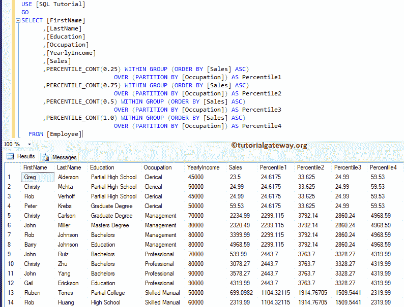

# SQL PERCENTILE _ CONT

> 原文：<https://www.tutorialgateway.org/sql-percentile_cont/>

SQL PERCENTILE _ CONT 是分析函数的一种，它将根据表中列值的连续分布来计算百分位数。SQL Server 中百分制的基本语法是

```
SELECT PERCENTILE_CONT(Numerical_Literal)
       WITHIN GROUP ( ORDER BY_Clause)
        OVER ( PARTITION_BY_Clause )
FROM [Source]
```

*   Numerical _ Literal:要计算的百分比。该值应该介于 0.0 和 1.0 之间
*   组内(Order By 子句):该子句将在组内以指定的顺序对数据进行排序。为了更好的理解，请参考 [SQL Order By 子句](https://www.tutorialgateway.org/sql-order-by-clause/)。
*   over(Partition _ By _ 子句):它将 [SELECT 语句](https://www.tutorialgateway.org/sql-select-statement/)选择的 [SQL Server](https://www.tutorialgateway.org/sql/) 记录划分为多个分区。

我们将使用下面显示的数据进行这个 SQL PERCENTILE _ CONT 演示


## SQL 百分点值 _CONT 示例

在本例中，我们向您展示了如何计算表中分区记录的百分比。以下查询将按销售升序排列数据，按职业划分数据。然后独立计算每个分区的百分位数。

```
SELECT [FirstName]
      ,[LastName]
      ,[Education]
      ,[Occupation]
      ,[YearlyIncome]
      ,[Sales]
      ,PERCENTILE_CONT(0) WITHIN GROUP (ORDER BY [Sales] ASC)
			   OVER (PARTITION BY [Occupation]) AS Percentile 
  FROM [Employee]
```


## SQL 百分点值 _CONT 示例 2

这里，我们在 PERCENTILE _`CONT()`函数中使用不同的数值。

```
SELECT [FirstName]
      ,[LastName]
      ,[Education]
      ,[Occupation]
      ,[YearlyIncome]
      ,[Sales]
      ,PERCENTILE_CONT(0.25) WITHIN GROUP (ORDER BY [Sales] ASC)
			     OVER (PARTITION BY [Occupation]) AS Percentile1  
      ,PERCENTILE_CONT(0.75) WITHIN GROUP (ORDER BY [Sales] ASC)
			     OVER (PARTITION BY [Occupation]) AS Percentile2 
      ,PERCENTILE_CONT(0.5) WITHIN GROUP (ORDER BY [Sales] ASC)
			     OVER (PARTITION BY [Occupation]) AS Percentile3 
      ,PERCENTILE_CONT(1.0) WITHIN GROUP (ORDER BY [Sales] ASC)
			      OVER (PARTITION BY [Occupation]) AS Percentile4 
  FROM [Employee]
```

