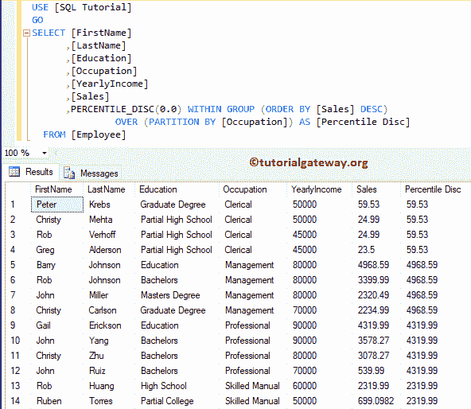

# SQL `PERCENTILE_DISC()`

> 原文：<https://www.tutorialgateway.org/sql-percentile_disc/>

SQL PERCENTILE _ DISC 将计算整个行集中或表中分区内排序值的百分比。SQL Server 分析函数中 PERCENTILE _ DISC 的基本语法如下所示:

```sql
SELECT PERCENTILE_DISC(Numerical_Literal)
       WITHIN GROUP ( ORDER BY_Clause)
        OVER ( PARTITION_BY_Clause )
FROM [Source]
```

*   Numerical _ Literal:指定要计算的百分比。该值应该介于 0.0 和 1.0 之间
*   组内(`ORDER BY`子句):这将按组内的指定顺序对列数据进行排序。为了更好的了解，请访问[订单条款](https://www.tutorialgateway.org/sql-order-by-clause/)。
*   over(Partition _ By _ 子句):它将 [`SELECT`语句](https://www.tutorialgateway.org/sql-select-statement/)选择的记录分成 [SQL Server](https://www.tutorialgateway.org/sql/) 分区。

我们将利用下图所示的数据进行百分位盘演示


## SQL 百分点 _ 磁盘示例

此示例显示如何计算表中分区记录的百分比。以下查询将按销售升序排列数据，按职业划分数据。然后独立计算每个分区的百分位数。

```sql
SELECT [FirstName]
      ,[LastName]
      ,[Education]
      ,[Occupation]
      ,[YearlyIncome]
      ,[Sales]
      ,PERCENTILE_DISC(0.0) WITHIN GROUP (ORDER BY [Sales] ASC)
			   OVER (PARTITION BY [Occupation]) AS [Percentile Disc] 
  FROM [Employee]
```


让我把顺序从升序改为降序。

```sql
SELECT [FirstName]
      ,[LastName]
      ,[Education]
      ,[Occupation]
      ,[YearlyIncome]
      ,[Sales]
      ,PERCENTILE_DISC(0.0) WITHIN GROUP (ORDER BY [Sales] DESC)
			   OVER (PARTITION BY [Occupation]) AS [Percentile Disc] 
  FROM [Employee]
```



## 百分位 _ 磁盘示例 2

在这种情况下，我们将在 SQL PERCENTILE _`DISC()`函数中使用不同的数值。

```sql
SELECT [FirstName]
      ,[LastName]
      ,[Education]
      ,[Occupation]
      ,[YearlyIncome]
      ,[Sales]
      ,PERCENTILE_DISC(0.25) WITHIN GROUP (ORDER BY [Sales] ASC)
		OVER (PARTITION BY [Occupation]) AS [Percentile Disc 1]  
      ,PERCENTILE_DISC(0.5) WITHIN GROUP (ORDER BY [Sales] ASC)
		OVER (PARTITION BY [Occupation]) AS [Percentile Disc 2]
      ,PERCENTILE_DISC(0.75) WITHIN GROUP (ORDER BY [Sales] ASC)
		OVER (PARTITION BY [Occupation]) AS [Percentile Disc 3] 
      ,PERCENTILE_DISC(1.0) WITHIN GROUP (ORDER BY [Sales] ASC)
		OVER (PARTITION BY [Occupation]) AS [Percentile Disc 4] 
  FROM [Employee]
```

