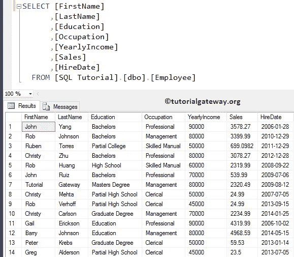
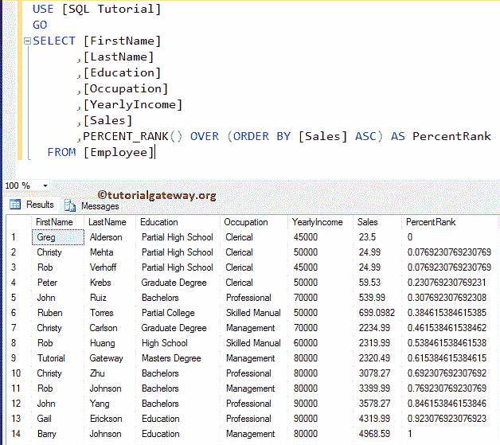
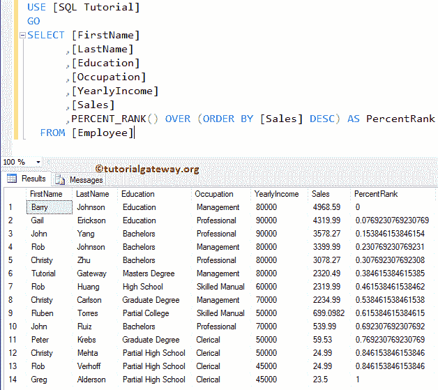
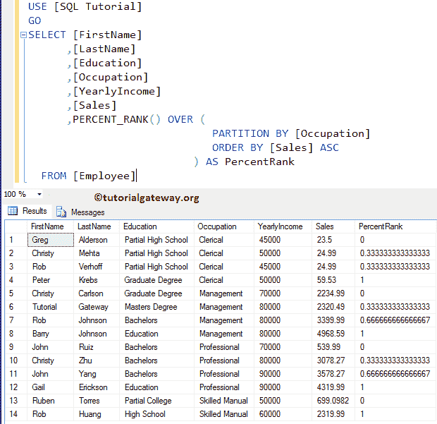
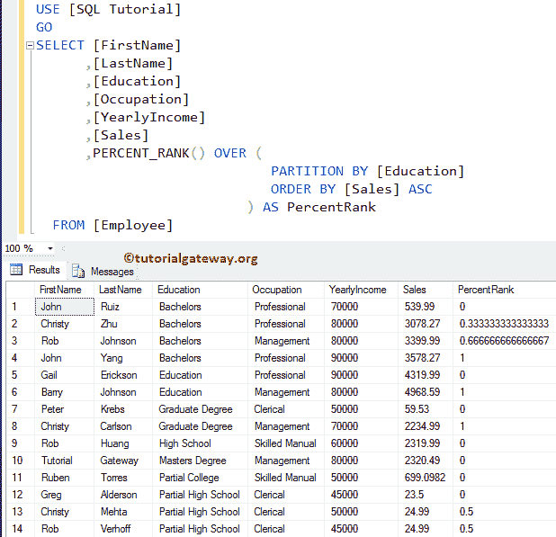

# SQL 百分比 _ 秩函数

> 原文:[https://www.tutorialgateway.org/sql-percent_rank-function/](https://www.tutorialgateway.org/sql-percent_rank-function/)

SQL PERCENT_RANK 是分析函数之一，它将计算每行的相对排名。这个 PERCENT_RANK 函数将从一系列大于 0 小于 1 的值中返回等级。SQL Server 中 PERCENT_RANK 的基本语法是:

```
SELECT PERCENT_RANK() 
               OVER (
                      PARTITION_BY_Clause 
                      ORDER_BY_Clause
                     )
FROM [Source]
```

我们将使用下面显示的数据进行这个 SQL PERCENT_RANK 演示



## 不带分区依据子句的 SQL PERCENT_RANK

在这个例子中，我们将展示如果在 SQL Server 的 PERCENT_RANK 函数中省略 Partition By 子句会发生什么。

```
SELECT [FirstName]
      ,[LastName]
      ,[Education]
      ,[Occupation]
      ,[YearlyIncome]
      ,[Sales]
      ,PERCENT_RANK() OVER (ORDER BY [Sales] ASC) AS PercentRank 
  FROM [Employee]
```



[Order By 子句](https://www.tutorialgateway.org/sql-order-by-clause/)使用员工表的销售额对其进行升序排序

```
ORDER BY [Sales] ASC
```

接下来，SQL PERCENT_RANK 函数返回百分比等级作为输出。这里，销售额最高的一行将分配 1 作为排名，销售额最少的一行分配 0 作为百分比排名

```
PERCENT_RANK() OVER (ORDER BY [Sales] ASC) AS PercentRank
```

让我把 Order by 子句从升序改为降序。如您所见，它将最小值列为 1，将最大值列为 0。

```
SELECT [FirstName]
      ,[LastName]
      ,[Education]
      ,[Occupation]
      ,[YearlyIncome]
      ,[Sales]
      ,PERCENT_RANK() OVER (ORDER BY [Sales] DESC) AS PercentRank 
  FROM [Employee]
```



## 示例分区的 SQL PERCENT_RANK

如何返回分区记录的百分比等级？。以下 SQL PERCENT_RANK 查询将使用销售额按职业对数据进行分区，然后分别为每个分区写入百分比等级。

```
SELECT [FirstName]
      ,[LastName]
      ,[Education]
      ,[Occupation]
      ,[YearlyIncome]
      ,[Sales]
      ,PERCENT_RANK() OVER (
			     PARTITION BY [Occupation]
			     ORDER BY [Sales] ASC
			    ) AS PercentRank 
  FROM [Employee]
```



只是为了确保你能理解。我们正在将 [SQL Server](https://www.tutorialgateway.org/sql/) 组值从职业更改为教育。

```
SELECT [FirstName]
      ,[LastName]
      ,[Education]
      ,[Occupation]
      ,[YearlyIncome]
      ,[Sales]
      ,PERCENT_RANK() OVER (
			     PARTITION BY [Education]
			     ORDER BY [Sales] ASC
			    ) AS PercentRank 
  FROM [Employee]
```

