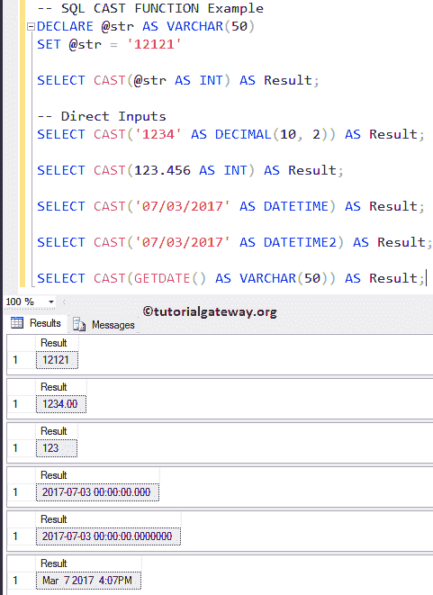
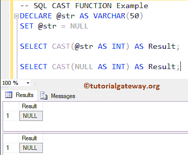
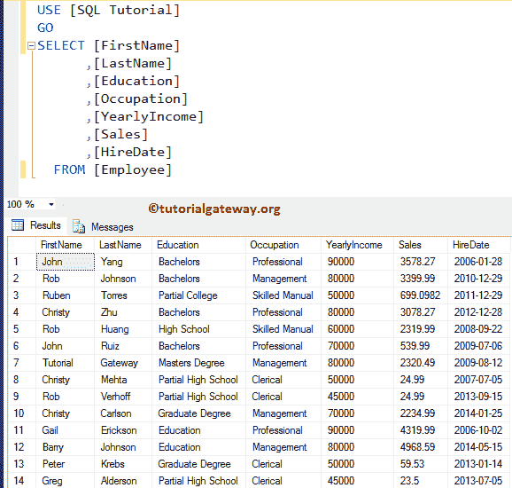
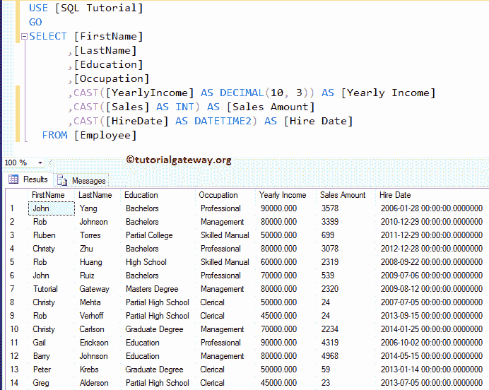

# SQL CAST 函数

> 原文：<https://www.tutorialgateway.org/sql-cast-function/>

SQL CAST 函数将表达式从一种数据类型转换为另一种数据类型。如果 CAST 函数无法将表达式转换为所需的数据类型，该函数将返回错误。SQL CAST 函数的语法是

```
CAST(Expression AS Data_Type [(Length)])

SELECT CAST(123 AS VARCHAR(50)) AS [result_name]
FROM [Source]
```

*   表达式:要转换为所需数据类型的有效表达式。
*   数据类型:指定要将给定表达式转换为的数据类型
*   长度:这是整数类型的可选参数。用于定义目标数据类型的长度。默认情况下是 30。

## SQL CAST 示例

SQL Server CAST 函数将任何有效的表达式转换为所需的类型。以下查询将字符串转换为整数和小数。

首先，我们声明了 VARCHAR 的一个变量。接下来，我们分配字符串数据“12121”。接下来，我们将字符串值转换为整数。我们还使用 [SQL Server](https://www.tutorialgateway.org/sql/) 中的[别名](https://www.tutorialgateway.org/sql-alias/)列分配了一个新名称“结果”。

在下一行中，我们直接对十进制值 123.456 使用了 SQL CAST 函数，并将其转换为整数(从高到低)。这里，它将截断十进制值并返回 123。建议大家参考[数据类型](https://www.tutorialgateway.org/sql-data-types/)了解数据类型及其局限性。

最后一条语句将字符串值更改为 DateTime 和 datetime2 数据类型。

最后，我们使用它将日期时间更改为 varchar。

```
DECLARE @str AS VARCHAR(50)
SET @str = '12121'

SELECT CAST(@str AS INT) AS Result; 

-- Direct Inputs
SELECT CAST('1234' AS DECIMAL(10, 2)) AS Result; 

SELECT CAST(123.456 AS INT) AS Result; 

SELECT CAST('07/03/2017' AS DATETIME) AS Result;  

SELECT CAST('07/03/2017' AS DATETIME2) AS Result;

SELECT CAST(GETDATE() AS VARCHAR(50)) AS Result;
```



### SQL CAST 函数示例 2

这里，我们使用 Sql Server 强制转换函数来处理空值。

```
DECLARE @str AS VARCHAR(50)
SET @str = NULL

SELECT CAST(@str AS INT) AS Result;

SELECT CAST(NULL AS INT) AS Result;
```



让我们使用如果我们尝试将“教程网关”字符串转换为日期时间会发生什么。这是不可能的，这是返回错误作为输出。

```
SELECT CAST('Tutorial Gateway' AS INT) AS Result;
```

执行上面的查询并查看错误消息。

```
Msg 245, Level 16, State 1, Line 2
Conversion failed when converting the Varchar value 'Tutorial Gateway' to data type int.
```

在这个例子中，我们将把 CAST 函数应用到我们的 Employee 表中。



密码

```
SELECT [FirstName]
      ,[LastName]
      ,[Education]
      ,[Occupation]
      ,CAST([YearlyIncome] AS DECIMAL(10, 3)) AS [Yearly Income]
      ,CAST([Sales] AS INT) AS [Sales Amount]
      ,CAST([HireDate] AS DATETIME2) AS [Hire Date]
  FROM [Employee]
```

