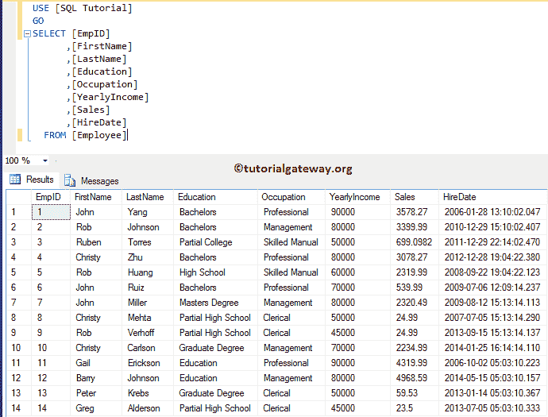
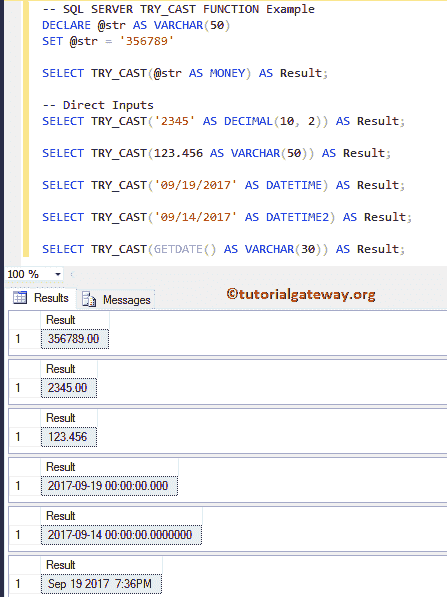
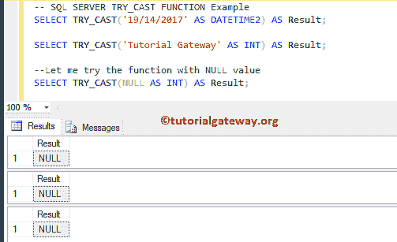
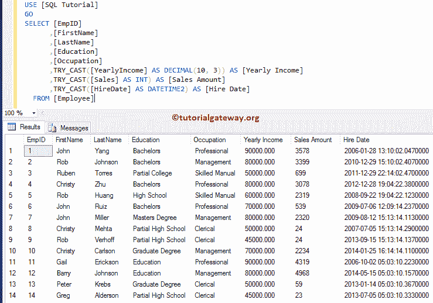

# SQL TRY CAST

> 原文：<https://www.tutorialgateway.org/sql-try-cast/>

SQL TRY`CAST()`函数是 SQL 转换函数之一，它类似于`CAST()`函数。它用于将表达式从一种数据类型转换为另一种数据类型。如果成功，那么 SQL TRY CAST 将返回所需数据类型的表达式。否则，它将返回 null。

如果 SQL`TRY_CAST()`函数无法将表达式转换为所需的数据类型，则该函数将返回空值。如果没有可能显式转换为所需的数据类型，那么它将引发错误。对于这个 SQL Server TRY CAST 演示，我们将使用 SQL 教程数据库中的雇员表。



## SQL TRY`CAST()`函数语法

SQL Server`TRY_CAST()`函数的语法是

```
TRY_CAST (Expression AS Data_Type [(Length)])

-- For example
SELECT CAST (245 AS VARCHAR(50)) AS [result_name]
FROM [Source]
```

*   表达式:指定要转换的任何有效表达式。
*   Data_Type:指定要将表达式转换为的[数据类型](https://www.tutorialgateway.org/sql-data-types/)
*   长度:整数类型的可选参数。可以使用此参数指定目标 [SQL Server](https://www.tutorialgateway.org/sql/) 数据类型的长度。

## SQL TRY`CAST()`函数示例 1

SQL Server`TRY_CAST()`函数可以帮助您将任何表达式转换为所需的数据类型。下面显示的查询将显示使用该功能的多种方式。

```
DECLARE @str AS VARCHAR(50)
SET @str = '356789'

SELECT TRY_CAST(@str AS MONEY) AS Result; 

-- Direct Inputs
SELECT TRY_CAST('2345' AS DECIMAL(10, 2)) AS Result; 

SELECT TRY_CAST(123.456 AS VARCHAR(50)) AS Result; 

SELECT TRY_CAST('09/19/2017' AS DATETIME) AS Result;  

SELECT TRY_CAST('09/14/2017' AS DATETIME2) AS Result;

SELECT TRY_CAST(GETDATE() AS VARCHAR(30)) AS Result;
```

如您所见，它返回的结果与我们在`Cast()`函数中得到的结果相同。我们已经在 [SQL CAST](https://www.tutorialgateway.org/sql-cast-function/) 文章中解释了程序流程，所以请参考。



## SQL TRY`CAST()`函数示例 2

在本例中，我们将向您展示，当我们在 SQL Server 中将错误的表达式和空值传递给 Try`cast()`函数时会发生什么。

```
SELECT TRY_CAST('19/14/2017' AS DATETIME2) AS Result;

SELECT TRY_CAST('Tutorial Gateway' AS INT) AS Result;

--Let me try the function with NULL value
SELECT TRY_CAST(NULL AS INT) AS Result;
```

从下面的截图中，您可以看到它正在为表达式返回空值。因为它无法将它们转换为所需的数据类型。



让我们使用如果我们尝试将 65(整数值)转换为 XML 数据类型会发生什么。如您所知，不可能隐式或显式地将整数转换为 XML。因此，这个函数返回错误作为输出。

```
SELECT TRY_CAST(65 AS XML) AS Result;
```

执行 Try_cast 查询

```
Messages
-------
Msg 529, Level 16, State 2, Line 2
Explicit conversion from data type int to xml is not allowed.
```

## SQL TRY`CAST()`函数示例 3

在这个例子中，我们将对我们的雇员表应用 SQL`TRY_CAST()`函数。

```
SELECT [EmpID]
      ,[FirstName]
      ,[LastName]
      ,[Education]
      ,[Occupation]
      ,TRY_CAST([YearlyIncome] AS DECIMAL(10, 3)) AS [Yearly Income]
      ,TRY_CAST([Sales] AS INT) AS [Sales Amount]
      ,TRY_CAST([HireDate] AS DATETIME2) AS [Hire Date]
  FROM [Employee]
```

