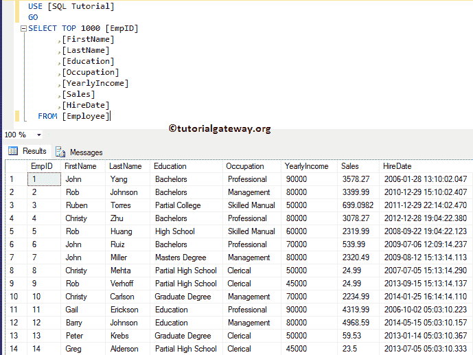
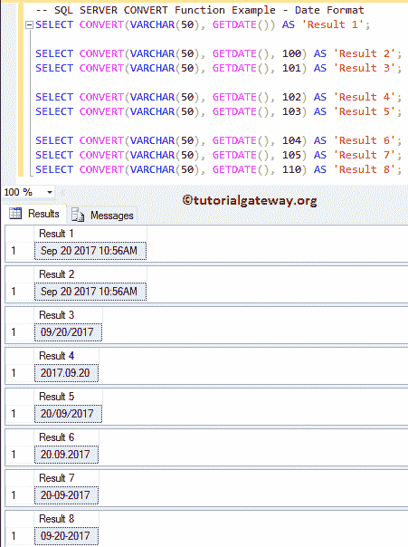
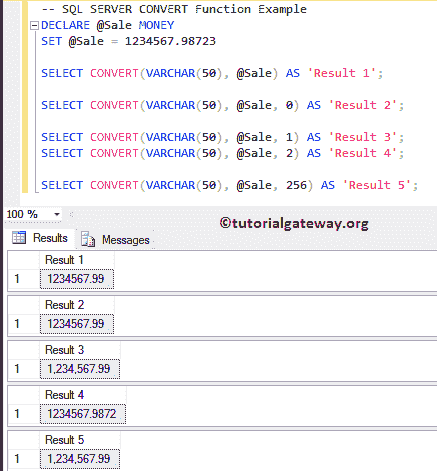
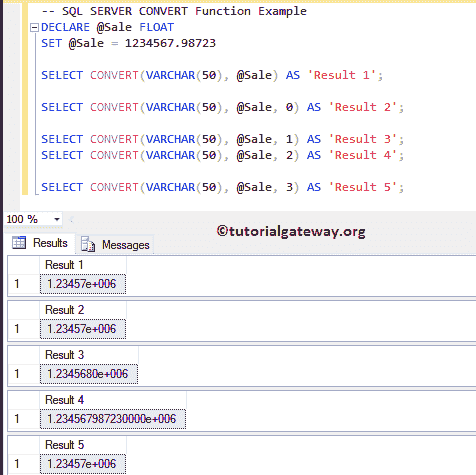
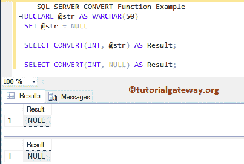
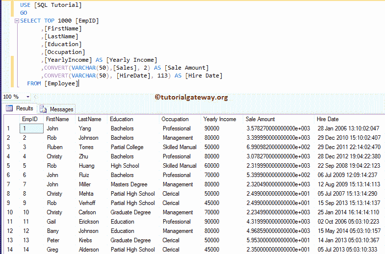

# SQL CONVERT

> 原文：<https://www.tutorialgateway.org/sql-convert/>

SQL `CONVERT()`函数用于将表达式从一种数据类型转换为另一种数据类型。如果 SQL Server `CONVERT()`函数无法将表达式更改为所需的数据类型，则会返回一个错误。在这个演示中，我们使用了雇员表。



## SQL 转换函数语法

SQL 转换函数的语法

```
CONVERT (Data_Type [(Length)], Expression, [Style])

-- For example
SELECT CONVERT (VARCHAR(50), 245) AS [result_name]
FROM [Source]
```

*   Data_Type:指定要将表达式转换为的[数据类型](https://www.tutorialgateway.org/sql-data-types/)
*   长度:整数类型的可选参数。可以使用这个 [SQL Server](https://www.tutorialgateway.org/sql/) 参数来指定目标数据类型的长度。默认情况下是 30。
*   要使用 SQL `Convert()`函数更改为所需数据类型的表达式。
*   样式:使用整数类型的可选参数来定义样式。

## 将函数转换为日期格式

SQL Server `CONVERT()`函数中可用的格式样式列表。

| 没有世纪(yy) | 带世纪(年) | 标准 | 输入/输出 |
| – | 0 至 100 | 这是日期时间和小日期时间的默认值 | 我的 dd yyyy hh:miAM (or PM) |
| one | One hundred and one | 美国（United States 的缩写） | 1 =毫米/日/年
101 =毫米/日/年 |
| Two | One hundred and two | 美国国家标准学会 | 2 = yyy . mm . DD
102 = yyy . mm . DD |
| three | One hundred and three | 英国/法国 | 3 =日/月/年
103 =日/月/年 |
| four | One hundred and four | 德国人 | 4 = DD . mm . YY
104 = DD . mm . yyy |
| five | One hundred and five | 意大利的 | 5 =日-月-年
105 =日-月-年 |
| six | One hundred and six | – | 6 = dd mon yy
106 = dd mon yyyy |
| seven | One hundred and seven | – | 7 =我的 dd，YY
107 =我的 dd，yyyy |
| eight | One hundred and eight | – | hh:mi:ss |
| – | 9 或 109 | 默认值+毫秒 | 我的 dd yyyy hh:mi:ss:mmmmAM (or PM) |
| Ten | One hundred and ten | 美利坚合众国 | 10 =毫米-日-年
110 =毫米-日-年 |
| Eleven | One hundred and eleven | 黑漆；（Japan）日本 | 11 =年/月/日
111 =年/月/日 |
| Twelve | One hundred and twelve | 国际标准化组织 | 12 = yymmdd
112 = yymmdd |
| – | 13 或 113 | 欧洲默认值+毫秒 | DD mon yyyy hh:mi:ss:mmm(24 小时) |
| Fourteen | One hundred and fourteen | – | hh:mi:ss:mmm(24 小时) |
| – | 20 或 120 | ODBC 规范的 | yyyy-mm-DD hh:mi:ss(24 小时) |
| – | 21 还是 121 | 以毫秒为单位的 ODBC 规范。这是时间、日期、日期时间 2 和日期时间偏移量的默认值 | yyyy-mm-DD hh:mi:ss . mmm(24 小时) |
| – | One hundred and twenty-six | ISO8601 | yyyy-mm-ddThh:mi:ss.mmm(无空格) |
| – | One hundred and twenty-seven | 带时区 Z 的 ISO8601 | yyyy-mm-ddThh:mi:ss.mmmZ(无空格) |
| – | One hundred and thirty | 回历 | dd mon yyyy hh:mi:ss:mmmAM |
| – | One hundred and thirty-one | 回历 | dd/mm/yyyy hh:mi:ss:mmmAM |

### 将示例转换为日期格式

在这个例子中，我们使用 [GETDATE()](https://www.tutorialgateway.org/sql-getdate-function/) 上的`CONVERT()`函数以不同的格式返回日期。

```
SELECT CONVERT(VARCHAR(50), GETDATE()) AS 'Result 1';

SELECT CONVERT(VARCHAR(50), GETDATE(), 100) AS 'Result 2';
SELECT CONVERT(VARCHAR(50), GETDATE(), 101) AS 'Result 3';

SELECT CONVERT(VARCHAR(50), GETDATE(), 102) AS 'Result 4';
SELECT CONVERT(VARCHAR(50), GETDATE(), 103) AS 'Result 5';

SELECT CONVERT(VARCHAR(50), GETDATE(), 104) AS 'Result 6';
SELECT CONVERT(VARCHAR(50), GETDATE(), 105) AS 'Result 7';
SELECT CONVERT(VARCHAR(50), GETDATE(), 110) AS 'Result 8';
```



## SQL 转换货币格式示例

如果一个表达是金钱或小钱，那么我们可以使用风格参数来风格化。SQL Server `CONVERT()`函数中可用的货币格式样式列表。

| 价值 | 输出 |
| Zero | 它只会在小数点后返回两位数 |
| one | 它将通过放置逗号来分隔每三个数字。它还会在小数点后返回两位数。 |
| Two | 这将返回小数点后的四位数字 |
| One hundred and twenty-six | 当您更改为 char 或 varchar 时，这相当于 2 |

```
DECLARE @Sale MONEY
SET @Sale = 1234567.98723

SELECT CONVERT(VARCHAR(50), @Sale) AS 'Result 1';

SELECT CONVERT(VARCHAR(50), @Sale, 0) AS 'Result 2';

SELECT CONVERT(VARCHAR(50), @Sale, 1) AS 'Result 3';
SELECT CONVERT(VARCHAR(50), @Sale, 2) AS 'Result 4';

SELECT CONVERT(VARCHAR(50), @Sale, 256) AS 'Result 5';
```



## SQL 转换浮点值示例

当表达式是 float 或 real 时，我们可以使用 style 参数。以下是 SQL `CONVERT()`函数中可用的格式样式。

| 价值 | 输出 |
| Zero | 该返回最大值为 6 位数 |
| one | 它返回八位数。总是用在科学符号中 |
| Two | 它总是返回 16 位数字。总是用在科学符号中 |
| three | 它受 SQL Server 2016 支持。它返回 17 位数字，对于执行转换而不丢失非常有用 |

```
DECLARE @Sale FLOAT
SET @Sale = 1234567.98723

SELECT CONVERT(VARCHAR(50), @Sale) AS 'Result 1';

SELECT CONVERT(VARCHAR(50), @Sale, 0) AS 'Result 2';

SELECT CONVERT(VARCHAR(50), @Sale, 1) AS 'Result 3';
SELECT CONVERT(VARCHAR(50), @Sale, 2) AS 'Result 4';

SELECT CONVERT(VARCHAR(50), @Sale, 3) AS 'Result 5';
```



## SQL 转换空值示例 1

在这个 SQL 转换函数示例中，我们将使用空值。

```
DECLARE @str AS VARCHAR(50)
SET @str = NULL

SELECT CONVERT(INT, @str) AS Result;

SELECT CONVERT(INT, NULL) AS Result;
```



如果我们使用 SQL `Convert()`函数将“教程网关”字符串更改为日期时间。如您所见，这是不可能的，所以这个函数返回错误作为输出。

```
SELECT CONVERT(INT, 'Tutorial Gateway') AS Result;
```

执行上面的事务处理 SQL 查询

```
Msg 245, Level 16, State 1, Line 2
Conversion failed when converting the Varchar value 'Tutorial Gateway' to data type int.
```

在本例中，我们将在员工表中应用这一点。

```
SELECT TOP 1000 [EmpID]
      ,[FirstName]
      ,[LastName]
      ,[Education]
      ,[Occupation]
      ,[YearlyIncome] AS [Yearly Income]
      ,CONVERT(VARCHAR(50),[Sales], 2) AS [Sale Amount]
      ,CONVERT(VARCHAR(50), [HireDate], 113) AS [Hire Date]
  FROM [Employee]
```

