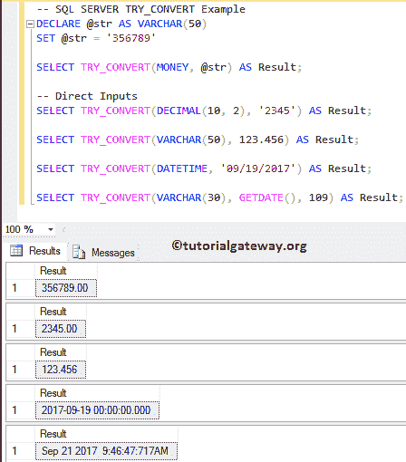
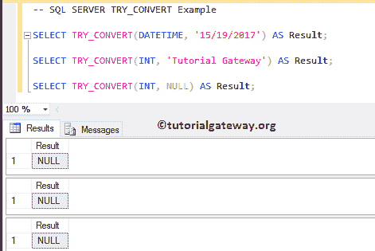
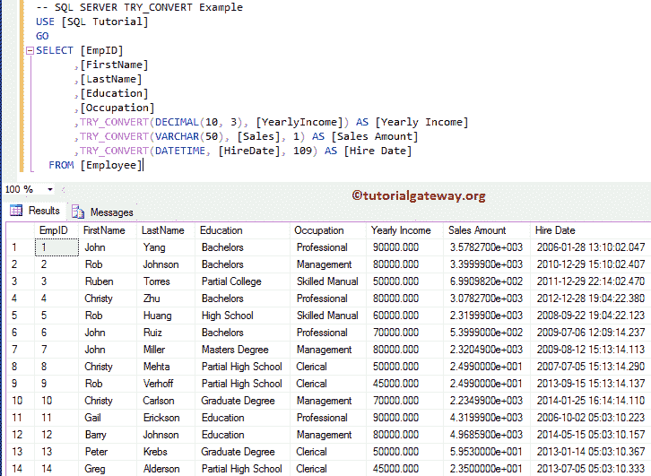

# SQL `TRY_CONVERT()`

> 原文：<https://www.tutorialgateway.org/sql-try-convert/>

SQL TRY 转换函数类似于转换函数。它用于将表达式从一种数据类型转换为另一种数据类型。如果成功，它将返回所需数据类型的表达式。

如果 SQL `TRY_CONVERT()`函数无法将表达式转换为所需的数据类型，则返回空值。如果不可能显式地更改为所需的数据类型，那么它将抛出一个错误。对于这个 SQL Server 尝试转换，我们将使用数据库中的雇员表。


## SQL TRY 转换函数语法

SQL Server `TRY_CONVERT()`函数的基本语法如下所示:

```sql
TRY_CONVERT (Data_Type [(Length)], Expression, [Style])

-- For example
SELECT TRY_CONVERT (VARCHAR(50), 245) AS [result_name]
FROM [Source]
```

*   数据类型:指定要将表达式更改为的[数据类型](https://www.tutorialgateway.org/sql-data-types/)
*   长度:整数类型的可选参数。使用此参数指定目标数据类型长度。
*   表达式:请指定要更改的任何有效表达式。
*   样式:整数类型也是可选的。使用此 [SQL Server](https://www.tutorialgateway.org/sql/) 参数定义样式。

## SQL TRY 转换示例

SQL Server `TRY_CONVERT()`函数可以帮助您将任何表达式转换为所需的数据类型。下面显示的查询将显示使用这个“尝试[转换](https://www.tutorialgateway.org/sql-convert/)功能的多种方法。

```sql
DECLARE @str AS VARCHAR(50)
SET @str = '356789'

SELECT TRY_CONVERT(MONEY, @str) AS Result; 

-- Direct Inputs
SELECT TRY_CONVERT(DECIMAL(10, 2), '2345') AS Result; 

SELECT TRY_CONVERT(VARCHAR(50), 123.456) AS Result; 

SELECT TRY_CONVERT(DATETIME, '09/19/2017') AS Result;  

SELECT TRY_CONVERT(VARCHAR(30), GETDATE(), 109) AS Result;
```



在这个例子中，我们将展示当我们传递错误的表达式和空值时会发生什么。

```sql
SELECT TRY_CONVERT(DATETIME, '15/19/2017') AS Result;  

SELECT TRY_CONVERT(INT, 'Tutorial Gateway') AS Result;

SELECT TRY_CONVERT(INT, NULL) AS Result;
```

请参见 SQL 尝试转换函数正在为表达式返回空值。因为它无法将它们更改为所需的数据类型。



让我们使用如果我们尝试将 12 个整数更改为 XML 数据类型会发生什么。如您所知，不可能隐式或显式地将整数转换为 XML。因此，这个函数返回错误作为输出。

```sql
SELECT TRY_CONVERT(XML, 12) AS Result;
```

运行上面的 try_convert 查询

```sql
Messages
--------
Msg 529, Level 16, State 2, Line 3
Explicit conversion from data type int to xml is not allowed.
```

在这个例子中，我们将在我们的雇员表上应用 Sql Server `TRY_CONVERT()`函数。

```sql
SELECT [EmpID]
      ,[FirstName]
      ,[LastName]
      ,[Education]
      ,[Occupation]
      ,TRY_CONVERT(DECIMAL(10, 3), [YearlyIncome]) AS [Yearly Income]
      ,TRY_CONVERT(VARCHAR(50), [Sales], 1) AS [Sales Amount]
      ,TRY_CONVERT(DATETIME, [HireDate], 109) AS [Hire Date]
  FROM [Employee]
```

