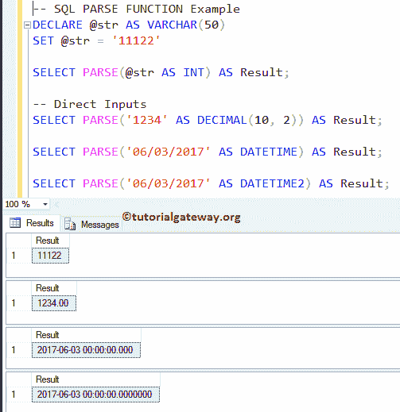
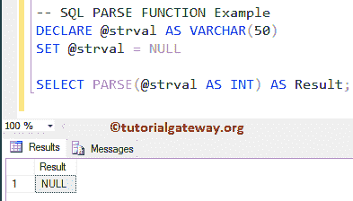
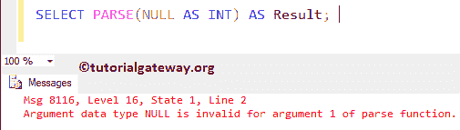
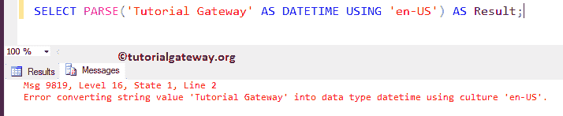

# SQL 解析函数

> 原文：<https://www.tutorialgateway.org/sql-parse-function/>

SQL PARSE 函数是一个 SQL 转换函数，用于将字符串数据转换为请求的数据类型，并将结果作为表达式返回。建议使用此 SQL PARSE 函数将字符串数据转换为日期时间或数字类型。

## SQL 解析函数语法

SQL Server 解析函数的语法是

```
PARSE (String_Value AS Data_Type [USING Culture])

-- For example
SELECT PARSE (String_Column_Value AS Data_Type USING 'en-US') AS [result_name]
FROM [Source]
```

*   数据类型:要将字符串值转换为的数据类型
*   区域性:这是一个可选参数。默认情况下，它使用当前会话语言。

## SQL 解析函数示例 1

SQL Server 解析函数主要用于将字符串转换为日期和时间以及数值。下面的 Parse 函数查询将整数或字符串解析为十进制，将字符串解析为 DateTime。

如果解析函数无法将字符串转换为所需的数据类型。或者如果我们传递不可转换的字符串，或者如果我们传递空值，那么这个解析函数将返回错误。

```
DECLARE @str AS VARCHAR(50)
SET @str = '11122'

SELECT PARSE(@str AS INT) AS Result; 

-- Direct Inputs
SELECT PARSE('1234' AS DECIMAL(10, 2)) AS Result; 

SELECT PARSE('06/03/2017' AS DATETIME) AS Result;  

SELECT PARSE('06/03/2017' AS DATETIME2) AS Result;
```



我们正在将字符串值转换为整数，并使用 [SQL Server](https://www.tutorialgateway.org/sql/) 中的[别名](https://www.tutorialgateway.org/sql-alias/)列将其命名为“结果”。

```
SELECT TRY_PARSE(@str AS INT) AS Result;
```

在下一行中，我们直接对字符串值使用 SQL PARSE 函数，并将其转换为精度为 2 的十进制值

```
SELECT PARSE('1234' AS DECIMAL(10, 2)) AS Result;
```

接下来，我们将字符串转换为日期时间和日期时间 2 [数据类型](https://www.tutorialgateway.org/sql-data-types/)。

```
SELECT PARSE('06/03/2017' AS DATETIME) AS Result;  

SELECT PARSE('06/03/2017' AS DATETIME2) AS Result;
```

## 解析函数示例 2

在这个 SQL Parse 函数示例中，我们将使用空值和不可转换的字符串。

```
DECLARE @strval AS VARCHAR(50)
SET @strval = NULL

SELECT PARSE(@strval AS INT) AS Result;
```



让我们使用如果我们传递空值作为直接输入会发生什么

```
SELECT PARSE(NULL AS INT) AS Result;
```



我们尝试将“教程网关”字符串转换为日期时间。这是不可能的，所以这个 SQL 解析函数返回错误作为输出。

```
SELECT PARSE('Tutorial Gateway' AS DATETIME USING 'en-US') AS Result;
```

