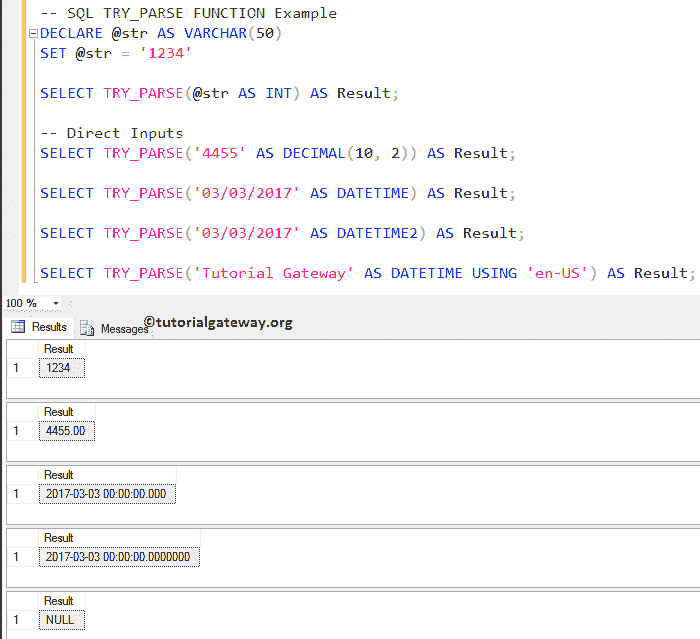
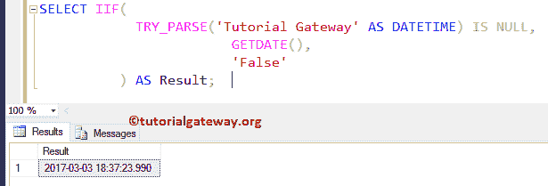

# SQL TRY_PARSE 函数

> 原文:[https://www.tutorialgateway.org/sql-try_parse-function/](https://www.tutorialgateway.org/sql-try_parse-function/)

SQL TRY_PARSE 是一个 SQL 转换函数。这个函数将字符串数据转换为请求的数据类型，并将结果作为表达式返回。我建议您使用这个 SQL TRY_PARSE 函数将字符串数据转换为日期/时间或数字类型。

## 函数语法

如果 SQL Try_Parse 函数无法将字符串转换为所需的数据类型，或者如果我们将字符串作为不可转换传递，则该函数将返回空值。SQL Server TRY_PARSE 函数的语法是

```
TRY_PARSE (String_Value AS Data_Type [USING Culture])

-- For example
SELECT TRY_PARSE (String_Column AS Data_Type USING 'en-US') AS [Column1]
FROM [Source]
```

*   字符串值:请指定要转换为所需数据类型的有效字符串。
*   数据类型:在这里，您必须指定要将字符串值转换为的数据类型
*   区域性:这是一个可选参数。如果忽略该参数，则该函数将使用当前会话的语言。

## SQL TRY_PARSE 函数示例 1

SQL Server Try_Parse 函数主要用于将字符串值转换为日期和时间以及数值。以下查询将字符串解析为整数和小数。并将字符串解析为日期时间。

```
DECLARE @str AS VARCHAR(50)
SET @str = '1234'

SELECT TRY_PARSE(@str AS INT) AS Result; 

-- Direct Inputs
SELECT TRY_PARSE('4455' AS DECIMAL(10, 2)) AS Result; 

SELECT TRY_PARSE('03/03/2017' AS DATETIME) AS Result;  

SELECT TRY_PARSE('03/03/2017' AS DATETIME2) AS Result; 

SELECT TRY_PARSE('Tutorial Gateway' AS DATETIME USING 'en-US') AS Result;
```



下面几行 [SQL Server](https://www.tutorialgateway.org/sql/) 代码用来声明一个 VARCHAR [数据类型](https://www.tutorialgateway.org/sql-data-types/)的变量。接下来，我们分配字符串数据“1234”。

```
DECLARE @str AS VARCHAR(50)
SET @str = '1234'
```

从下面的语句中，您可以看到我们正在使用 try parse 函数将字符串转换为整数。我们还使用[别名](https://www.tutorialgateway.org/sql-alias/)列为结果分配了新的名称。

```
SELECT TRY_PARSE(@str AS INT) AS Result;
```

在下一行中，我们直接对字符串使用了 SQL TRY_PARSE 函数，并将其转换为十进制值

```
SELECT TRY_PARSE('4455' AS DECIMAL(10, 2)) AS Result;
```

接下来，我们将字符串转换为日期时间和日期时间 2 数据类型。请参考 [SQL 数据类型](https://www.tutorialgateway.org/sql-data-types/)了解数据类型限制。

```
SELECT TRY_PARSE('03/03/2017' AS DATETIME) AS Result;  

SELECT TRY_PARSE('03/03/2017' AS DATETIME2) AS Result;
```

最后，我们尝试将“教程网关”字符串转换为日期时间。如您所见，这是不可能的，所以这个 SQL Server 尝试解析函数返回空值作为输出。

```
SELECT TRY_PARSE('Tutorial Gateway' AS DATETIME USING 'en-US') AS Result;
```

## 将 IIF 与 SQL TRY_PARSE 一起使用

在这个例子中，我们展示了如何使用 [I`if`语句](https://www.tutorialgateway.org/sql-iif-function/)来处理 TRY_PARSE 返回的空值。当您正在插入记录，并且不知道该列是否有日期和时间时，这可能会有所帮助。在这种情况下，您可以使用这个函数来检查，如果没有，我们可以用当前的日期和时间来替换它。

```
SELECT IIF(
	    TRY_PARSE('Tutorial Gateway' AS DATETIME) IS NULL, 
		       GETDATE(), 
		       'False'
	   ) AS Result;
```

这里我们使用了 I`if`语句和 [IS NULL 语句](https://www.tutorialgateway.org/sql-is-null-function/)来检查结果表达式是否为 NULL。

