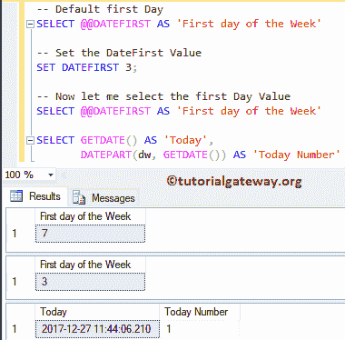

# SQL `DATEFIRST()`

> 原文：<https://www.tutorialgateway.org/sql-datefirst/>

函数的作用是:将一周的第一天设置为 1 到 7。如果您的默认语言是美国英语，则默认情况下，7(星期日)被设置为第一天。SQL Server 中日期优先的基本语法是

```sql
SET DATEFIRST { number (or number_variable) }

-- For example,
SET DATEFIRST 4;
```

下面的 [SQL Server](https://www.tutorialgateway.org/sql/) 表将显示该值及其对应的工作日名称

| 价值 | 一周的第一天 |
| one | 星期一 |
| Two | 星期二 |
| three | 星期三 |
| four | 星期四 |
| five | 星期五 |
| six | 星期六 |
| seven | 在星期日 |

## sql 日期第一个示例

在这个例子中，我们将展示 SET DATEFIRST 将如何影响工作日？。

```sql
-- Default first Day
SELECT @@DATEFIRST AS 'First day of the Week'

-- Set the DateFirst Value to 3 (Wednesday)
SET DATEFIRST 3;

-- Now let me select the first Day Value
SELECT @@DATEFIRST AS 'First day of the Week'

SELECT GETDATE() AS 'Today', 
       DATEPART(dw, GETDATE()) AS 'Today Number'
```

虽然今天是星期三，但是 dw 的 [DATEPART](https://www.tutorialgateway.org/sql-datepart/) 将返回 1(而不是 4)，因为我们将第一天设置为星期三。因此，计数将从星期三开始(星期三= 1，星期四= 2，星期五= 3..)

