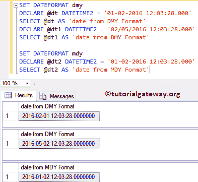

# SQL set date format(SQL 集日期格式)

> 原文：<https://www.tutorialgateway.org/sql-dateformat/>

设置日期格式函数将设置日期的顺序:月、年、日。该语句支持 dmy、mdy、ymd、ydm 和 dym 等格式，其中 d =日期，m =月，y =年。

SQL Server 中 DATEFORMAT 的基本语法如下所示:

```
SET DATEFORMAT DateFormat_Name
```

## SQL 设置日期格式示例

在这个例子中，我们将展示 [SQL](https://www.tutorialgateway.org/sql/) 格式将如何影响日期。请记住，[设置语言](https://www.tutorialgateway.org/sql-language-2/)将根据您选择的语言隐式更改日期格式。但是，SQL SET DATEFORMAT 将覆盖该格式。

```
-- Setting as date/Month/Year
SET DATEFORMAT dmy
DECLARE @dt DATETIME2 = '01-02-2016 12:03:28.000'
SELECT @dt AS 'date from DMY Format'

DECLARE @dt1 DATETIME2 = '02/05/2016 12:03:28.000'
SELECT @dt1 AS 'date from DMY Format'

-- Setting as Month/date/year
SET DATEFORMAT mdy
DECLARE @dt2 DATETIME2 = '01-02-2016 12:03:28.000'
SELECT @dt2 AS 'date from MDY Format'
```

