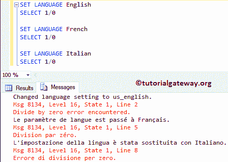

# SQL 语言

> 原文:[https://www.tutorialgateway.org/sql-language-2/](https://www.tutorialgateway.org/sql-language-2/)

SQL 语言是设置函数之一，它将设置语言或更改默认语言。此设置语言语句决定系统消息和日期时间格式。它的语法是

```
SET LANGUAGE Language_Name
```

## SQL 集合语言示例

在本例中，我们将向您展示 SET 语言将如何影响日期时间和消息格式。如果您发现理解语言名称很困难，那么请使用 sp_helplanguage 存储过程。

```
SELECT DATENAME(month, GETDATE()) AS 'Month Name'

SET LANGUAGE French
SELECT DATENAME(month, GETDATE()) AS 'Month Name'

SET LANGUAGE Italian
SELECT DATENAME(month, GETDATE()) AS 'Month Name'
```


让我给你看看 [SQL Server](https://www.tutorialgateway.org/sql/) 系统消息。为此，我们选择了除以零语句

```
SET LANGUAGE English
SELECT 1/0 

SET LANGUAGE French
SELECT 1/0 

SET LANGUAGE Italian
SELECT 1/0
```

你可以看到不同语言的信息。

