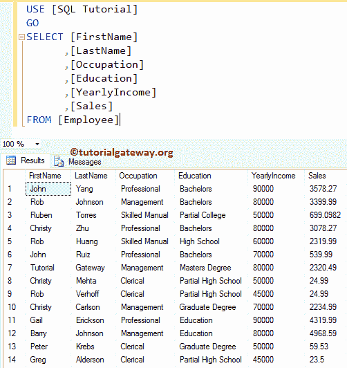
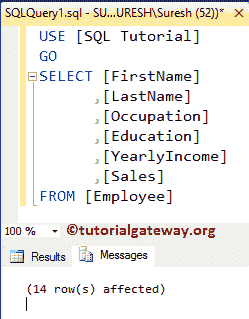
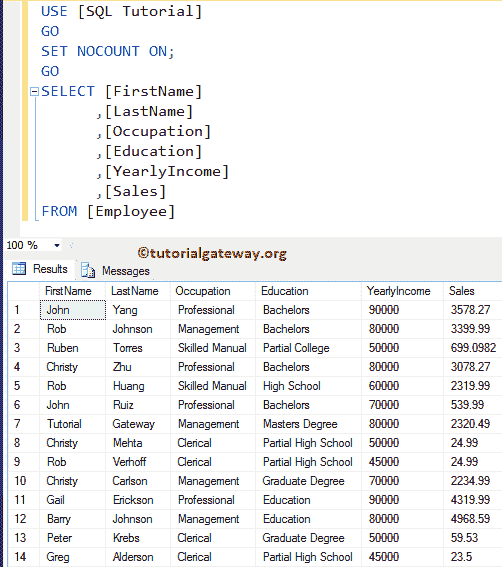
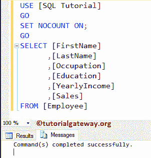
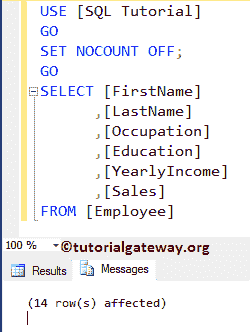

# SQL 设置无计数开启

> 原文：<https://www.tutorialgateway.org/sql-set-nocount-on/>

SQL SET NOCOUNT ON 和 OFF 是`SET()`函数的一种，它用于停止从查询或存储过程到客户端的受影响的消息行数。

通常，当您从表中选择数据时，存储过程或查询将返回这些记录作为结果。它会显示消息“由于 SQL 设置为“无计数”而受影响的行数”。例如，如果您在任何表中插入 10 条记录，那么 SQL 将返回十条受影响的记录等消息。

通过使用此 SQL Server 设置无计数打开，您可以停止上述消息。实时地，显示这些消息是额外的负担。因此，请尝试将此功能与“开”一起使用，以获得更好的性能。在我们进入设置无计数开和关的例子之前，让我们看看这背后的语法:

## 在语法上设置无计数

设置无计数开启的基本语法如下所示:

```
SET NOCOUNT {ON | OFF }
```

我们将使用下图所示的数据进行演示


## SQL 设置无计数开启示例

在本例中，我们向您展示了设置无计数将如何影响查询。在进入主要示例之前，让我编写一个简单的 [SELECT 语句](https://www.tutorialgateway.org/sql-select-statement/)，向您展示 SQL 显示的消息。

```
SELECT [FirstName]
      ,[LastName]
      ,[Occupation]
      ,[Education]
      ,[YearlyIncome]
      ,[Sales]
FROM [Employee]
```



从上面的 [SQL Server](https://www.tutorialgateway.org/sql/) 截图可以看到，表中包含了 14 条记录。现在，让我们导航到消息选项卡(结果选项卡之外)来检查信息。



它显示受影响的 14 行信息。让我们使用设置无计数开语句

```
SET NOCOUNT ON;  
GO  
SELECT [FirstName]
      ,[LastName]
      ,[Occupation]
      ,[Education]
      ,[YearlyIncome]
      ,[Sales]
FROM [Employee]
```



不影响查询结果。现在，让我们转到消息选项卡检查信息。



如您所见，没有诸如 14 行的信息受到影响。上面写着，命令成功完成。

## SQL 设置无计数关闭

使用 OFF 关键字显示影响消息的行

```
SET NOCOUNT OFF;  
GO  
SELECT [FirstName]
      ,[LastName]
      ,[Occupation]
      ,[Education]
      ,[YearlyIncome]
      ,[Sales]
FROM [Employee]
```



请参考[存储过程](https://www.tutorialgateway.org/stored-procedures-in-sql/)和[插入语句](https://www.tutorialgateway.org/sql-insert-statement/)文章。