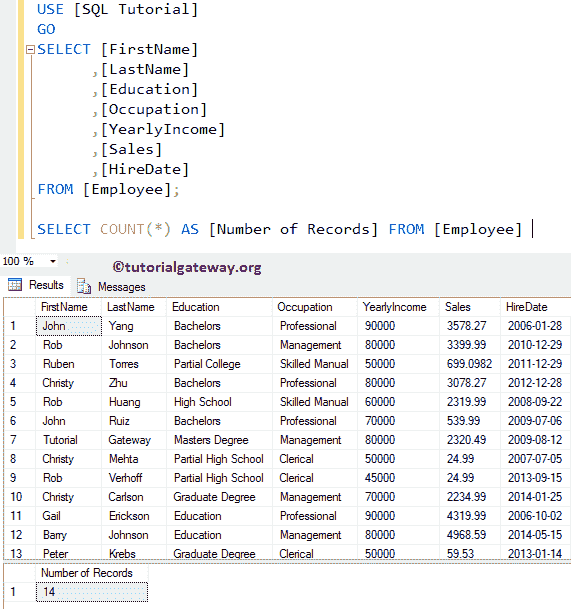
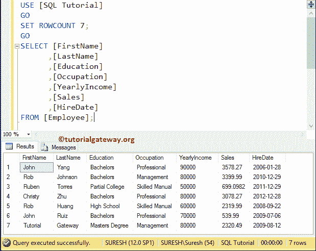
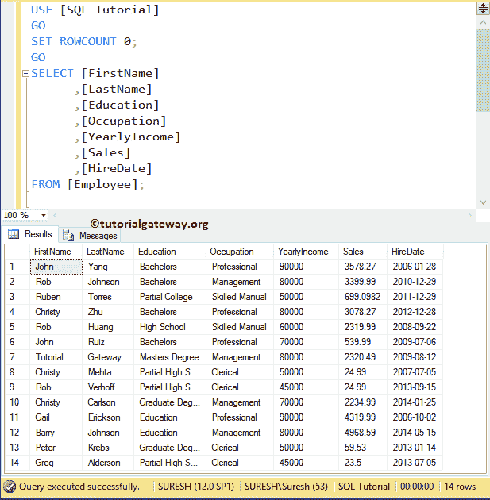
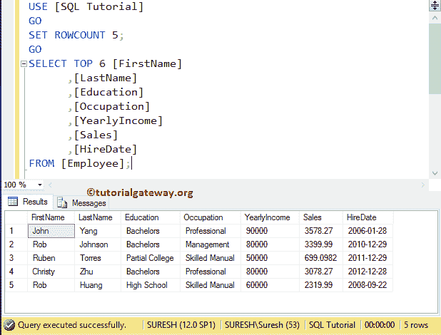

# SQL rowcount(SQL rowcount)

> 原文:[https://www.tutorialgateway.org/sql-rowcount/](https://www.tutorialgateway.org/sql-rowcount/)

SQL 行计数集函数使 SQL 服务器在返回指定的数字后停止查询处理。SQL Server 中 ROWCOUNT 的基本语法如下所示:

```
SET ROWCOUNT { number (or number variable) }

-- For example,
SET ROWCOUNT 4;
```

我们将使用下面显示的数据进行这个 SQL Server 演示


## SQL ROWCOUNT 有什么用？

在本例中，我们向您展示了 SQL Server 中的 SET ROWCOUNT 将如何影响查询。在我们进入主要的 [SQL Server](https://www.tutorialgateway.org/sql/) 示例之前，让我使用[计数函数](https://www.tutorialgateway.org/sql-count-function/)来查找我们的员工表拥有的行数。

```
SELECT [FirstName]
      ,[LastName]
      ,[Education]
      ,[Occupation]
      ,[YearlyIncome]
      ,[Sales]
      ,[HireDate]
FROM [Employee];

SELECT COUNT(*) AS [Number of Records] FROM [Employee]
```



从上面的截图可以看到，表中包含了 14 条记录。现在，让我们使用这个 set 函数将记录限制为 7。

```
SET ROWCOUNT 7;
GO
SELECT [FirstName]
      ,[LastName]
      ,[Education]
      ,[Occupation]
      ,[YearlyIncome]
      ,[Sales]
      ,[HireDate]
FROM [Employee];
```

查询将返回七条记录。这是因为，当查询处理到达第 7 条记录时，它将停止处理其他记录。



注:虽然此行计数不会影响[删除](https://www.tutorialgateway.org/sql-delete-statement/)、[更新](https://www.tutorialgateway.org/sql-update-statement/)和[插入](https://www.tutorialgateway.org/sql-insert-statement/)语句，但避免此语句是一种良好的做法。代替这个，你可以使用[顶条款](https://www.tutorialgateway.org/sql-top-clause/)

### 关闭 SQL 行数设置示例

使用设置行计数 0；停止设置或关闭它。

```
SET ROWCOUNT 0;
GO
SELECT [FirstName]
      ,[LastName]
      ,[Education]
      ,[Occupation]
      ,[YearlyIncome]
      ,[Sales]
      ,[HireDate]
FROM [Employee];
```



### 在顶子句中使用 Sql Server 行计数示例

如果同时使用 [TOP 子句](https://www.tutorialgateway.org/sql-top-clause/)和 ROWCOUNT，则该函数将覆盖 TOP 子句

```
SET ROWCOUNT 5;
GO
SELECT TOP 6 [FirstName]
      ,[LastName]
      ,[Education]
      ,[Occupation]
      ,[YearlyIncome]
      ,[Sales]
      ,[HireDate]
FROM [Employee];
```

从下面的截图中可以看到，我们将其设置为 5，并选择 TOP 6。这里，它返回了前 5 条记录，因为一旦达到 5 条，查询执行将停止。

