# 用于原始 XML 数据的 SQL

> 原文：<https://www.tutorialgateway.org/sql-for-xml-raw/>

在 SQL Server 中对 FOR XML 使用 Raw 模式是将结果集中的每一行都转换成一个 XML 元素。对于这个 SQL FOR XML 原始模式的例子，我们使用的是 SQL 测试中的新员工表。下面的截图显示了该数据库中的 SQL Server 表。

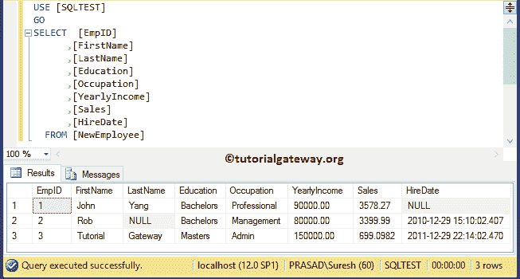

## 面向 XML 原始数据的 SQL 示例 1

在这个例子中，我们向您展示了使用 FOR XML RAW 模式的基本方法。使用原始模式的最简单方法是在我们的[数据库](https://www.tutorialgateway.org/how-to-create-database-in-sql-server/)上的[`SELECT`语句](https://www.tutorialgateway.org/sql-select-statement/)后追加 FOR XML 原始数据。

```
-- SQL Server FOR XML RAW Example
SELECT  [EmpID]
      ,[FirstName]
      ,[LastName]
      ,[Education]
      ,[Occupation]
      ,[YearlyIncome]
      ,[Sales]
      ,[HireDate]
  FROM [NewEmployee]
  FOR XML RAW;
```

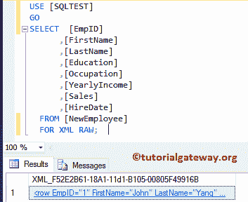

从上面的 [SQL Server](https://www.tutorialgateway.org/sql/) 截图可以看到，查询已经生成了 XML 文件。请点击超链接查看 XML 文件。

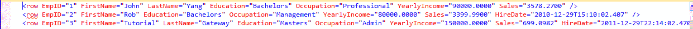

请注意，新员工表中的每一行都映射了<row>元素，列成为了属性。</row>

## 面向 XML 的 SQL 原始示例 2

在这个 FOR XML RAW 示例中，让我们看看如何添加列值作为子元素(而不是属性)。为了实现这一点，我们必须使用 ELEMENTS 关键字和 FOR XML RAW。

```
-- SQL Server FOR XML RAW Example

SELECT  [EmpID]
      ,[FirstName]
      ,[LastName]
      ,[Education]
      ,[Occupation]
      ,[YearlyIncome]
      ,[Sales]
      ,[HireDate]
  FROM [NewEmployee]
  FOR XML RAW, ELEMENTS;
```

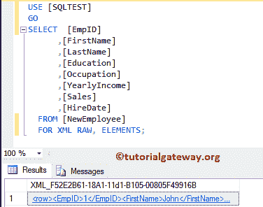

现在，您可以看到 SQL For XML Raw 添加了列值作为子元素

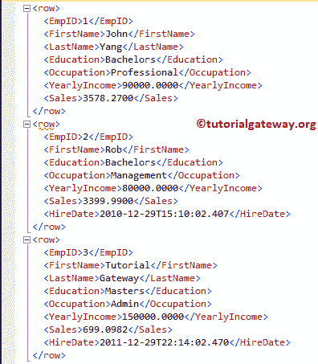

## 对于 XML 原始示例 3

如果您看到前面的 For XML RAW 图像，每行由默认的<row>元素分隔。让我们看看如何用自定义元素覆盖默认行。</row>

```
-- SQL Server FOR XML RAW Example

SELECT  [EmpID]
      ,[FirstName]
      ,[LastName]
      ,[Education]
      ,[Occupation]
      ,[YearlyIncome]
      ,[Sales]
      ,[HireDate]
  FROM [NewEmployee]
  FOR XML RAW('EmployeeDetails'), ELEMENTS;
```

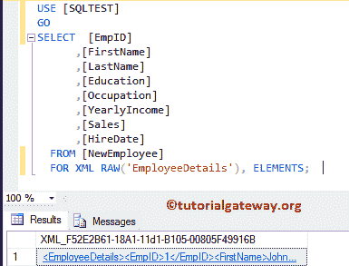

可以看到，<row>元素被替换为<employeedetails></employeedetails></row>

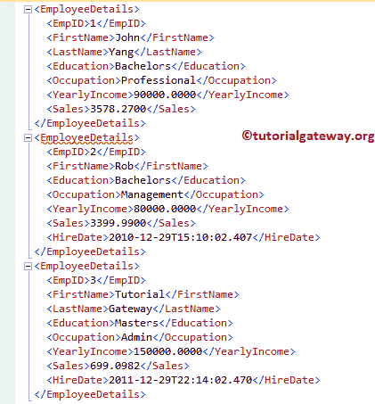

## 对于 XML 原始示例 4

用于 XML 原始数据的 SQL Server 允许您创建一个新的根元素，它将包装其中的所有其他元素。要做到这一点，请使用 ROOT 关键字和 FOR XML RAW。

```
-- SQL Server FOR XML RAW Example

SELECT  [EmpID]
      ,[FirstName]
      ,[LastName]
      ,[Education]
      ,[Occupation]
      ,[YearlyIncome]
      ,[Sales]
      ,[HireDate]
  FROM [NewEmployee]
  FOR XML RAW('Employee'), ROOT, ELEMENTS;
```

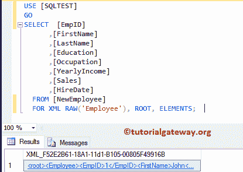

而 XML 文件是:

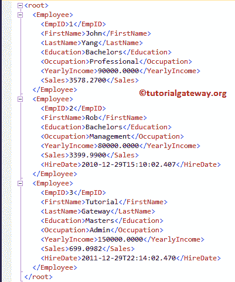

## 面向 XML 的 SQL 原始示例 5

如果观察上面的截图，有一个<root>元素作为父级。在这个例子中，我们将改变这个默认的元素名。</root>

```
-- SQL Server FOR XML RAW Example

SELECT  [EmpID]
      ,[FirstName]
      ,[LastName]
      ,[Education]
      ,[Occupation]
      ,[YearlyIncome]
      ,[Sales]
      ,[HireDate]
  FROM [NewEmployee]
  FOR XML RAW('Employee'), 
          ROOT('EmployeeDetails'), ELEMENTS;
```

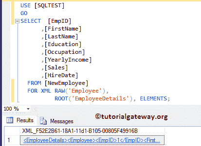

现在可以看到<root>元素被<employeedetails></employeedetails></root>

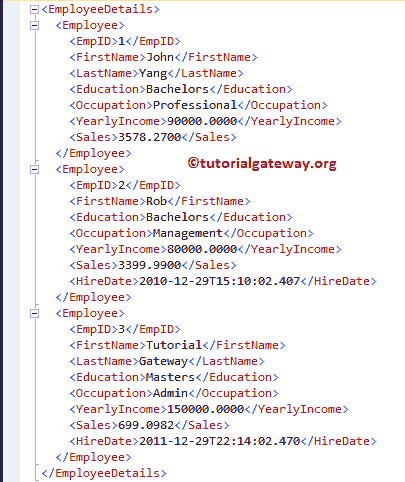

所取代

## 对于 XML 原始示例 6

如果您观察以上所有示例，生成的 XML 文件将忽略具有空值的元素。这是 Sql Server For XML Raw 的默认行为，但是您可以通过添加 XSINIL 关键字来更改这一点。

```
-- SQL Server FOR XML RAW Example

SELECT  [EmpID]
      ,[FirstName]
      ,[LastName]
      ,[Education]
      ,[Occupation]
      ,[YearlyIncome]
      ,[Sales]
      ,[HireDate]
  FROM [NewEmployee]
  FOR XML RAW('Employee'), 
          ROOT('EmployeeDetails'), ELEMENTS XSINIL;
```

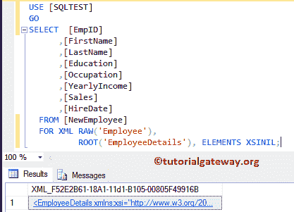

现在您可以看到，XML 文件显示的元素是空的

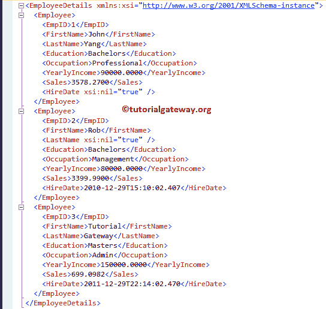

## 对于 XML 原始示例 7

通过使用 XMLSCHEMA 关键字，您可以生成 XML 文件和模式。在这个 SQL FOR XML RAW 示例中，我们将展示相同的内容。

```
-- SQL Server FOR XML RAW Example

SELECT  [EmpID]
      ,[FirstName]
      ,[LastName]
      ,[Education]
      ,[Occupation]
      ,[YearlyIncome]
      ,[Sales]
      ,[HireDate]
  FROM [NewEmployee]
  FOR XML RAW('Employee'), 
          ROOT('EmployeeDetails'), ELEMENTS XSINIL, XMLSCHEMA;
```

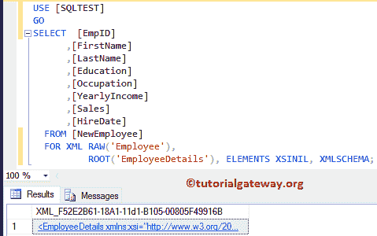

您可以看到 For XML Raw 正在返回 XML 文件和模式。

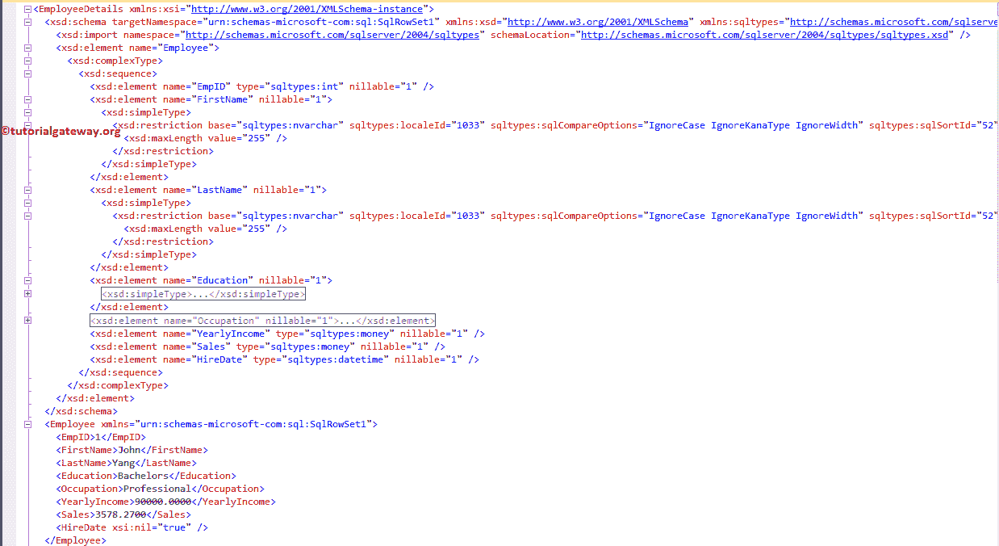

让我将默认目标名称空间更改为自定义名称空间。

```
-- SQL Server FOR XML RAW Example
SELECT  [EmpID]
      ,[FirstName]
      ,[LastName]
      ,[Education]
      ,[Occupation]
      ,[YearlyIncome]
      ,[Sales]
      ,[HireDate]
  FROM [NewEmployee]
  FOR XML RAW('Employee'), 
          ROOT('EmployeeDetails'), ELEMENTS XSINIL, XMLSCHEMA('urn:tutorialgateway.org');
```

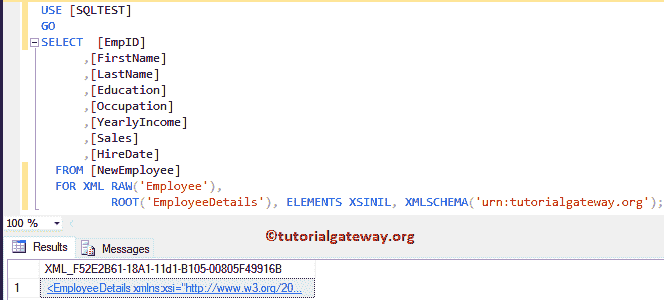

您可以看到我们在上面的查询

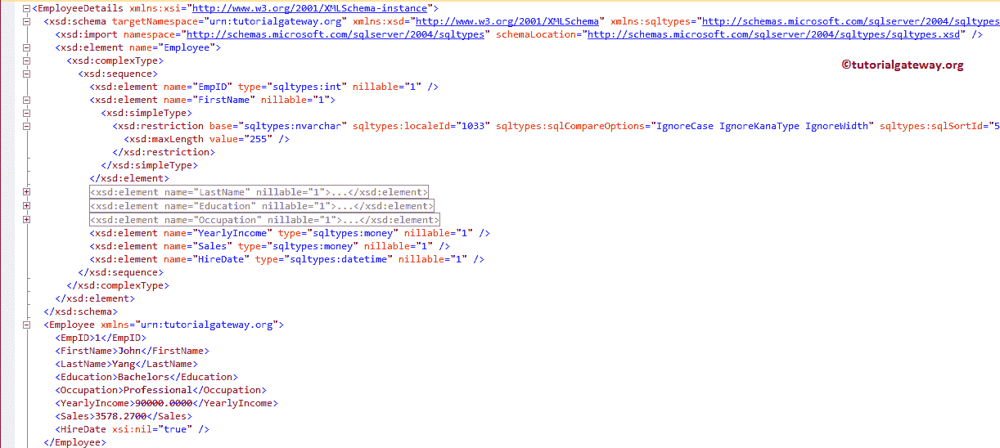

中使用的名称空间